# WedSync Visual Testing Workflow - Multi-Agent System

## 🎯 System Overview

This Visual Testing Workflow represents a comprehensive, multi-agent system designed to ensure WedSync's quality across all user interactions before human testing begins. The system employs 5 specialized AI agents working in parallel to provide complete coverage of visual, functional, performance, and accessibility testing.

## 🤖 Agent Portfolio

### [01 - Role-Based Test Architect](./agents/01-ROLE-BASED-TEST-ARCHITECT.md) 👰‍♀️🤵‍♂️
**Mission:** Design comprehensive test scenarios and user journey maps  
**Specialization:** Wedding industry expertise, user experience mapping, test scenario creation  
**Key Tools:** Serena MCP, Sequential Thinking MCP, Ref MCP  
**Output:** User journey documentation, test scenarios, edge case identification

### [02 - Visual Regression Specialist](./agents/02-VISUAL-REGRESSION-SPECIALIST.md) 🖼️
**Mission:** Build pixel-perfect UI regression detection system  
**Specialization:** Screenshot automation, visual diff analysis, cross-browser consistency  
**Key Tools:** Browser MCP, Playwright MCP, Filesystem MCP  
**Output:** Visual baselines, regression reports, cross-browser compatibility validation

### [03 - Functional Testing Orchestrator](./agents/03-FUNCTIONAL-TESTING-ORCHESTRATOR.md) ⚙️
**Mission:** Automate all interactive element testing and user flow validation  
**Specialization:** Complex user interactions, form testing, cross-role integration  
**Key Tools:** Browser MCP, Playwright MCP, Supabase MCP  
**Output:** Interactive test automation, user journey validation, error scenario testing

### [04 - Performance & Accessibility Guardian](./agents/04-PERFORMANCE-ACCESSIBILITY-GUARDIAN.md) ♿⚡
**Mission:** Monitor performance and ensure universal accessibility  
**Specialization:** Core Web Vitals, WCAG compliance, mobile optimization  
**Key Tools:** Browser MCP, Playwright MCP, Sequential Thinking MCP  
**Output:** Performance monitoring, accessibility audits, optimization recommendations

### [05 - CI/CD Integration & Reporting](./agents/05-CICD-INTEGRATION-REPORTING.md) 🔄📊
**Mission:** Orchestrate testing pipeline and provide comprehensive reporting  
**Specialization:** GitHub automation, multi-channel notifications, analytics  
**Key Tools:** GitHub CLI, Browser MCP, Filesystem MCP  
**Output:** Automated pipelines, stakeholder reports, quality analytics

## 🏗️ System Architecture

```mermaid
graph TB
    A[Role-Based Test Architect] --> E[CI/CD Integration & Reporting]
    B[Visual Regression Specialist] --> E
    C[Functional Testing Orchestrator] --> E
    D[Performance & Accessibility Guardian] --> E
    
    E --> F[GitHub PR Status]
    E --> G[Slack Notifications]
    E --> H[Executive Dashboard]
    E --> I[Technical Reports]
    
    subgraph "User Roles Testing"
        J[Couple Role 👰‍♀️🤵‍♂️]
        K[Guest Role 👥]
        L[Vendor Role 🏢]
        M[Admin Role ⚙️]
        N[Anonymous Role 🌐]
    end
    
    A --> J
    A --> K
    A --> L
    A --> M
    A --> N
```



## 🚀 Parallel Agent Deployment Strategy

### Session 1: Role-Based Test Architect
```bash
# Claude Code Session #1
cd "Visual Testing Workflow/agents"
# Load: 01-ROLE-BASED-TEST-ARCHITECT.md
# Focus: User journey mapping and test scenario creation
# Timeline: 2-3 weeks to full productivity
```

### Session 2: Visual Regression Specialist  
```bash
# Claude Code Session #2
cd "Visual Testing Workflow/agents"
# Load: 02-VISUAL-REGRESSION-SPECIALIST.md
# Focus: Screenshot automation and visual diff system
# Timeline: 3-4 weeks to full productivity
```

### Session 3: Functional Testing Orchestrator
```bash
# Claude Code Session #3
cd "Visual Testing Workflow/agents" 
# Load: 03-FUNCTIONAL-TESTING-ORCHESTRATOR.md
# Focus: Interactive testing and user flow automation
# Timeline: 3-4 weeks to full productivity
```

### Session 4: Performance & Accessibility Guardian
```bash
# Claude Code Session #4
cd "Visual Testing Workflow/agents"
# Load: 04-PERFORMANCE-ACCESSIBILITY-GUARDIAN.md  
# Focus: Performance monitoring and accessibility compliance
# Timeline: 3-4 weeks to full productivity
```

### Session 5: CI/CD Integration & Reporting
```bash
# Claude Code Session #5
cd "Visual Testing Workflow/agents"
# Load: 05-CICD-INTEGRATION-REPORTING.md
# Focus: Pipeline orchestration and comprehensive reporting
# Timeline: 4-5 weeks to full productivity
```

## 📊 Expected Outcomes & Benefits

### Quality Assurance Improvements
- **95%+ Bug Detection Rate** before human testing
- **Zero Critical Regressions** reach production
- **100% Cross-Browser Compatibility** validation
- **Complete Accessibility Compliance** (WCAG 2.1 AA)

### Development Velocity Impact  
- **70% Reduction** in manual testing time
- **Sub-5 Minute Feedback** for developers on changes
- **Automated Release Confidence** scoring
- **Predictive Quality Analytics** for risk assessment

### Business Value Creation
- **Reduced Support Tickets** from UI/UX issues
- **Higher User Satisfaction** through consistent experience  
- **Faster Time-to-Market** with confident deployments
- **Brand Protection** through consistent visual quality

## 🔄 Agent Collaboration Matrix

| Agent | Provides To Others | Receives From Others |
|-------|-------------------|---------------------|
| **Test Architect** | Test scenarios, user journeys, success criteria | Technical constraints, feasibility feedback |
| **Visual Specialist** | Visual baselines, regression reports, browser compatibility | UI states to capture, page transitions to test |
| **Functional Orchestrator** | Interaction test results, user flow validation | Expected behaviors, error scenarios to test |
| **Performance Guardian** | Performance metrics, accessibility scores | Performance requirements, user scenarios |
| **CI/CD Integrator** | Pipeline automation, comprehensive reports | Test results from all agents, alert configurations |

## 🎯 Success Metrics by Agent

### Individual Agent KPIs
- **Test Architect:** 100% critical user journeys mapped and documented
- **Visual Specialist:** <5% false positive rate on visual regressions  
- **Functional Orchestrator:** 95%+ functional bug detection before production
- **Performance Guardian:** All pages meet Core Web Vitals "Good" thresholds
- **CI/CD Integrator:** <15 minute full test suite execution time

### System-Wide Success Indicators
- **Zero Production Incidents** from missed test failures
- **95% Stakeholder Satisfaction** with test reporting clarity
- **Sub-15 Minute** comprehensive test suite execution
- **100% Automated Coverage** of critical business functions

## 📅 Implementation Timeline

### Phase 1: Foundation (Weeks 1-4)
- **Week 1-2:** Deploy Test Architect and Visual Specialist agents
- **Week 3-4:** Deploy Functional Orchestrator and Performance Guardian agents
- **Milestone:** Basic testing coverage for all user roles established

### Phase 2: Integration (Weeks 5-8)  
- **Week 5-6:** Deploy CI/CD Integration agent and connect all systems
- **Week 7-8:** Fine-tune inter-agent communication and reporting
- **Milestone:** Fully automated testing pipeline operational

### Phase 3: Optimization (Weeks 9-12)
- **Week 9-10:** Performance optimization and advanced analytics
- **Week 11-12:** Predictive analytics and continuous improvement systems
- **Milestone:** Self-improving testing ecosystem with predictive capabilities

## 🛠️ Technical Prerequisites

### Required MCP Servers
- ✅ **Browser MCP** - Advanced browser automation and testing
- ✅ **Playwright MCP** - Sophisticated testing capabilities  
- ✅ **GitHub CLI** - Repository management and PR automation
- ✅ **Supabase MCP** - Test data management and storage
- ✅ **Filesystem MCP** - File operations and report management
- ✅ **Sequential Thinking MCP** - Complex problem solving and optimization
- ✅ **Serena MCP** - Code analysis and understanding
- ✅ **Ref MCP** - Documentation and best practices research

### Infrastructure Requirements
- **GitHub Actions** - CI/CD pipeline execution
- **Docker** - Isolated test environments
- **Slack Workspace** - Team notifications and alerts
- **Email Service** - Stakeholder reporting
- **Cloud Storage** - Test artifacts and historical data

## 🔐 Security & Privacy Considerations

### Test Data Management
- **Synthetic Data Only** - No real user information in test scenarios
- **Automated Cleanup** - Test data removed after each run
- **Secure Credentials** - API keys and tokens properly managed
- **Access Controls** - Role-based access to test results and reports

### Infrastructure Security  
- **Isolated Environments** - Test environments separate from production
- **Encrypted Storage** - All test artifacts encrypted at rest
- **Audit Logging** - Complete audit trail of all testing activities
- **Compliance** - GDPR and privacy regulation compliance

## 📞 Support & Escalation

### Agent-Specific Support
- **Technical Issues:** Contact Technical Lead for MCP configuration
- **Domain Questions:** Wedding industry expertise consultation available
- **Integration Problems:** DevOps team for pipeline and infrastructure issues

### Emergency Protocols
- **P0 Critical:** Immediate Slack alert to #wedsync-critical-alerts
- **P1 High:** GitHub issue creation with 2-hour response SLA
- **P2 Medium:** Daily summary in team standup meetings

## 🎓 Agent Training & Onboarding

### New Agent Deployment Checklist
- [ ] Read complete agent README and understand mission
- [ ] Configure required MCP servers and tools
- [ ] Set up development environment and test data
- [ ] Execute initial test scenarios and validate setup
- [ ] Establish communication channels with other agents
- [ ] Complete first weekly report and stakeholder update

### Continuous Learning Process
- **Weekly Agent Sync:** Share learnings and optimizations across agents
- **Monthly Review:** Assess agent performance and identify improvements
- **Quarterly Planning:** Update agent capabilities and expand coverage
- **Annual Assessment:** Comprehensive review and strategic planning

## 🏆 Quality Philosophy

*"Every pixel, every interaction, every performance metric matters when serving couples during the most important moment of their lives. Our multi-agent testing system ensures that WedSync not only works flawlessly but creates confidence and joy for every user."*

## 🚦 Getting Started - Quick Deploy

### 1. Immediate Setup (Day 1)
```bash
# Clone and set up basic structure
git checkout -b visual-testing-workflow-deployment
cd "Visual Testing Workflow"

# Review all agent documentation
ls agents/*.md

# Choose your agent based on expertise and start immediately
```

### 2. Agent Selection Guide
- **Backend/API Focus:** Start with Functional Testing Orchestrator
- **Frontend/Design Focus:** Start with Visual Regression Specialist  
- **UX/Product Focus:** Start with Role-Based Test Architect
- **Performance/DevOps Focus:** Start with Performance & Accessibility Guardian
- **Integration/Systems Focus:** Start with CI/CD Integration & Reporting

### 3. Success Validation
Each agent should achieve their first successful test execution within **Week 1** of deployment.

---

## 📋 Quick Reference

| Need | Agent | File |
|------|--------|------|
| Test Scenarios | Role-Based Test Architect | `01-ROLE-BASED-TEST-ARCHITECT.md` |
| Visual Testing | Visual Regression Specialist | `02-VISUAL-REGRESSION-SPECIALIST.md` |
| Interactive Testing | Functional Testing Orchestrator | `03-FUNCTIONAL-TESTING-ORCHESTRATOR.md` |
| Performance/A11y | Performance & Accessibility Guardian | `04-PERFORMANCE-ACCESSIBILITY-GUARDIAN.md` |
| CI/CD & Reports | CI/CD Integration & Reporting | `05-CICD-INTEGRATION-REPORTING.md` |

**System Status:** ✅ Ready for Deployment  
**Total Agents:** 5 Specialized Testing Agents  
**Expected Impact:** 95%+ reduction in production bugs, 70% reduction in manual testing effort  
**Time to Full Value:** 8-12 weeks for complete system maturity