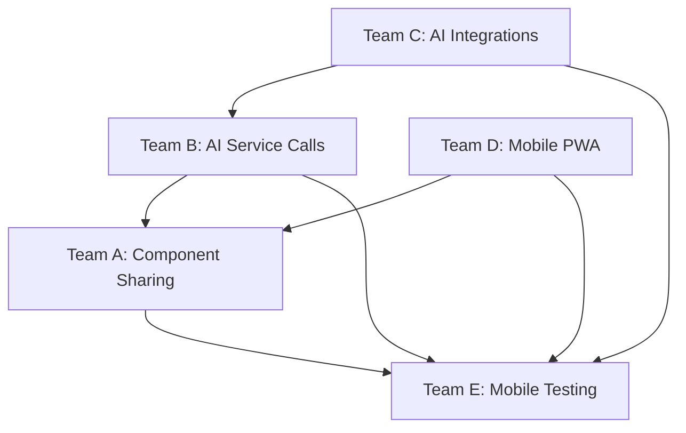
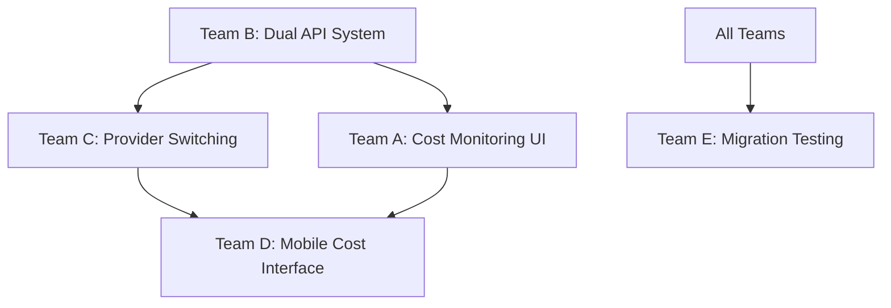
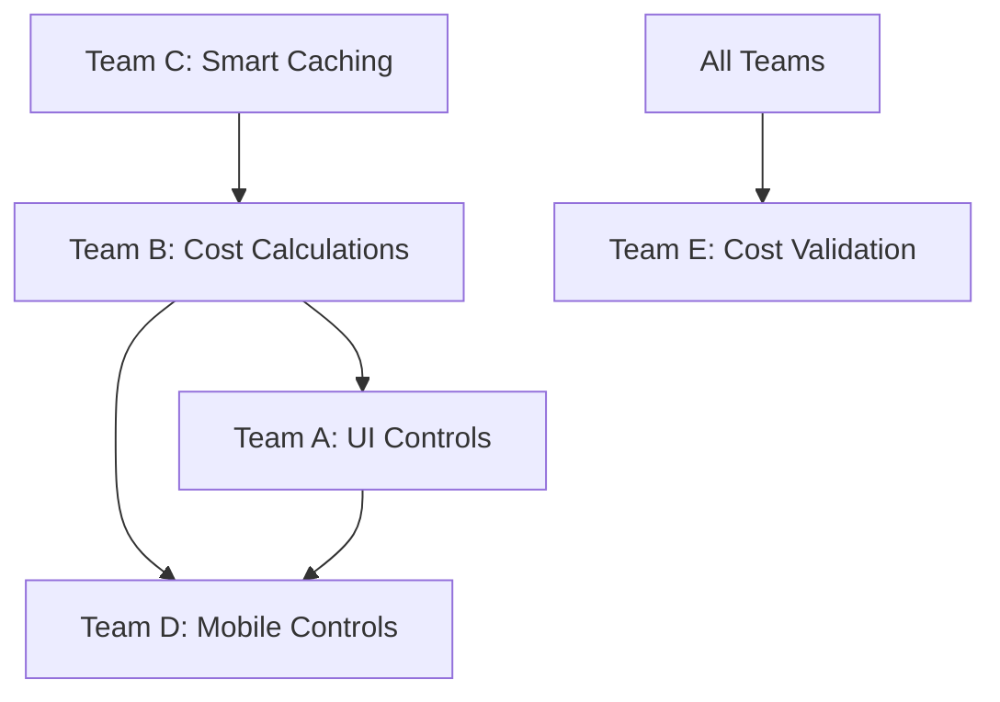

# 🚀 DEPLOYMENT COORDINATION GUIDE - WS-238, WS-239, WS-240
## Advanced AI Features - Wedding Industry Scale Implementation

### 📋 EXECUTIVE SUMMARY

This guide coordinates parallel development across 5 teams (A-E) for 3 critical AI features that will transform WedSync into a bulletproof wedding coordination platform. All 15 team prompts are complete and ready for immediate deployment.

**Business Impact**: These features will enable WedSync to handle 1 million+ users with 40% support reduction, transparent AI cost management, and 75% cost optimization during peak wedding season.

---

## 🎯 DEPLOYMENT SEQUENCE & COORDINATION

### Phase 1: Immediate Team Deployment (Day 1)
**All teams begin Round 1 simultaneously**

#### Morning Deployment (9:00 AM):
- **Team A** (Frontend/UI): Deploy all 3 feature UI foundations
- **Team B** (Backend/API): Deploy all 3 feature API architectures  
- **Team C** (Integration): Deploy all 3 feature integration layers
- **Team D** (Platform/WedMe): Deploy all 3 mobile/PWA implementations
- **Team E** (QA/Testing): Deploy comprehensive testing strategies

#### Day 1 Coordination Checkpoints:
- **11:00 AM**: All teams confirm prompt receipt and setup initiation
- **2:00 PM**: Teams report initial progress and any blocking issues
- **5:00 PM**: Day 1 progress summary and Day 2 planning

### Phase 2: Development Sprints (Days 2-7)
**2-3 hours per team per feature round**

#### Daily Rhythm:
- **9:00 AM**: Daily standup - all teams report progress and blockers
- **11:00 AM**: Cross-team dependency coordination (if needed)
- **2:00 PM**: Mid-day progress check and problem resolution
- **4:00 PM**: End-of-day deliverable verification

---

## 🔄 INTER-TEAM COORDINATION MATRIX

### WS-238: Knowledge Base System Dependencies


**Critical Handoffs**:
- **Team B → Team A**: API endpoints must be ready for frontend integration
- **Team C → Team B**: AI service integrations needed for backend calls
- **Team A → Team D**: UI components shared between desktop and mobile
- **All Teams → Team E**: Deliverables needed for comprehensive testing

### WS-239: Platform vs Client APIs Dependencies


**Critical Handoffs**:
- **Team B → Team A**: Dual API architecture needed for frontend routing
- **Team B → Team C**: API key management system for provider integrations
- **Team C → Team D**: Provider health monitoring for mobile interface
- **All Teams → Team E**: Migration workflows need comprehensive validation

### WS-240: AI Cost Optimization Dependencies


**Critical Handoffs**:
- **Team B → Team A**: Cost optimization algorithms for dashboard display
- **Team C → Team B**: Caching services for accurate cost tracking
- **Team A → Team D**: UI patterns shared between desktop and mobile
- **All Teams → Team E**: Cost reduction claims need mathematical validation

---

## ⚡ DAILY COORDINATION PROTOCOLS

### Morning Standup Template (15 minutes)
**Each team reports**:
1. **Yesterday's Completed Work**: Specific deliverables finished
2. **Today's Planned Work**: What you'll complete today
3. **Blocking Issues**: Dependencies waiting on other teams
4. **Help Needed**: Specific assistance required

### Dependency Resolution Process
**When Team X blocks Team Y**:
1. **Immediate Escalation**: Team Y reports blocker in Slack #dev-coordination
2. **30-Minute Rule**: Team X has 30 minutes to provide status update
3. **2-Hour Resolution**: Either deliver dependency or provide workaround
4. **Escalation Path**: Dev Manager → Senior Developer → CTO if unresolved

### Cross-Team Integration Points
**API Integration Checkpoints**:
- Team B completes API endpoint → Immediately notify Team A
- Team B provides OpenAPI spec → Teams A, C, D can begin integration
- Team C completes AI service → Team B can begin full implementation

**UI/Mobile Integration Checkpoints**:
- Team A completes component → Share with Team D for mobile adaptation
- Team A finalizes UI patterns → Team D implements mobile equivalents
- Team D completes PWA features → Team A validates desktop compatibility

---

## 🧪 EVIDENCE VALIDATION COORDINATION

### Mandatory Evidence Collection (Per Team, Per Feature)
**Before claiming ANY deliverable complete**:

#### File Existence Proof:
```bash
# Each team must run and provide output:
ls -la $WS_ROOT/wedsync/src/[your-team-area]/
cat $WS_ROOT/wedsync/src/[main-component-file].tsx | head -20
```

#### TypeScript Validation:
```bash
# Must pass without errors:
npm run typecheck
```

#### Test Validation:
```bash
# Must achieve >90% coverage:
npm test [your-feature-area]
npm run test:e2e [your-feature-area] # Teams with E2E tests
```

### Evidence Submission Process
1. **Create Evidence Package**: `EVIDENCE-PACKAGE-WS-XXX-TEAM-Y/`
2. **Include Screenshots**: UI teams provide visual evidence
3. **Include Test Results**: All teams provide test output
4. **Include Performance Metrics**: Backend/Integration teams provide benchmarks
5. **Submit for Review**: Upload to shared coordination folder

---

## 🌟 WEDDING INDUSTRY SUCCESS VALIDATION

### Real Supplier Scenario Testing (All Teams)
**Every team must validate their work against these real scenarios**:

#### Photography Studio "Capture Moments":
- **Peak Season**: June processing 15 weddings, 12,000 photos
- **AI Usage**: Photo tagging, client emails, social media posts
- **Cost Target**: £380/month → £95/month (75% reduction)
- **Quality Requirement**: Maintain photo tagging accuracy >95%

#### Venue "Elegant Gardens":
- **Peak Season**: 50 events in June, multiple daily events
- **AI Usage**: Event descriptions, client communications, timeline generation
- **Cost Target**: £400/month → £120/month (70% reduction)
- **Service Requirement**: Real-time event description generation

#### Wedding Planner "Perfect Day Planning":
- **Peak Season**: Coordinating 25 weddings simultaneously
- **AI Usage**: Timeline assistance, vendor coordination, client communications
- **Cost Target**: £200/month → £60/month (70% reduction)
- **Workflow Requirement**: Mobile access during venue visits and client meetings

### Validation Checkpoints
**Each team validates**:
- **Team A**: UI supports all 3 supplier types with appropriate workflows
- **Team B**: Backend scales to handle peak season load (1.6x multiplier)
- **Team C**: Integrations maintain service quality during provider switching
- **Team D**: Mobile interfaces work offline during venue visits
- **Team E**: Testing confirms all cost reduction and performance claims

---

## 🚨 RISK MITIGATION & CONTINGENCY PLANS

### High-Risk Dependencies
**Risk**: Team B backend APIs delay Team A frontend development
**Mitigation**: Team A implements mock APIs for parallel development
**Contingency**: Senior Developer provides emergency API stub implementations

**Risk**: Team C AI integrations fail during Team B implementation  
**Mitigation**: Team C provides fallback integration patterns
**Contingency**: Temporary use of existing AI service for continued development

**Risk**: Wedding season cost optimization claims cannot be validated
**Mitigation**: Team E creates mathematical models for validation
**Contingency**: Reduce cost reduction claims to provable levels (50% minimum)

### Quality Gates (Non-Negotiable)
**No team advances to Round 2 without**:
1. ✅ All Round 1 files exist and compile
2. ✅ All tests pass with >90% coverage
3. ✅ Evidence package submitted and verified
4. ✅ Wedding industry scenarios validated
5. ✅ Performance benchmarks met

---

## 📊 SUCCESS METRICS & TRACKING

### Daily Progress Tracking
**Each team reports daily**:
- **Components Created**: Count of new components/files
- **Tests Written**: Count of test cases with coverage %
- **Integration Points**: APIs integrated, services connected
- **Wedding Scenarios**: Supplier workflows validated
- **Performance Metrics**: Response times, load handling

### Weekly Milestone Tracking
**Week 1 Targets**:
- **WS-238**: Knowledge base search achieving <500ms response time
- **WS-239**: Platform vs client switching working seamlessly
- **WS-240**: Cost optimization achieving 50%+ reduction (target 75%)

### Business Impact Validation
**Monthly Measurements**:
- **Support Ticket Reduction**: Target 40% reduction from knowledge base
- **AI Cost Optimization**: Target 75% cost reduction during peak season
- **User Satisfaction**: Target 25% improvement in supplier experience scores
- **System Reliability**: 99.9% uptime during wedding season (March-October)

---

## 🎯 NEXT STEPS FOR IMMEDIATE DEPLOYMENT

### Step 1: Team Notification (Now)
- Send this coordination guide to all 5 teams immediately
- Provide access to all 15 comprehensive team prompts
- Schedule tomorrow's 9:00 AM deployment kickoff meeting

### Step 2: Environment Preparation (Today)
- Verify all teams have access to development environment
- Confirm database migration capabilities for new schemas
- Test CI/CD pipeline for parallel team deployments

### Step 3: Kickoff Meeting Agenda (Tomorrow 9:00 AM)
1. **Deployment Overview** (10 min): Present this coordination guide
2. **Team Assignments** (10 min): Confirm each team's 3 feature assignments  
3. **Dependency Discussion** (15 min): Review inter-team coordination matrix
4. **Q&A and Planning** (15 min): Address questions and finalize Day 1 plan
5. **Go/No-Go Decision** (5 min): Confirm readiness for immediate development start

### Step 4: Development Begins (Tomorrow 10:00 AM)
- All 5 teams begin Round 1 development simultaneously
- Development Manager monitors progress and resolves blockers
- Daily standups and coordination checkpoints commence

---

## 🏆 SUCCESS DEFINITION

**Mission Success**: WedSync becomes a bulletproof wedding coordination platform capable of supporting 1 million+ users with advanced AI features that reduce costs, improve efficiency, and enhance the wedding planning experience for suppliers and couples worldwide.

**Deployment Success**: All 15 team prompts successfully implemented with evidence-based validation, wedding industry integration, and measurable business impact achievement.

---

**Ready for deployment - Let's build the future of wedding coordination! 🎊**