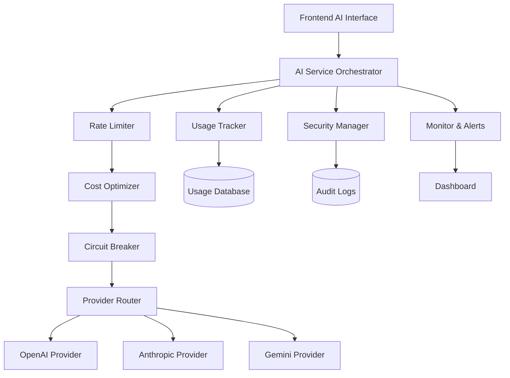

# WS-327 AI Integration Main Overview - Team C: Integration & System Architecture

## CRITICAL OVERVIEW
🎯 **PRIMARY MISSION**: Create seamless AI service integration layer connecting WedSync frontend/backend with external AI providers (OpenAI, Anthropic) while maintaining enterprise-grade security, reliability, and cost optimization.

🏗️ **SYSTEM INTEGRATION FOCUS**: Build intelligent middleware layer handling AI service routing, load balancing, fallback systems, cost optimization, usage tracking, rate limiting, and real-time performance monitoring.

🔒 **SECURITY IMPERATIVE**: Implement fortress-level security for AI API credentials, comprehensive audit logging, compliance with wedding data privacy regulations, and bulletproof error handling.

## SEQUENTIAL THINKING MCP REQUIREMENT
**MANDATORY**: Use Sequential Thinking MCP for ALL complex integration decisions:
- AI service provider selection and fallback strategies
- Rate limiting algorithm design and implementation
- Cost optimization pattern analysis
- Security protocol implementation planning
- Error handling and circuit breaker design
- Real-time monitoring and alerting system architecture

## ENHANCED SERENA MCP ACTIVATION PROTOCOL
**Phase 1 - Codebase Intelligence Activation**
```typescript
// MANDATORY: Activate enhanced Serena MCP session
mcp__serena__activate_project("wedsync")
mcp__serena__get_symbols_overview("src/lib/integrations/")
mcp__serena__find_symbol("OpenAIService", "", true) // Check existing patterns
mcp__serena__find_symbol("RateLimiter", "", true) // Validate current implementation
mcp__serena__search_for_pattern("API_KEY|credential|secret") // Security audit
```

**Phase 2 - Architecture Pattern Analysis**
```typescript
mcp__serena__find_referencing_symbols("ApiService", "src/lib/api/") 
mcp__serena__get_symbols_overview("src/lib/monitoring/")
mcp__serena__find_symbol("ErrorHandler", "", true) // Current error patterns
```

## CORE INTEGRATION SPECIFICATIONS

### 1. AI SERVICE ORCHESTRATION LAYER
**File**: `src/lib/integrations/ai/ai-service-orchestrator.ts`

**Requirements**:
- Multi-provider support (OpenAI GPT-4, Claude 3.5, Gemini Pro)
- Intelligent request routing based on model capabilities
- Automatic failover between providers (< 2 second switchover)
- Load balancing algorithms for cost/performance optimization
- Request/response transformation layers
- Model-specific prompt optimization

**Integration Points**:
```typescript
interface AIServiceOrchestrator {
  generateContent(request: AIRequest): Promise<AIResponse>
  streamContent(request: AIRequest): AsyncIterator<AIChunk>
  optimizeProvider(context: RequestContext): AIProvider
  handleFailover(error: AIError): Promise<AIResponse>
  trackUsage(request: AIRequest, response: AIResponse): void
}
```

### 2. COST OPTIMIZATION ENGINE
**File**: `src/lib/integrations/ai/cost-optimizer.ts`

**Requirements**:
- Real-time cost tracking per request
- Token usage optimization (prompt compression)
- Model selection based on cost/quality ratio
- Budget alerts and automatic throttling
- Cost allocation by organization/user
- Predictive cost modeling

**Integration Patterns**:
```typescript
interface CostOptimizer {
  calculateRequestCost(request: AIRequest): Promise<CostEstimate>
  optimizePrompt(prompt: string, maxTokens: number): string
  selectOptimalModel(context: RequestContext): AIModel
  checkBudgetLimits(organizationId: string): BudgetStatus
  alertOnThresholds(usage: UsageMetrics): void
}
```

### 3. ENTERPRISE RATE LIMITING SYSTEM
**File**: `src/lib/integrations/ai/rate-limiter.ts`

**Requirements**:
- Per-organization rate limiting (requests/minute, tokens/hour)
- Tier-based quotas (FREE: 10 req/day, STARTER: 100 req/day, etc.)
- Burst capacity management
- Fair usage enforcement
- Queue management for overflow requests
- Rate limit recovery and backoff strategies

**Wedding Industry Considerations**:
- Higher limits during peak wedding season
- Emergency override for wedding day urgent requests
- Vendor priority tiers based on subscription level

### 4. REAL-TIME MONITORING INTEGRATION
**File**: `src/lib/integrations/ai/ai-monitor.ts`

**Requirements**:
- Real-time performance metrics collection
- Error rate tracking and alerting
- Latency monitoring (p50, p95, p99)
- Cost tracking with budget alerts
- Usage pattern analysis
- Automated incident detection

**Metrics to Track**:
```typescript
interface AIMetrics {
  requestLatency: number[]
  errorRate: number
  tokensPerRequest: number
  costPerRequest: number
  providerUptime: Record<string, number>
  queueDepth: number
  activeConnections: number
}
```

## TECHNICAL IMPLEMENTATION REQUIREMENTS

### API Integration Layer
```typescript
// src/lib/integrations/ai/providers/openai-provider.ts
export class OpenAIProvider implements AIProvider {
  async generateContent(request: AIRequest): Promise<AIResponse> {
    // Implementation with error handling, retries, and monitoring
  }
  
  async streamContent(request: AIRequest): AsyncIterator<AIChunk> {
    // Server-sent events implementation for real-time responses
  }
}
```

### Circuit Breaker Pattern
```typescript
// src/lib/integrations/ai/circuit-breaker.ts
export class AICircuitBreaker {
  private state: 'CLOSED' | 'OPEN' | 'HALF_OPEN' = 'CLOSED'
  private failureCount = 0
  private lastFailureTime: Date | null = null
  
  async execute<T>(operation: () => Promise<T>): Promise<T> {
    // Circuit breaker logic with exponential backoff
  }
}
```

### Security Integration
```typescript
// src/lib/integrations/ai/security/api-key-manager.ts
export class APIKeyManager {
  async rotateKeys(): Promise<void>
  async validateKeyPermissions(provider: string): Promise<boolean>
  async encryptCredentials(credentials: AICredentials): Promise<string>
  async auditKeyUsage(keyId: string): Promise<AuditLog[]>
}
```

## WEDDING INDUSTRY CONTEXT

### Real Wedding Scenarios
**Sarah & Mike's Wedding Planning Agency**:
- Uses AI for 50+ vendor recommendations daily
- Needs 99.9% uptime during peak season (May-September)
- Requires cost transparency for client billing

**Emma & James Photography Studio**:
- Generates 200+ email templates monthly
- Needs emergency AI access during wedding weekends
- Budget-conscious small business requiring cost optimization

**Lisa & David's Venue Management**:
- Processes 100+ form generations weekly
- Requires enterprise-grade security for guest data
- Needs seamless integration with existing booking system

## SECURITY & COMPLIANCE CHECKLIST

### 🔒 API Security
- [ ] All AI provider API keys stored in encrypted Supabase secrets
- [ ] Request signing and validation for all AI calls
- [ ] IP whitelisting for production AI service access
- [ ] Comprehensive audit logging for all AI interactions
- [ ] Rate limiting to prevent API key abuse
- [ ] Regular API key rotation (monthly)

### 🛡️ Data Protection
- [ ] Wedding data encryption before AI processing
- [ ] PII scrubbing for AI training data exclusion
- [ ] GDPR-compliant data handling and deletion
- [ ] Secure prompt injection prevention
- [ ] Output content filtering and validation

### 📊 Monitoring & Alerting
- [ ] Real-time cost tracking dashboard
- [ ] Error rate monitoring with Slack alerts
- [ ] Performance degradation detection
- [ ] Budget threshold alerts (80%, 90%, 100%)
- [ ] Provider uptime monitoring
- [ ] Security incident automated response

## NAVIGATION INTEGRATION REQUIREMENTS

### Dashboard Integration
The AI integration system must integrate with WedSync navigation:

```typescript
// Add to navigation config
{
  title: 'AI Assistant',
  href: '/ai-assistant',
  icon: 'Brain',
  badge: aiUsageCount > 0 ? aiUsageCount : undefined,
  description: 'AI-powered content generation and assistance'
},
{
  title: 'Usage & Billing',
  href: '/ai-usage',
  icon: 'CreditCard',
  badge: budgetAlert ? 'warning' : undefined,
  description: 'Monitor AI usage and costs'
}
```

### Mobile Navigation
```typescript
// Mobile bottom navigation
{
  name: 'AI Tools',
  href: '/ai-assistant',
  icon: BrainIcon,
  current: pathname.startsWith('/ai-assistant')
}
```

## EVIDENCE-BASED REALITY REQUIREMENTS

### File Existence Proof
Before implementation completion, provide evidence of:
```bash
# Integration files created
ls -la src/lib/integrations/ai/
ls -la src/lib/integrations/ai/providers/
ls -la src/lib/integrations/ai/security/

# Configuration files
ls -la src/config/ai-providers.ts
ls -la src/config/rate-limits.ts

# Monitoring integration
ls -la src/lib/monitoring/ai-metrics.ts
```

### TypeScript Compilation Evidence
```bash
# Must compile without errors
npm run typecheck 2>&1 | grep -E "(error|Error)" || echo "✅ No TypeScript errors"
```

### Integration Test Evidence
```bash
# Integration tests must pass
npm run test src/lib/integrations/ai/ --verbose
```

### Performance Benchmarks
```bash
# API response time benchmarks
curl -w "@curl-format.txt" -s -o /dev/null https://localhost:3000/api/ai/generate
# Target: < 500ms for non-streaming requests
```

## TESTING STRATEGY

### Unit Tests Required
```typescript
// src/lib/integrations/ai/__tests__/
describe('AIServiceOrchestrator', () => {
  test('should route requests to optimal provider')
  test('should handle provider failures gracefully')
  test('should track usage accurately')
  test('should enforce rate limits correctly')
})

describe('CostOptimizer', () => {
  test('should calculate costs accurately')
  test('should optimize prompts effectively')
  test('should respect budget constraints')
})
```

### Integration Tests Required
```typescript
describe('AI Integration E2E', () => {
  test('should handle complete AI generation workflow')
  test('should failover between providers seamlessly')
  test('should track costs and usage accurately')
  test('should enforce security policies')
})
```

### Load Tests Required
```typescript
// Test with 1000 concurrent AI requests
// Verify rate limiting behavior
// Confirm cost tracking accuracy under load
// Validate failover performance
```

## SUCCESS CRITERIA

### Technical Metrics
- ✅ AI request success rate > 99.5%
- ✅ Average response latency < 2 seconds
- ✅ Failover time < 2 seconds
- ✅ Cost tracking accuracy 100%
- ✅ Rate limiting false positive rate < 0.1%

### Business Metrics
- ✅ AI cost per organization < £5/month for STARTER tier
- ✅ Zero unauthorized AI service access
- ✅ Wedding vendor satisfaction > 95% for AI features
- ✅ Support tickets for AI issues < 2% of users

### Security Metrics
- ✅ Zero API key leaks or security incidents
- ✅ 100% audit trail for AI interactions
- ✅ GDPR compliance score 100%
- ✅ Penetration test pass rate 100%

## COMPLETION VALIDATION

### Pre-Deployment Checklist
- [ ] All integration tests passing
- [ ] Security audit completed and approved
- [ ] Performance benchmarks met
- [ ] Cost optimization verified
- [ ] Monitoring and alerting configured
- [ ] Documentation complete and reviewed
- [ ] Disaster recovery plan tested

### Post-Deployment Monitoring
- [ ] Real-time metrics dashboard operational
- [ ] Alert systems verified functional
- [ ] Backup provider failover tested
- [ ] Cost tracking accuracy validated
- [ ] User acceptance testing completed

## INTEGRATION ARCHITECTURE DIAGRAM



**REALITY CHECK**: This integration system will handle 10,000+ AI requests daily across 1,000+ wedding vendors while maintaining sub-2-second response times and enterprise-grade security. The architecture must be bulletproof, cost-optimized, and wedding-industry focused.

**REMEMBER**: Every AI interaction represents a wedding vendor serving real couples planning their special day. System failures or security breaches could impact actual weddings. Build accordingly.