# 🗺️ Integration Dependency Map
**Purpose:** Visual guide to feature connections  
**Critical Path:** Shows what must be connected for MVP

---

## 🔴 Critical Integration Chain (Week 1)
**Must work end-to-end for MVP**

```mermaid
graph LR
    A[PDF Upload] -->|OCR Extract| B[Field Detection]
    B -->|Map Fields| C[Form Builder]
    C -->|Save Form| D[Database]
    D -->|Generate URL| E[Public Form]
    E -->|Client Submit| F[Form Submission]
    F -->|Process Data| G[Core Fields Sync]
    G -->|Update| H[Database]
    H -->|Notify| I[Email Service]
    
    style A fill:#e1f5fe
    style C fill:#e1f5fe
    style E fill:#e1f5fe
    style F fill:#ff6b6b
    style G fill:#ff6b6b
    style I fill:#ff6b6b
```



**🔵 Working** | **🔴 Broken** | **🟡 Partial**

---

## 📋 Integration Checklist by Component

### 1️⃣ PDF Import System
```
✅ PDF Upload (works)
✅ OCR Processing (works)
✅ Field Extraction (works)
❌ Auto-create Form (broken)
❌ Field Mapping UI (missing)
❌ Save to Form Builder (broken)
```

**Required Connections:**
```typescript
// In PDFImportInterface.tsx
const handleProcessComplete = async (extractedFields) => {
  // ADD: Create form from extracted fields
  const formId = await createFormFromPDF({
    name: pdfFileName,
    fields: extractedFields,
    source: 'pdf_import'
  });
  
  // ADD: Redirect to form builder with new form
  router.push(`/forms/${formId}/edit`);
};
```

### 2️⃣ Form Builder
```
✅ Drag-drop Interface (works)
✅ Field Types (works)
✅ Preview (works)
🟡 Save to Database (partial)
❌ Load from Database (broken)
❌ Publish Form (broken)
```

**Required Connections:**
```typescript
// In OptimizedFormBuilder.tsx
const handleSave = async () => {
  // FIX: Complete save implementation
  const response = await fetch('/api/forms', {
    method: form.id ? 'PUT' : 'POST',
    body: JSON.stringify({
      ...form,
      status: 'draft'
    })
  });
  
  // ADD: Handle response and show status
  if (response.ok) {
    toast.success('Form saved');
    setForm(await response.json());
  }
};

const handlePublish = async () => {
  // ADD: Publish implementation
  const response = await fetch(`/api/forms/${form.id}/publish`, {
    method: 'POST'
  });
  
  // ADD: Get public URL and show to user
  const { publicUrl } = await response.json();
  setPublishedUrl(publicUrl);
};
```

### 3️⃣ Core Fields System
```
✅ Database Schema (works)
✅ Sync Functions (works)
✅ RLS Policies (works)
❌ UI Component (missing)
❌ Field Mapping (missing)
❌ Visual Indicators (missing)
```

**Required New Component:**
```typescript
// New file: CoreFieldsMapper.tsx
export function CoreFieldsMapper({ formFields, coreFields }) {
  return (
    <div className="grid grid-cols-2 gap-4">
      <div>
        <h3>Your Form Fields</h3>
        {formFields.map(field => (
          <DraggableField key={field.id} field={field} />
        ))}
      </div>
      
      <div>
        <h3>Core Fields (Shared)</h3>
        {coreFields.map(coreField => (
          <DroppableTarget 
            key={coreField.id} 
            coreField={coreField}
            onDrop={(formField) => mapField(formField, coreField)}
          />
        ))}
      </div>
    </div>
  );
}
```

### 4️⃣ Public Form View
```
✅ Display Form (works)
✅ Render Fields (works)
✅ Validation (works)
❌ Submit Handler (broken)
❌ Success Message (missing)
❌ Core Fields Population (broken)
```

**Required Fix:**
```typescript
// In PublicFormView.tsx
const handleSubmit = async (data) => {
  // FIX: Connect to API
  try {
    setSubmitting(true);
    
    const response = await fetch(`/api/forms/${formId}/submit`, {
      method: 'POST',
      headers: { 'Content-Type': 'application/json' },
      body: JSON.stringify({
        formData: data,
        submittedAt: new Date().toISOString(),
        // ADD: Include core fields if available
        coreFields: extractCoreFields(data)
      })
    });
    
    if (response.ok) {
      // ADD: Show success and redirect
      setShowSuccess(true);
      setTimeout(() => {
        window.location.href = '/thank-you';
      }, 3000);
    }
  } catch (error) {
    setError('Submission failed. Please try again.');
  } finally {
    setSubmitting(false);
  }
};
```

### 5️⃣ Payment System
```
✅ Stripe Setup (works)
✅ Checkout Creation (works)
🟡 Webhook Handler (partial)
❌ Subscription Management (missing)
❌ Tier Enforcement (missing)
❌ Usage Tracking (missing)
```

**Required Middleware:**
```typescript
// In middleware.ts
export async function enforceSubscriptionLimits(req, user) {
  const tier = user.subscription_tier || 'free';
  const limits = TIER_LIMITS[tier];
  
  // Check form limit
  if (req.url.includes('/api/forms') && req.method === 'POST') {
    const formCount = await getFormCount(user.id);
    if (formCount >= limits.forms) {
      return NextResponse.json(
        { error: 'Form limit reached. Please upgrade.' },
        { status: 403 }
      );
    }
  }
  
  // Check other limits...
  return NextResponse.next();
}
```

### 6️⃣ Email Service
```
✅ Resend Configuration (works)
✅ Send Function (works)
❌ Form Submission Trigger (missing)
❌ Templates (missing)
❌ Queue System (missing)
```

**Required Integration:**
```typescript
// In /api/forms/[id]/submit/route.ts
import { sendEmail } from '@/lib/email/service';

export async function POST(req, { params }) {
  // ... save submission ...
  
  // ADD: Send notification email
  await sendEmail({
    to: vendor.email,
    subject: 'New Form Submission',
    template: 'form-submission',
    data: {
      formName: form.name,
      clientName: submission.name,
      submittedAt: submission.created_at
    }
  });
  
  // ADD: Send confirmation to client
  await sendEmail({
    to: submission.email,
    subject: 'Form Received',
    template: 'submission-confirmation',
    data: {
      vendorName: vendor.business_name
    }
  });
}
```

---

## 🔄 Data Flow Connections

### The Complete MVP Flow

```
1. VENDOR SETUP
   Signup → Onboarding → Dashboard
   
2. FORM CREATION (3 paths)
   a. Upload PDF → OCR → Form Builder → Save
   b. Use Template → Customize → Save
   c. Build from Scratch → Save
   
3. FORM CONFIGURATION
   Add Fields → Map Core Fields → Set Settings → Publish
   
4. CLIENT ACCESS
   Receive Link → Open Form → Fill Fields → Submit
   
5. DATA PROCESSING
   Validate → Save → Sync Core Fields → Notify Vendor
   
6. VENDOR FOLLOW-UP
   View Submission → Export Data → Send Response
```

---

## 🚨 Blocking Issues to Fix

### Priority 1: Show Stoppers
1. **Form submission doesn't save** - PublicFormView.tsx line 145
2. **Form builder doesn't persist** - OptimizedFormBuilder.tsx line 88
3. **PDF fields don't transfer** - PDFImportInterface.tsx line 234
4. **Payments don't create subscription** - /api/stripe/webhook line 45

### Priority 2: Critical Gaps
5. **No core fields UI** - Need new component
6. **No email on submission** - Add to submit handler
7. **No client list view** - Need new page
8. **No tier enforcement** - Add to middleware

### Priority 3: Important
9. **No form templates** - Add template system
10. **No analytics dashboard** - Create basic version
11. **No success messages** - Add toast notifications
12. **No loading states** - Add skeletons

---

## 📍 File-by-File Integration Points

### Files That Need Connection

```typescript
// 1. PublicFormView.tsx
LINE 145: Add actual submission handler
LINE 203: Connect to core fields
LINE 234: Add success state

// 2. OptimizedFormBuilder.tsx  
LINE 88: Complete save function
LINE 156: Add publish function
LINE 445: Connect to PDF import

// 3. PDFImportInterface.tsx
LINE 234: Auto-create form after OCR
LINE 267: Redirect to form builder
LINE 301: Map fields to form

// 4. /api/forms/route.ts
LINE 45: Complete POST handler
LINE 78: Add PUT handler
LINE 102: Add publish endpoint

// 5. /api/forms/[id]/submit/route.ts
CREATE: New file for submissions
ADD: Save logic
ADD: Email triggers

// 6. middleware.ts
LINE 34: Add tier checking
LINE 67: Add usage tracking
LINE 89: Add rate limiting
```

---

## ✅ Daily Integration Targets

### Monday: Core Flow
- [ ] Fix form submission (2 hours)
- [ ] Connect PDF to forms (2 hours)
- [ ] Test end-to-end (1 hour)

### Tuesday: Core Fields
- [ ] Create UI component (3 hours)
- [ ] Add mapping logic (2 hours)
- [ ] Test sync (1 hour)

### Wednesday: Payments
- [ ] Complete webhooks (2 hours)
- [ ] Add tier enforcement (2 hours)
- [ ] Test upgrades (1 hour)

### Thursday: Email
- [ ] Add triggers (2 hours)
- [ ] Create templates (2 hours)
- [ ] Test delivery (1 hour)

### Friday: Polish
- [ ] Add success messages (2 hours)
- [ ] Fix error handling (2 hours)
- [ ] Complete testing (2 hours)

---

## 🎯 Success Metrics

**By End of Week 1:**
- ✅ 10/10 integration points connected
- ✅ 5/5 critical flows working
- ✅ 0 blocking bugs
- ✅ <2s page loads
- ✅ Demo video recorded

**The goal is simple: Make what you have ACTUALLY WORK.**

---

*Remember: Every feature is built. They just need to talk to each other.*