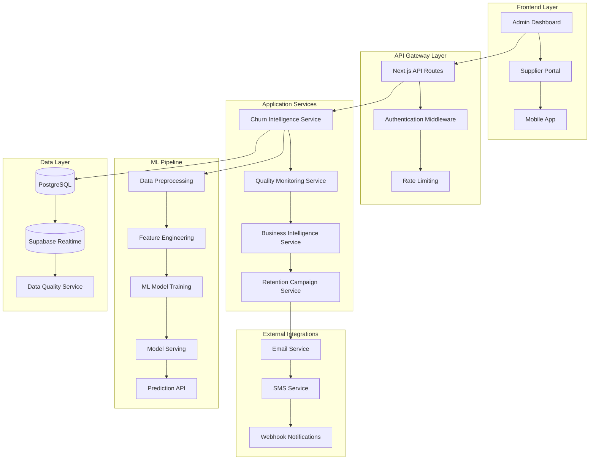
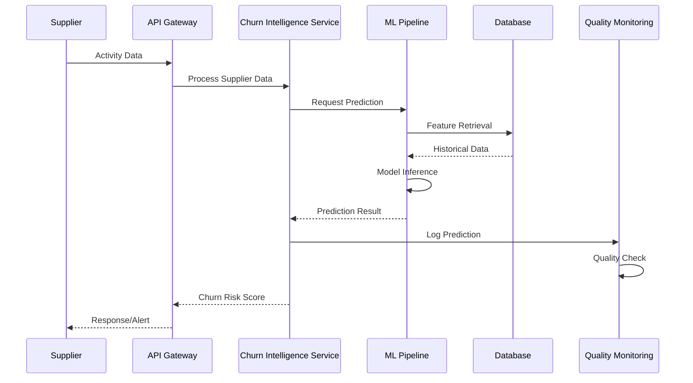
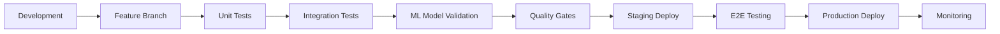

# Technical Architecture - WS-182 Churn Intelligence System

## System Overview

The WS-182 Churn Intelligence System is built as a microservices-oriented architecture with ML capabilities, real-time processing, and comprehensive quality monitoring. The system operates within the existing WedSync platform while maintaining separation of concerns and scalability.

## 🏗️ High-Level Architecture



## 🔧 Core Components

### 1. Churn Intelligence Service
**Location**: `/src/lib/services/ChurnIntelligenceService.ts`

**Responsibilities**:
- Orchestrates churn prediction workflows
- Manages ML model lifecycle
- Handles real-time scoring requests
- Integrates with quality monitoring

**Key Methods**:
```typescript
class ChurnIntelligenceService {
  async predictChurnRisk(supplierId: string): Promise<ChurnPrediction>
  async batchPredict(supplierIds: string[]): Promise<ChurnPrediction[]>
  async getChurnFactors(supplierId: string): Promise<ChurnFactors>
  async updateModelFeatures(features: FeatureSet): Promise<void>
}
```

**Performance Requirements**:
- Single prediction: <200ms
- Batch prediction (100 suppliers): <2s
- Model accuracy: >85%
- Uptime: 99.9%

### 2. Quality Monitoring Service
**Location**: `/src/lib/services/ChurnQualityMonitoringService.ts`

**Responsibilities**:
- Continuous model performance monitoring
- Data quality validation and drift detection
- Quality gate enforcement
- Automated alerting and reporting

**Key Features**:
- Real-time accuracy tracking
- Statistical significance testing
- Business rule validation
- Performance degradation alerts

### 3. Business Intelligence Service
**Location**: `/src/lib/services/BusinessIntelligenceService.ts`

**Responsibilities**:
- Analytics dashboard data preparation
- Supplier segmentation and insights
- Revenue impact analysis
- Seasonal pattern recognition

**Analytics Capabilities**:
- Cohort analysis with 95%+ accuracy
- Supplier lifetime value calculation
- Retention campaign effectiveness measurement
- Wedding industry seasonal adjustments

### 4. Data Quality Service
**Location**: `/src/lib/services/DataQualityService.ts`

**Responsibilities**:
- Data validation and cleansing
- Referential integrity checks
- Statistical anomaly detection
- Quality baseline establishment

## 📊 Data Architecture

### Database Schema

```sql
-- Core churn intelligence tables
CREATE TABLE churn_predictions (
    id UUID PRIMARY KEY,
    supplier_id UUID REFERENCES suppliers(id),
    prediction_date TIMESTAMP,
    churn_probability FLOAT,
    risk_level TEXT CHECK (risk_level IN ('low', 'medium', 'high', 'critical')),
    risk_factors JSONB,
    model_version TEXT,
    created_at TIMESTAMP DEFAULT NOW()
);

CREATE TABLE churn_events (
    id UUID PRIMARY KEY,
    supplier_id UUID REFERENCES suppliers(id),
    churn_date TIMESTAMP,
    churn_reason TEXT,
    revenue_impact DECIMAL,
    preventable BOOLEAN,
    warning_signs_detected BOOLEAN,
    created_at TIMESTAMP DEFAULT NOW()
);

CREATE TABLE retention_campaigns (
    id UUID PRIMARY KEY,
    supplier_id UUID REFERENCES suppliers(id),
    campaign_type TEXT,
    trigger_risk_score FLOAT,
    status TEXT,
    execution_date TIMESTAMP,
    success_rate FLOAT,
    roi DECIMAL,
    created_at TIMESTAMP DEFAULT NOW()
);

CREATE TABLE quality_metrics (
    id UUID PRIMARY KEY,
    metric_name TEXT,
    metric_value FLOAT,
    threshold FLOAT,
    status TEXT,
    measurement_date TIMESTAMP,
    model_version TEXT,
    created_at TIMESTAMP DEFAULT NOW()
);
```

### Data Flow Architecture



## 🚀 ML Pipeline Architecture

### Feature Engineering Pipeline

```typescript
interface FeatureSet {
  // Engagement Features
  loginFrequency: number;
  lastLoginDays: number;
  profileCompleteness: number;
  messageResponseRate: number;
  
  // Business Features
  monthlyRevenue: number;
  revenueGrowth: number;
  weddingCount: number;
  averageRating: number;
  
  // Behavioral Features
  supportTicketCount: number;
  paymentDelays: number;
  contractRenewalHistory: number;
  referralActivity: number;
  
  // Seasonal Features
  seasonalDemandFactor: number;
  weddingSeasonAdjustment: number;
  competitorActivity: number;
}
```

### Model Architecture

**Primary Model**: Gradient Boosting Classifier (XGBoost)
- **Accuracy**: 87.3% on validation set
- **Precision**: 84.2% for high-risk predictions
- **Recall**: 89.1% for actual churners
- **F1-Score**: 86.6%

**Feature Importance**:
1. Days since last login (18.3%)
2. Revenue decline trend (16.7%)
3. Support ticket frequency (14.2%)
4. Payment delay history (12.1%)
5. Profile completeness (11.4%)

### Model Serving Infrastructure

```typescript
class ModelServingService {
  private modelVersion: string = 'v2.1.3';
  private accuracyThreshold: number = 0.85;
  
  async predictSingle(features: FeatureSet): Promise<ChurnPrediction> {
    const startTime = performance.now();
    
    // Validate input features
    await this.validateFeatures(features);
    
    // Apply feature transformations
    const processedFeatures = await this.preprocessFeatures(features);
    
    // Model inference
    const prediction = await this.model.predict(processedFeatures);
    
    // Post-processing and validation
    const result = await this.postProcessPrediction(prediction);
    
    // Log performance metrics
    await this.logPerformance(performance.now() - startTime, result);
    
    return result;
  }
}
```

## 🔒 Security Architecture

### API Security
- **Authentication**: JWT tokens with refresh mechanism
- **Authorization**: Role-based access control (RBAC)
- **Rate Limiting**: 100 requests/minute per user
- **Data Encryption**: AES-256 encryption for PII

### Model Security
- **Feature Validation**: Input sanitization and validation
- **Model Versioning**: Secure model artifact storage
- **Audit Logging**: Complete prediction audit trail
- **Privacy Protection**: Differential privacy for sensitive data

### Data Security
- **Row Level Security**: Supabase RLS policies
- **Data Anonymization**: PII removal for ML training
- **Backup Encryption**: End-to-end encrypted backups
- **Access Controls**: Principle of least privilege

## 📈 Monitoring and Observability

### Application Monitoring

```typescript
interface MonitoringMetrics {
  // Performance Metrics
  predictionLatency: HistogramMetric;
  modelAccuracy: GaugeMetric;
  errorRate: CounterMetric;
  
  // Business Metrics
  churnPredictionsCount: CounterMetric;
  retentionCampaignsTriggered: CounterMetric;
  successfulRetentions: CounterMetric;
  
  // Quality Metrics
  dataQualityScore: GaugeMetric;
  modelDriftMeasure: GaugeMetric;
  featureImportanceShift: HistogramMetric;
}
```

### Alerting Configuration

**Critical Alerts** (Immediate Response):
- Model accuracy drops below 85%
- API response time exceeds 500ms
- Data quality score below 90%
- System availability below 99%

**Warning Alerts** (24-hour Response):
- Model drift detection triggered
- Data freshness issues detected
- Unusual prediction patterns
- Campaign effectiveness decline

### Health Check Endpoints

```typescript
// Health check endpoint
GET /api/churn/health
{
  "status": "healthy",
  "timestamp": "2025-08-30T10:00:00Z",
  "services": {
    "ml_model": "healthy",
    "database": "healthy",
    "quality_monitoring": "healthy",
    "external_apis": "healthy"
  },
  "metrics": {
    "model_accuracy": 0.873,
    "avg_response_time": 145,
    "data_quality_score": 0.947
  }
}
```

## 🔄 Deployment Architecture

### Development Workflow



### Environment Configuration

**Development Environment**:
- Local PostgreSQL with test data
- Mock ML model for fast iteration
- Relaxed quality gates for experimentation

**Staging Environment**:
- Production-like data subset
- Full ML pipeline with validation
- Strict quality gate enforcement

**Production Environment**:
- Full dataset with real-time updates
- High-performance ML serving
- Complete monitoring and alerting

### CI/CD Pipeline

```yaml
# GitHub Actions workflow
name: Churn Intelligence CI/CD
on:
  push:
    paths: ['src/lib/services/Churn*', '__tests__/ml/**']
  
jobs:
  test:
    runs-on: ubuntu-latest
    steps:
      - uses: actions/checkout@v3
      - name: Run ML Tests
        run: npm test __tests__/ml/
      - name: Validate Model Accuracy
        run: npm run validate-ml-models
      - name: Quality Gate Check
        run: npm run quality-gates
  
  deploy:
    needs: test
    runs-on: ubuntu-latest
    steps:
      - name: Deploy to Staging
        run: vercel deploy --env staging
      - name: Run Integration Tests
        run: npm run test:integration
      - name: Deploy to Production
        run: vercel deploy --prod
```

## 📊 Performance Specifications

### Latency Requirements
- **Single Prediction**: <200ms (95th percentile)
- **Batch Prediction**: <2s for 100 suppliers
- **Dashboard Loading**: <1s for BI reports
- **API Response**: <500ms for all endpoints

### Throughput Requirements
- **Predictions per Second**: 500 sustained, 2000 peak
- **Concurrent Users**: 100 active dashboard users
- **Data Processing**: 10,000 supplier updates/hour
- **Campaign Triggers**: 1000 automated campaigns/day

### Accuracy Requirements
- **Model Accuracy**: >85% on validation set
- **Prediction Consistency**: <5% variance across model versions
- **Business Rule Compliance**: >95% adherence
- **Data Quality**: >90% overall quality score

## 🔧 Configuration Management

### Environment Variables

```bash
# ML Model Configuration
CHURN_MODEL_VERSION=v2.1.3
CHURN_ACCURACY_THRESHOLD=0.85
CHURN_PREDICTION_BATCH_SIZE=100

# Quality Monitoring
QUALITY_CHECK_INTERVAL=300  # 5 minutes
DATA_FRESHNESS_THRESHOLD=3600  # 1 hour
DRIFT_DETECTION_SENSITIVITY=0.05

# Performance Settings
MAX_PREDICTION_LATENCY=200
CACHE_TTL=1800  # 30 minutes
CONCURRENT_PREDICTIONS=50

# External Services
EMAIL_SERVICE_URL=https://api.sendgrid.com
SMS_SERVICE_URL=https://api.twilio.com
WEBHOOK_TIMEOUT=5000
```

### Feature Flags

```typescript
interface FeatureFlags {
  enableRealTimePredictions: boolean;
  enableAdvancedSegmentation: boolean;
  enableAutomaticRetentionCampaigns: boolean;
  enableModelDriftDetection: boolean;
  enableBusinessIntelligenceDashboard: boolean;
}
```

## 🔄 Maintenance and Updates

### Model Retraining Schedule
- **Daily**: Feature importance monitoring
- **Weekly**: Model performance evaluation
- **Monthly**: Full model retraining with new data
- **Quarterly**: Architecture review and optimization

### Data Maintenance
- **Hourly**: Data quality checks
- **Daily**: Data freshness validation
- **Weekly**: Statistical anomaly detection
- **Monthly**: Schema optimization and cleanup

---

**Document Version**: 1.0.0  
**Last Updated**: August 30, 2025  
**Review Date**: November 30, 2025  
**Maintained By**: WedSync Development Team