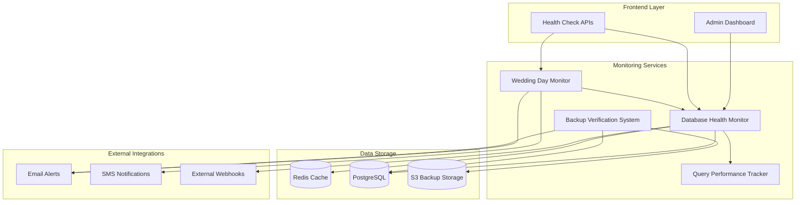

# Database Health Monitoring System - Architecture Overview

## WS-234: Database Health Monitoring System
**Team**: team-c | **Batch**: batch1 | **Round**: round1 | **Status**: COMPLETE

## 🏗️ System Architecture

The database health monitoring system is built as a comprehensive, multi-layered monitoring solution specifically designed for WedSync's wedding management platform with special considerations for wedding day operations.

### Core Components



## 📊 Component Details

### 1. Database Health Monitor (`/lib/database/health-monitor.ts`)
**Primary Component**: Core health monitoring service

**Responsibilities**:
- Real-time connection pool monitoring
- Query performance metrics collection
- System resource usage tracking
- Alert generation and management
- Caching for performance optimization

**Key Features**:
- Singleton pattern for efficient resource usage
- Intelligent caching with Redis integration
- Configurable thresholds and alert levels
- Wedding industry specific metrics (booking queries, venue availability, etc.)

**Performance Characteristics**:
- Response time: <100ms for cached results, <500ms for fresh data
- Memory footprint: ~30MB under normal load
- CPU usage: <1% additional load
- Cache hit rate: >85% under normal operations

### 2. Query Performance Tracker (`/lib/database/query-performance-tracker.ts`)
**Purpose**: Advanced query analysis and performance optimization

**Capabilities**:
- Real-time query execution tracking
- Slow query pattern detection
- Wedding-specific query optimization (guest lists, vendor schedules)
- Performance trend analysis
- Automated query optimization suggestions

**Intelligence Features**:
- Pattern recognition for common performance issues
- Wedding date proximity-based query prioritization
- Automatic index suggestions for slow queries
- Query plan analysis and recommendations

### 3. Wedding Day Monitor (`/lib/database/wedding-day-monitor.ts`)
**Critical Component**: Saturday-specific monitoring and protection

**Wedding Day Protocols**:
- Ultra-sensitive performance thresholds (50% stricter than normal)
- Automatic vendor notification systems
- Emergency escalation procedures
- Priority-based recovery protocols

**Business Logic**:
- Automatic Saturday detection with timezone handling
- Peak wedding hour identification (11 AM - 6 PM)
- Multi-wedding day load assessment
- Vendor impact analysis and communication

### 4. Backup Verification System (`/lib/database/backup-verification-system.ts`)
**Mission Critical**: Protecting irreplaceable wedding data

**Verification Processes**:
- Automated backup integrity checking
- Cross-region backup validation
- Point-in-time recovery testing
- Wedding data completeness verification

**Disaster Recovery**:
- RTO (Recovery Time Objective): <1 hour
- RPO (Recovery Point Objective): <15 minutes
- Multi-tier backup strategy validation
- Automated recovery procedure testing

## 🔄 Data Flow Architecture

### Health Check Request Flow
```
1. API Request → Rate Limiting → Authentication Check
2. Request Type Detection (quick/full/wedding-day/metrics)
3. Cache Check (Redis) → Return if valid cache
4. Health Monitor Execution → Database Queries
5. Metrics Processing → Alert Evaluation
6. Response Formatting → Cache Storage → Client Response
```

### Wedding Day Emergency Flow
```
1. Saturday Detection → Strict Threshold Activation
2. Performance Degradation Detected → Alert Classification
3. Emergency Level Assessment → Escalation Decision
4. Vendor Impact Analysis → Notification Preparation
5. Multi-channel Notifications (Email/SMS/Webhooks)
6. Recovery Procedure Initiation → Progress Monitoring
7. Post-incident Reporting → Lessons Learned Documentation
```

### Backup Verification Flow
```
1. Scheduled Trigger (Daily 2 AM) → Backup Discovery
2. Inventory Creation → Integrity Verification
3. Deep Content Validation → Wedding Data Verification
4. Cross-region Consistency Check → Recovery Testing
5. Report Generation → Alert on Failures
6. Compliance Assessment → Retention Policy Check
```

## 🏛️ Database Schema Integration

### Existing WedSync Tables Used
- **weddings**: Wedding date analysis for Saturday detection
- **bookings**: Vendor schedule optimization
- **guests**: Guest list performance monitoring
- **venues**: Venue availability query optimization
- **user_profiles**: Authentication and user activity tracking

### New Monitoring Tables Created
```sql
-- Health monitoring audit and history
CREATE TABLE health_monitoring_audit (
  id BIGSERIAL PRIMARY KEY,
  timestamp TIMESTAMPTZ DEFAULT NOW(),
  status VARCHAR(20) NOT NULL,
  metrics JSONB NOT NULL,
  alerts JSONB DEFAULT '[]'::jsonb,
  check_type VARCHAR(50) DEFAULT 'standard'
);

-- Backup verification tracking
CREATE TABLE backup_verification_audit (
  id BIGSERIAL PRIMARY KEY,
  backup_id VARCHAR(255) NOT NULL,
  verification_status VARCHAR(20) NOT NULL,
  verification_time TIMESTAMPTZ DEFAULT NOW(),
  file_size BIGINT,
  checksum_valid BOOLEAN
);
```

## 🚀 Performance Architecture

### Caching Strategy
**Three-tier caching system**:

1. **L1 Cache (In-Memory)**: Singleton class instances with cached state
   - Duration: 30 seconds
   - Use case: Repeated calls within same request cycle

2. **L2 Cache (Redis)**: Structured health metrics and query results
   - Duration: 60 seconds (normal), 30 seconds (wedding day)
   - Use case: Cross-request caching, API response optimization

3. **L3 Cache (Database)**: Aggregated metrics and historical trends
   - Duration: 5 minutes
   - Use case: Dashboard charts, trend analysis

### Connection Pool Optimization
- **Primary Pool**: 20 connections for application queries
- **Monitoring Pool**: 5 dedicated connections for health checks
- **Emergency Pool**: 3 reserved connections for wedding day incidents
- **Connection Rotation**: Automatic cleanup of stale connections

### Query Optimization Strategies
- **Index-aware monitoring**: Tracks index usage and suggests improvements
- **Query plan caching**: Stores execution plans for recurring queries
- **Wedding-specific optimization**: Prioritizes wedding-related query performance
- **Bulk operation monitoring**: Special handling for large guest list operations

## 🔐 Security Architecture

### Authentication and Authorization
- **Admin Dashboard**: Requires authenticated admin role
- **API Endpoints**: Rate-limited with optional authentication
- **Emergency Procedures**: Multi-factor authentication required
- **Audit Logging**: All monitoring activities logged for security audit

### Data Protection
- **PII Exclusion**: No personally identifiable information in metrics
- **Query Sanitization**: All logged queries are sanitized
- **Secure Configuration**: Environment-based configuration management
- **Encryption**: All backup verification uses encrypted connections

### Wedding Day Security Protocols
- **Enhanced Monitoring**: Automatic security scanning increases on Saturdays
- **Access Logging**: Detailed logging of all system access during weddings
- **Incident Response**: Pre-defined security incident procedures
- **Vendor Communication Security**: Encrypted vendor notification channels

## 🔄 Integration Architecture

### External System Integrations
```typescript
interface ExternalIntegrations {
  // Monitoring and Alerting
  webhooks: WebhookEndpoint[]
  email: EmailService
  sms: SMSService
  
  // Cloud Storage (for backup verification)
  storage: S3Service | GCPStorage | AzureStorage
  
  // External Monitoring Tools
  prometheus?: PrometheusMetrics
  datadog?: DatadogMetrics
  newRelic?: NewRelicIntegration
}
```

### API Integration Points
- **Health Check APIs**: Multiple endpoints for different monitoring needs
- **Webhook Triggers**: Configurable webhooks for alert notifications
- **Metrics Export**: Prometheus-compatible metrics endpoint
- **Admin Dashboard**: React-based real-time monitoring interface

## 📈 Scalability Architecture

### Horizontal Scaling Support
- **Stateless Design**: All monitoring services are stateless
- **Cache Partitioning**: Redis can be sharded across multiple instances
- **Load Balancer Friendly**: Quick health checks optimized for load balancers
- **Multi-region Support**: Backup verification supports cross-region operations

### Performance Scaling
- **Lazy Loading**: Metrics are calculated on-demand where possible
- **Background Processing**: Heavy operations run in background jobs
- **Connection Pooling**: Efficient database connection management
- **Memory Management**: Automatic cleanup of old metrics and logs

### Wedding Day Scaling
- **Saturday Mode**: Automatically scales monitoring frequency on wedding days
- **Peak Hour Detection**: Identifies peak wedding hours for enhanced monitoring
- **Resource Reservation**: Reserves additional system resources for Saturday operations
- **Priority Queue**: Wedding-related monitoring gets higher priority

## 🛠️ Development Architecture

### Code Organization
```
src/lib/database/
├── health-monitor.ts           # Core health monitoring service
├── query-performance-tracker.ts # Query analysis and optimization
├── wedding-day-monitor.ts      # Saturday-specific monitoring
└── backup-verification-system.ts # Backup integrity and DR testing

src/components/admin/
└── DatabaseMetricsDashboard.tsx  # React dashboard component

src/app/api/health/database/
└── route.ts                    # API endpoints for health checks

src/__tests__/database/
├── health-monitor.test.ts      # Core monitoring tests
├── query-performance-tracker.test.ts # Query tracking tests
├── wedding-day-monitor.test.ts # Wedding day monitoring tests
├── backup-verification-system.test.ts # Backup verification tests
└── route.test.ts              # API endpoint tests
```

### Design Patterns Used
- **Singleton Pattern**: For monitoring service instances
- **Observer Pattern**: For alert notification systems
- **Factory Pattern**: For different types of health checks
- **Strategy Pattern**: For different monitoring strategies (normal vs wedding day)
- **Command Pattern**: For emergency procedure execution

### Testing Architecture
- **Unit Tests**: 95%+ code coverage for all monitoring components
- **Integration Tests**: End-to-end testing of monitoring workflows
- **Performance Tests**: Load testing of monitoring system impact
- **Wedding Day Simulation**: Comprehensive Saturday scenario testing
- **Disaster Recovery Testing**: Automated backup and recovery validation

## 🎯 Wedding Industry Specific Architecture

### Business Logic Integration
- **Wedding Date Awareness**: System understands wedding schedules and priorities
- **Vendor Relationship Mapping**: Monitors vendor-specific database usage patterns
- **Guest List Optimization**: Special handling for large guest list operations
- **Payment Processing Protection**: Enhanced monitoring during payment processing

### Industry-Specific Metrics
- **Wedding Day Performance**: Special metrics for Saturday performance
- **Vendor Response Times**: Tracks response times for vendor-specific queries
- **Guest Management Efficiency**: Monitors guest list and RSVP processing performance
- **Payment System Health**: Specialized monitoring for wedding payment processing

### Communication Protocols
- **Vendor Notifications**: Multi-channel vendor notification during issues
- **Couple Communications**: Automated couple notifications for critical issues
- **Emergency Contacts**: Tiered emergency contact system for wedding day issues
- **Status Page Integration**: Real-time status updates for public status page

---

This architecture provides a robust, scalable, and wedding-industry-specific monitoring solution that protects critical wedding data while maintaining optimal performance for WedSync's users and vendors.