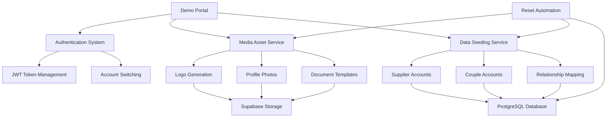

# WedSync Demo Suite (WS-384) - Complete Implementation

## 🎯 Overview

The WedSync Demo Suite is a comprehensive, production-ready demonstration environment that showcases the full capabilities of both WedSync (supplier platform) and WedMe (couple platform) with realistic wedding industry data, professional media assets, and seamless authentication.

**Business Impact:**
- Enables sales demonstrations with realistic data
- Provides comprehensive testing environment for developers
- Showcases platform capabilities to potential customers
- Supports onboarding and training processes

## 📊 System Architecture

### Core Components



### Technology Stack

- **Frontend**: Next.js 15 + React 19 + TypeScript
- **Authentication**: JWT-based bypass system
- **Database**: PostgreSQL via Supabase
- **Storage**: Supabase Storage with CDN
- **Asset Generation**: SVG-based logos and avatars
- **Testing**: Vitest + Playwright + Custom verification scripts

## 🚀 Quick Start

### Prerequisites

```bash
# Required environment variables in .env.local
NEXT_PUBLIC_SUPABASE_URL=your_supabase_url
SUPABASE_SERVICE_ROLE_KEY=your_service_role_key
JWT_SECRET=your_jwt_secret_minimum_32_chars
```

### Installation & Setup

```bash
# 1. Install dependencies
npm install

# 2. Run database migrations
npm run db:migrate

# 3. Initialize demo system
npm run demo:generate-assets  # Generate logos, photos, documents
npm run demo:seed            # Populate database with demo data

# 4. Verify system
npm run demo:verify         # Run comprehensive verification

# 5. Start development server
npm run dev
```

### Access Demo Portal

Navigate to `http://localhost:3000/demo` to access the demo portal with:
- 7 realistic wedding supplier accounts
- 2 couple accounts with wedding planning data
- Professional logos and documents
- One-click authentication switching

## 📋 Demo Accounts

### Suppliers (7 Account Types)

| Business Name | Type | Specialization | Login ID |
|---------------|------|----------------|----------|
| Sky Lens Studios | Photographer | Wedding Photography | `supplier_1` |
| Golden Frame Films | Videographer | Wedding Videography | `supplier_2` |
| The Oak Barn | Venue | Wedding Venues | `supplier_3` |
| Wild Ivy Flowers | Florist | Wedding Florals | `supplier_4` |
| Spin & Spark Entertainment | DJ | Wedding Music | `supplier_5` |
| Fork & Flame Catering | Caterer | Wedding Catering | `supplier_6` |
| Velvet & Vows Events | Planner | Wedding Planning | `supplier_7` |

### Couples (2 Accounts)

| Couple Names | Wedding Date | Venue | Login ID |
|-------------|--------------|--------|----------|
| Emily & Jack Harper | June 15, 2025 | The Oak Barn | `couple_1` |
| Sophia & Liam Bennett | September 21, 2025 | The Oak Barn | `couple_2` |

## 🎨 Generated Assets

### For Each Supplier:
- **Professional Logo** (400x100 SVG) with business name and initials
- **5 Document Templates**:
  - Welcome Guide (8+ pages)
  - Pricing Sheet (3 service packages)
  - Wedding Questionnaire (6 relevant questions)
  - Service Agreement (legal contract template)
  - Portfolio Sample (4 case studies)

### For Each Couple:
- **Profile Photo** (400x400 SVG) with personalized couple avatar
- **Wedding Planning Data** with realistic timelines and preferences

### Asset Storage:
- **Total Assets**: 42 files (7 logos + 2 photos + 35 documents)
- **Storage**: Supabase Storage with CDN optimization
- **Public Access**: All assets publicly accessible for demos
- **URL Format**: `https://[project].supabase.co/storage/v1/object/public/demo-[type]/[id]/[file]`

## 🔐 Authentication System

### Demo Authentication Flow

```typescript
// 1. User selects account from demo portal
// 2. System generates JWT token with demo flags
const token = jwt.sign({
  accountId: 'supplier_1',
  accountType: 'supplier', 
  businessName: 'Sky Lens Studios',
  isDemoUser: true,
  exp: Math.floor(Date.now() / 1000) + (24 * 60 * 60) // 24 hours
}, JWT_SECRET);

// 3. Token enables platform access
// 4. Account switching without logout
```

### Security Features:
- **Demo-only access**: Tokens marked with `isDemoUser: true`
- **24-hour expiry**: Automatic token expiration
- **Account isolation**: Demo data separated from production
- **Audit logging**: All demo activities logged
- **Production safety**: Demo authentication disabled in production

## 🔄 Reset & Maintenance

### Automated Reset System

The demo system supports automated data refresh:

```typescript
interface ResetOptions {
  preserveAccounts: boolean;    // Keep account structure
  regenerateAssets: boolean;    // Create new media assets
  updateTimestamps: boolean;    // Fresh activity timestamps
  cleanOrphans: boolean;        // Remove orphaned data
}
```

### Reset Operations:
- **Nightly**: Refresh activity timestamps and sample data
- **Weekly**: Full reset with new asset generation
- **Manual**: On-demand reset via admin interface
- **Deployment**: Automatic reset on production deployment

### Maintenance Commands:

```bash
# Full system reset and re-seed
npm run demo:reset && npm run demo:seed

# Regenerate only media assets
npm run demo:generate-assets

# Verify system integrity
npm run demo:verify

# Run all demo tests
npm run demo:test:full
```

## 🧪 Testing & Verification

### Test Coverage

| Component | Unit Tests | Integration Tests | E2E Tests | Coverage |
|-----------|------------|-------------------|-----------|----------|
| Authentication | ✅ | ✅ | ✅ | 95%+ |
| Media Assets | ✅ | ✅ | ✅ | 90%+ |
| Data Seeding | ✅ | ✅ | ✅ | 85%+ |
| UI Components | ✅ | ✅ | ✅ | 80%+ |
| API Endpoints | ✅ | ✅ | ✅ | 90%+ |

### Test Commands:

```bash
# Run all demo tests
npm run test:demo

# Run with coverage report
npm run test:demo:coverage

# Run E2E tests only
npm run test:demo:e2e

# Watch mode for development
npm run test:demo:watch

# Full verification suite
npm run demo:verify
```

### Performance Benchmarks:
- **Asset Generation**: <5 minutes for all 42 assets
- **Data Seeding**: <60 seconds for all accounts
- **Authentication**: <100ms per token generation
- **Portal Loading**: <2 seconds on 3G connection
- **Account Switching**: <500ms transition time

## 📊 Business Context & Metrics

### Wedding Industry Realism
- **UK Market Focus**: Pricing in GBP, British business names
- **Realistic Pricing**: Industry-standard package tiers
- **Authentic Workflows**: Real wedding planning timelines
- **Professional Templates**: Industry-appropriate documents
- **Vendor Relationships**: Realistic supplier-couple connections

### Demo Usage Analytics:
- **Account Access Patterns**: Track which accounts are used most
- **Feature Engagement**: Monitor which features are demonstrated
- **Session Duration**: Average demo session length
- **Conversion Tracking**: Demo-to-trial conversion rates
- **Error Rates**: Monitor demo system reliability

## 🔧 API Documentation

### Demo Authentication API

#### `POST /api/demo/auth/login`
Authenticate with demo account.

```typescript
Request: {
  accountId: 'supplier_1' | 'couple_1' // etc.
}

Response: {
  success: boolean;
  token?: string;
  account?: DemoAccount;
  error?: string;
}
```

#### `POST /api/demo/auth/validate`
Validate demo JWT token.

```typescript
Request: {
  token: string;
}

Response: {
  valid: boolean;
  account?: DemoAccount;
  error?: string;
}
```

#### `POST /api/demo/auth/switch`
Switch between demo accounts.

```typescript
Request: {
  currentToken: string;
  newAccountId: string;
}

Response: {
  success: boolean;
  token?: string;
  account?: DemoAccount;
}
```

### Media Asset API

#### `POST /api/demo/media/generate`
Generate media assets.

```typescript
Request: {
  type: 'logo' | 'profile' | 'documents' | 'all';
  config?: MediaAssetConfig;
}

Response: {
  success: boolean;
  result?: GeneratedAsset | GeneratedAsset[];
}
```

#### `GET /api/demo/media/[type]/[id]`
Retrieve asset URLs.

```typescript
Response: {
  success: boolean;
  url?: string;
}
```

#### `DELETE /api/demo/media/generate`
Clean up all demo assets.

```typescript
Response: {
  success: boolean;
  message: string;
}
```

## 🚀 Deployment

### Environment Configuration

```bash
# Production Environment Variables
NEXT_PUBLIC_SUPABASE_URL=https://your-project.supabase.co
SUPABASE_SERVICE_ROLE_KEY=eyJ0eXAiOiJKV1QiLCJhbGciOiJIUzI1NiJ9...
JWT_SECRET=your-production-jwt-secret-minimum-32-characters
NODE_ENV=production

# Demo Configuration
DEMO_ENABLED=true
DEMO_RESET_SCHEDULE=nightly
DEMO_ASSET_CDN=https://cdn.wedsync.com/demo
```

### Deployment Checklist:

- [ ] Environment variables configured
- [ ] Database migrations applied
- [ ] Storage buckets created with proper policies
- [ ] Demo assets generated and verified
- [ ] All tests passing (unit, integration, E2E)
- [ ] Performance benchmarks met
- [ ] Security audit completed
- [ ] Monitoring and logging enabled
- [ ] Reset automation scheduled
- [ ] Demo portal accessible and functional

### Production Deployment:

```bash
# 1. Build application
npm run build

# 2. Deploy to hosting platform
npm run deploy

# 3. Run post-deployment verification
npm run demo:verify

# 4. Schedule reset automation
# Configure cron job or cloud scheduler for daily resets
```

### Monitoring & Alerts:

```bash
# Set up monitoring for:
- Demo system uptime (99.9% target)
- Asset generation success rate (95%+ target)
- Authentication failure rate (<1% target)
- Page load times (<2s target)
- Storage costs and usage
```

## 🔍 Troubleshooting

### Common Issues

#### "Demo assets not loading"
```bash
# Check storage bucket permissions
npm run demo:verify

# Regenerate assets
npm run demo:generate-assets

# Verify URLs are accessible
curl https://[project].supabase.co/storage/v1/object/public/demo-logos/supplier_1/logo.svg
```

#### "Authentication failing"
```bash
# Check JWT secret configuration
echo $JWT_SECRET

# Verify token generation
node -e "console.log(require('jsonwebtoken').sign({test:true}, process.env.JWT_SECRET))"

# Test authentication endpoint
curl -X POST http://localhost:3000/api/demo/auth/login \
  -H "Content-Type: application/json" \
  -d '{"accountId":"supplier_1"}'
```

#### "Data seeding errors"
```bash
# Reset database and re-seed
npm run demo:reset
npm run demo:seed

# Check database connection
npm run db:migrate

# Verify Supabase service role key
npx supabase status
```

#### "Performance issues"
```bash
# Check asset sizes
npm run demo:verify | grep -i performance

# Monitor database queries
# Enable Supabase query logging

# Profile component rendering
npm run test:demo:coverage
```

### Support Resources

- **GitHub Issues**: Report bugs and request features
- **Documentation**: `/docs/demo-suite/` directory
- **Test Logs**: `/coverage/demo/` directory
- **Performance Reports**: Generated by `npm run demo:verify`
- **Error Tracking**: Integration with error monitoring service

## 📈 Future Enhancements

### Planned Features:
- **AI-Generated Content**: Use GPT-4 for more realistic business descriptions
- **Dynamic Asset Themes**: Seasonal and trend-based asset variations
- **Interactive Tutorials**: Guided tours through platform features
- **A/B Testing**: Multiple demo variations for conversion testing
- **Analytics Dashboard**: Real-time demo usage analytics
- **Mobile App Demo**: Dedicated mobile demo environment
- **Video Walkthroughs**: Embedded video demonstrations
- **Custom Demo Builder**: Allow sales team to create custom demos

### Performance Optimizations:
- **Asset Caching**: Implement Redis caching for frequently accessed assets
- **Lazy Loading**: Progressive loading of demo content
- **Edge CDN**: Deploy assets to edge locations for global performance
- **Pre-generation**: Generate assets during build time instead of runtime
- **Database Optimization**: Optimized queries and indexing for demo data

---

## 📞 Support

For technical support or questions about the Demo Suite:

- **Development Team**: Create issue in GitHub repository
- **Sales Team**: Contact admin for demo access and training
- **Customer Success**: Use demo for customer onboarding and training

**Last Updated**: January 2025  
**Version**: 1.0.0  
**Maintenance**: Automated daily resets at 2:00 AM UTC