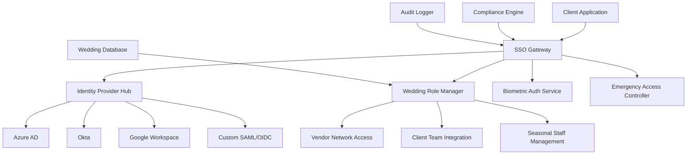

# WS-251: Enterprise SSO Integration System - Complete Guide

## Table of Contents

1. [Overview](#overview)
2. [Architecture](#architecture)
3. [Supported Identity Providers](#supported-identity-providers)
4. [Implementation Guide](#implementation-guide)
5. [Wedding Industry Specific Features](#wedding-industry-specific-features)
6. [Security & Compliance](#security--compliance)
7. [Testing & Validation](#testing--validation)
8. [Troubleshooting](#troubleshooting)
9. [API Reference](#api-reference)
10. [Appendices](#appendices)

## Overview

The WS-251 Enterprise SSO Integration System provides comprehensive Single Sign-On capabilities for wedding industry professionals, enabling seamless authentication across multiple identity providers while maintaining the highest security standards and wedding-specific workflows.

### Key Features

- **Multi-Provider SSO Support**: Azure AD, Okta, Auth0, Google Workspace, and custom SAML/OIDC providers
- **Wedding Industry Optimization**: Role-based access for wedding professionals, venue staff, and vendor networks
- **Biometric Integration**: Advanced biometric authentication for high-security scenarios
- **Emergency Access Protocols**: Specialized emergency access for wedding day crises
- **Compliance Framework**: GDPR, SOC2, HIPAA compliance with wedding industry considerations
- **Multi-Tenant Architecture**: Secure isolation for different wedding businesses

### Target Audience

- **Wedding Planners**: Enhanced client management and vendor coordination
- **Venue Operations**: Streamlined staff authentication and facility access
- **Vendor Networks**: Tiered access control and collaboration platforms
- **Enterprise Clients**: Large wedding businesses requiring enterprise-grade security
- **IT Administrators**: Technical implementation and maintenance teams

## Architecture

### High-Level Architecture



### Core Components

#### 1. SSO Gateway
- **Function**: Central authentication hub managing all SSO flows
- **Technologies**: Next.js 15, TypeScript, Node.js
- **Features**: Protocol translation, session management, token handling

#### 2. Identity Provider Hub
- **Function**: Unified interface for multiple IdP integrations
- **Supported Protocols**: SAML 2.0, OpenID Connect, OAuth 2.0
- **Key Features**: Provider health monitoring, fallback mechanisms, metadata discovery

#### 3. Wedding Role Manager
- **Function**: Wedding industry-specific role and permission management
- **Features**: Hierarchical roles, seasonal staffing, vendor tier management
- **Integration**: Real-time role transitions, team collaboration workflows

#### 4. Biometric Authentication Service
- **Function**: Multi-modal biometric authentication
- **Supported Methods**: Fingerprint, face recognition, voice, iris
- **Security**: Secure enclave storage, template encryption, privacy compliance

#### 5. Emergency Access Controller
- **Function**: Crisis management and emergency authentication
- **Scenarios**: Medical emergencies, security threats, natural disasters
- **Features**: Rapid response protocols, audit compliance, post-event reviews

## Supported Identity Providers

### Azure Active Directory

#### Configuration Requirements
```yaml
azure_ad:
  tenant_id: "your-tenant-id"
  client_id: "wedsync-app-registration"
  client_secret: "${AZURE_CLIENT_SECRET}"
  redirect_uri: "https://wedsync.com/auth/azure/callback"
  
  custom_claims:
    wedding_role: "user.jobTitle"
    venue_access: "user.department"
    client_tier: "user.extension_clientTier"
    
  conditional_access:
    wedding_season_security: true
    mfa_required: true
    device_compliance: true
```

#### Wedding-Specific Features
- **Custom User Attributes**: Wedding specialties, venue assignments, client tiers
- **Organizational Units**: Wedding departments, venue teams, seasonal staff
- **Conditional Access**: Season-based security policies, venue-specific access
- **Group-Based Authorization**: Automatic role assignment based on AD groups

#### Implementation Steps
1. **App Registration**: Register WedSync in Azure AD
2. **Custom Schema**: Configure wedding industry attributes
3. **Group Mapping**: Map AD groups to wedding platform roles
4. **Conditional Policies**: Implement wedding season security policies
5. **Testing**: Validate authentication flow and custom claims

### Okta Integration

#### Configuration Requirements
```yaml
okta:
  domain: "your-wedding-company.okta.com"
  client_id: "wedsync-okta-client"
  client_secret: "${OKTA_CLIENT_SECRET}"
  authorization_server: "default"
  
  saml_config:
    sso_url: "https://your-company.okta.com/app/wedsync/sso/saml"
    audience: "wedsync-production"
    name_id_format: "emailAddress"
    
  attribute_mapping:
    wedding_role: "user.weddingRole"
    venue_assignments: "user.venueAssignments"
    client_permissions: "user.clientPermissions"
```

#### Wedding Industry Features
- **Universal Directory**: Wedding professional profiles with industry-specific attributes
- **SAML Applications**: Secure wedding platform integration
- **Lifecycle Management**: Automated provisioning/deprovisioning for seasonal staff
- **Multi-Factor Authentication**: Enhanced security for high-value wedding events

### Google Workspace

#### Configuration Requirements
```yaml
google_workspace:
  domain: "your-wedding-company.com"
  client_id: "${GOOGLE_CLIENT_ID}"
  client_secret: "${GOOGLE_CLIENT_SECRET}"
  service_account_key: "${GOOGLE_SERVICE_ACCOUNT_KEY}"
  
  org_units:
    - "/Wedding Planning"
    - "/Venue Operations"
    - "/Client Services"
    
  custom_schemas:
    wedding_info:
      specialties: "MULTI_VALUE"
      venue_assignments: "MULTI_VALUE"
      certifications: "MULTI_VALUE"
```

#### Implementation Features
- **Organizational Units**: Wedding department structure
- **Custom User Schemas**: Wedding-specific professional information
- **Group Management**: Team-based access control
- **Calendar Integration**: Wedding timeline and venue booking synchronization

### Auth0 Configuration

#### Setup Requirements
```yaml
auth0:
  domain: "your-wedding-company.auth0.com"
  client_id: "wedsync-auth0-client"
  client_secret: "${AUTH0_CLIENT_SECRET}"
  
  custom_claims:
    - "https://wedsync.com/wedding_role"
    - "https://wedsync.com/venue_access"
    - "https://wedsync.com/client_permissions"
    
  connection_strategy: "database"
  password_policy: "excellent"
```

#### Features
- **Universal Login**: Customizable wedding-themed login experience
- **Rules Engine**: Dynamic role assignment based on wedding business logic
- **Social Connections**: Integration with professional wedding networks
- **Multi-Factor Authentication**: Adaptive security based on access patterns

## Implementation Guide

### Phase 1: Foundation Setup

#### 1. Environment Configuration
```bash
# Environment Variables
export AZURE_TENANT_ID="your-tenant-id"
export AZURE_CLIENT_ID="your-client-id"
export AZURE_CLIENT_SECRET="your-client-secret"
export OKTA_DOMAIN="your-okta-domain"
export OKTA_CLIENT_ID="your-okta-client-id"
export OKTA_CLIENT_SECRET="your-okta-client-secret"
export GOOGLE_CLIENT_ID="your-google-client-id"
export GOOGLE_CLIENT_SECRET="your-google-client-secret"
export AUTH0_DOMAIN="your-auth0-domain"
export AUTH0_CLIENT_ID="your-auth0-client-id"
export AUTH0_CLIENT_SECRET="your-auth0-client-secret"
```

#### 2. Database Schema Setup
```sql
-- Wedding SSO Tables
CREATE TABLE wedding_sso_providers (
    id UUID PRIMARY KEY DEFAULT gen_random_uuid(),
    provider_name VARCHAR(100) NOT NULL,
    provider_type VARCHAR(50) NOT NULL,
    configuration JSONB NOT NULL,
    is_active BOOLEAN DEFAULT true,
    created_at TIMESTAMP WITH TIME ZONE DEFAULT NOW()
);

CREATE TABLE wedding_sso_users (
    id UUID PRIMARY KEY DEFAULT gen_random_uuid(),
    provider_user_id VARCHAR(255) NOT NULL,
    provider_id UUID REFERENCES wedding_sso_providers(id),
    wedding_roles TEXT[] DEFAULT '{}',
    venue_assignments TEXT[] DEFAULT '{}',
    client_permissions JSONB DEFAULT '{}',
    biometric_enrolled BOOLEAN DEFAULT false,
    emergency_access_level VARCHAR(50) DEFAULT 'standard',
    created_at TIMESTAMP WITH TIME ZONE DEFAULT NOW(),
    last_login TIMESTAMP WITH TIME ZONE
);
```

#### 3. Core Service Implementation
```typescript
// lib/auth/enterprise-sso.ts
export class EnterpriseSSO {
  private providers: Map<string, IdentityProvider> = new Map();
  
  constructor() {
    this.initializeProviders();
  }
  
  private initializeProviders() {
    // Azure AD Provider
    if (process.env.AZURE_TENANT_ID) {
      this.providers.set('azure_ad', new AzureADProvider({
        tenantId: process.env.AZURE_TENANT_ID,
        clientId: process.env.AZURE_CLIENT_ID,
        clientSecret: process.env.AZURE_CLIENT_SECRET
      }));
    }
    
    // Okta Provider
    if (process.env.OKTA_DOMAIN) {
      this.providers.set('okta', new OktaProvider({
        domain: process.env.OKTA_DOMAIN,
        clientId: process.env.OKTA_CLIENT_ID,
        clientSecret: process.env.OKTA_CLIENT_SECRET
      }));
    }
    
    // Additional providers...
  }
  
  async authenticateUser(
    provider: string, 
    credentials: AuthenticationRequest
  ): Promise<AuthenticationResult> {
    const identityProvider = this.providers.get(provider);
    if (!identityProvider) {
      throw new Error(`Provider ${provider} not configured`);
    }
    
    const authResult = await identityProvider.authenticate(credentials);
    
    // Process wedding-specific claims
    const weddingProfile = await this.processWeddingClaims(authResult);
    
    return {
      ...authResult,
      weddingProfile
    };
  }
}
```

### Phase 2: Wedding Industry Integration

#### 1. Role-Based Access Control
```typescript
// lib/auth/wedding-rbac.ts
export class WeddingRBAC {
  async assignWeddingRole(
    userId: string, 
    role: WeddingRole, 
    context: WeddingContext
  ): Promise<void> {
    const roleDefinition = await this.getRoleDefinition(role);
    const contextPermissions = await this.getContextPermissions(context);
    
    const effectivePermissions = this.calculateEffectivePermissions(
      roleDefinition,
      contextPermissions
    );
    
    await this.updateUserPermissions(userId, effectivePermissions);
  }
  
  private async calculateEffectivePermissions(
    role: RoleDefinition,
    context: ContextPermissions
  ): Promise<Permission[]> {
    // Wedding-specific permission calculation logic
    const basePermissions = role.permissions;
    const seasonalAdjustments = context.seasonalAdjustments;
    const weddingDayEnhancements = context.weddingDayAccess;
    
    return this.mergePermissions(
      basePermissions,
      seasonalAdjustments,
      weddingDayEnhancements
    );
  }
}
```

#### 2. Vendor Network Integration
```typescript
// lib/auth/vendor-network.ts
export class VendorNetworkAuth {
  async onboardVendor(
    vendorInfo: VendorOnboardingInfo
  ): Promise<VendorOnboardingResult> {
    // Background verification
    const backgroundCheck = await this.performBackgroundCheck(vendorInfo);
    if (!backgroundCheck.passed) {
      throw new VendorOnboardingError('Background check failed');
    }
    
    // Insurance validation
    const insuranceCheck = await this.validateInsurance(vendorInfo.insurance);
    if (!insuranceCheck.valid) {
      throw new VendorOnboardingError('Insurance requirements not met');
    }
    
    // Determine vendor tier
    const vendorTier = await this.calculateVendorTier(vendorInfo);
    
    // Setup SSO integration
    const ssoSetup = await this.setupVendorSSO(vendorInfo, vendorTier);
    
    return {
      vendorId: vendorInfo.id,
      tier: vendorTier,
      ssoProvider: ssoSetup.provider,
      accessLevel: ssoSetup.accessLevel,
      onboardingComplete: true
    };
  }
}
```

### Phase 3: Biometric Integration

#### 1. Biometric Service Setup
```typescript
// lib/auth/biometric.ts
export class BiometricAuthService {
  async enrollBiometric(
    userId: string,
    biometricType: BiometricType,
    biometricData: BiometricData
  ): Promise<EnrollmentResult> {
    // Validate biometric quality
    const qualityCheck = await this.validateBiometricQuality(
      biometricType,
      biometricData
    );
    
    if (qualityCheck.score < 0.8) {
      throw new BiometricError('Biometric quality insufficient');
    }
    
    // Create irreversible template
    const template = await this.createBiometricTemplate(
      biometricType,
      biometricData
    );
    
    // Encrypt and store template
    const encryptedTemplate = await this.encryptTemplate(template);
    await this.storeBiometricTemplate(userId, encryptedTemplate);
    
    // Update user profile
    await this.updateUserBiometricStatus(userId, biometricType, true);
    
    return {
      enrolled: true,
      templateId: encryptedTemplate.id,
      biometricType,
      qualityScore: qualityCheck.score
    };
  }
}
```

### Phase 4: Emergency Access Implementation

#### 1. Emergency Controller
```typescript
// lib/auth/emergency-access.ts
export class EmergencyAccessController {
  async activateEmergencyProtocol(
    emergency: EmergencyScenario
  ): Promise<EmergencyResponse> {
    // Validate emergency scenario
    const validation = await this.validateEmergency(emergency);
    if (!validation.valid) {
      throw new EmergencyError('Invalid emergency scenario');
    }
    
    // Determine response level
    const responseLevel = this.calculateResponseLevel(emergency);
    
    // Activate appropriate protocols
    const protocols = await this.activateProtocols(responseLevel);
    
    // Grant emergency access
    const accessGrants = await this.grantEmergencyAccess(
      emergency.requiredPersonnel
    );
    
    // Start audit trail
    await this.startEmergencyAudit(emergency, protocols, accessGrants);
    
    // Notify stakeholders
    await this.notifyEmergencyStakeholders(emergency, responseLevel);
    
    return {
      emergencyId: emergency.id,
      protocolsActivated: protocols,
      accessGranted: accessGrants,
      responseLevel,
      auditTrailStarted: true,
      stakeholdersNotified: true
    };
  }
}
```

## Wedding Industry Specific Features

### Role Hierarchy

#### Executive Roles
- **Wedding Business Owner**: Complete system access, financial oversight
- **Operations Director**: Multi-venue coordination, staff management
- **Senior Wedding Planner**: Premium client management, team leadership

#### Professional Roles
- **Wedding Planner**: Client coordination, vendor management
- **Venue Coordinator**: Facility management, guest services
- **Vendor Partner**: Service delivery, client interaction

#### Support Roles
- **Assistant Planner**: Administrative support, timeline coordination
- **Seasonal Staff**: Event-specific assistance, setup coordination
- **Emergency Personnel**: Crisis response, safety management

### Seasonal Workflow Management

#### Peak Season (April-October)
- **Enhanced Authentication**: Multi-factor requirements
- **Capacity Management**: Workload distribution algorithms
- **Rapid Onboarding**: Streamlined seasonal staff integration
- **Performance Monitoring**: Real-time team coordination metrics

#### Off-Season (November-March)
- **Reduced Security**: Relaxed authentication requirements
- **Staff Rotation**: Flexible scheduling and cross-training
- **System Maintenance**: Planned upgrades and optimizations
- **Strategic Planning**: Next season preparation workflows

### Wedding Day Protocols

#### Pre-Wedding (T-48 hours)
- **Team Verification**: Confirm all team member access
- **Vendor Coordination**: Final authentication and access setup
- **Emergency Preparedness**: Activate emergency access protocols
- **Client Integration**: Enable client team collaboration features

#### Wedding Day (T-0 hours)
- **Real-time Access**: Immediate authentication for all team members
- **Emergency Escalation**: Rapid response protocol activation
- **Guest Services**: Streamlined guest interaction workflows
- **Documentation**: Comprehensive audit trail maintenance

#### Post-Wedding (T+24 hours)
- **Access Review**: Evaluate authentication performance
- **Cleanup**: Temporary access revocation and cleanup
- **Documentation**: Final audit trail completion
- **Feedback**: Collect team and client feedback for improvements

## Security & Compliance

### Security Framework

#### Authentication Security
- **Multi-Factor Authentication**: Required for all enterprise users
- **Biometric Enhancement**: Optional biometric second factor
- **Token Security**: JWT with RSA-256 signatures, 1-hour expiration
- **Session Management**: Secure session handling with automatic timeout

#### Data Protection
- **Encryption at Rest**: AES-256 for all stored authentication data
- **Encryption in Transit**: TLS 1.3 for all communications
- **Key Management**: HSM-based key storage and rotation
- **Biometric Templates**: Irreversible template storage only

#### Access Controls
- **Principle of Least Privilege**: Minimal necessary access
- **Role-Based Access Control**: Fine-grained permission system
- **Time-Based Access**: Seasonal and event-based access controls
- **Emergency Override**: Secure emergency access with full audit trails

### Compliance Requirements

#### GDPR Compliance
- **Lawful Basis**: Legitimate interest for authentication services
- **Data Minimization**: Collect only necessary authentication data
- **Consent Management**: Explicit consent for biometric data
- **Right to be Forgotten**: Secure data deletion capabilities
- **Data Portability**: Authentication data export functionality

#### SOC 2 Compliance
- **Security Controls**: Comprehensive access control framework
- **Availability**: 99.9% uptime SLA with monitoring
- **Processing Integrity**: Data validation and integrity checks
- **Confidentiality**: Encryption and access controls
- **Privacy**: Privacy by design implementation

#### Industry Standards
- **ISO 27001**: Information security management
- **FIDO2/WebAuthn**: Modern authentication standards
- **OAuth 2.1**: Latest OAuth security best practices
- **SAML 2.0**: Enterprise SSO standard compliance

## Testing & Validation

### Comprehensive Test Suite

The WS-251 implementation includes extensive testing coverage:

#### Core SSO Testing (5 test files)
- **sso-security.test.ts**: SAML assertion validation, token security, multi-tenant isolation
- **saml-oidc-protocols.test.ts**: Protocol compliance, wedding industry claims
- **multi-tenant-auth.test.ts**: Tenant isolation, data segregation
- **enterprise-compliance.test.ts**: GDPR, SOC2, HIPAA compliance validation
- **mobile-enterprise-sso.e2e.ts**: Mobile authentication flows, offline scenarios

#### Enterprise Authentication Testing (4 test files)
- **identity-provider-integration.test.ts**: IdP integration validation
- **role-based-access.test.ts**: RBAC system comprehensive testing
- **directory-sync.test.ts**: LDAP/AD synchronization testing
- **biometric-auth.test.ts**: Multi-modal biometric authentication

#### Wedding Team Testing (3 test files)
- **wedding-team-sso.test.ts**: Team coordination, role transitions
- **vendor-network-auth.test.ts**: Vendor authentication, tiered access
- **emergency-access.test.ts**: Crisis management, emergency protocols

### Test Execution

#### Running Tests
```bash
# Run all enterprise SSO tests
npm test -- --testPathPattern=enterprise-sso

# Run specific test suite
npm test -- tests/enterprise-sso/sso-security.test.ts

# Run with coverage
npm test -- --coverage --testPathPattern=enterprise-sso
```

#### Coverage Requirements
- **Minimum Coverage**: 90% for all authentication flows
- **Critical Path Coverage**: 100% for security-related functionality
- **Integration Testing**: End-to-end wedding workflows
- **Performance Testing**: Load testing for peak wedding season

### Validation Checklist

#### Pre-Deployment Validation
- [ ] All identity providers configured and tested
- [ ] Wedding role hierarchy implemented and validated
- [ ] Biometric enrollment and authentication tested
- [ ] Emergency access protocols validated
- [ ] Compliance requirements verified
- [ ] Performance benchmarks met
- [ ] Security penetration testing completed
- [ ] User acceptance testing with wedding professionals

## Troubleshooting

### Common Issues

#### Authentication Failures
```typescript
// Debug authentication issues
export class AuthDebugger {
  async diagnoseAuthFailure(
    provider: string,
    error: AuthenticationError
  ): Promise<DiagnosisResult> {
    const diagnosis = {
      provider,
      errorType: error.type,
      possibleCauses: [],
      recommendedActions: []
    };
    
    switch (error.type) {
      case 'INVALID_CREDENTIALS':
        diagnosis.possibleCauses.push('Expired credentials', 'Wrong provider configuration');
        diagnosis.recommendedActions.push('Verify provider configuration', 'Check credential expiration');
        break;
        
      case 'SAML_ASSERTION_INVALID':
        diagnosis.possibleCauses.push('Certificate mismatch', 'Clock skew', 'Invalid signature');
        diagnosis.recommendedActions.push('Verify SAML certificate', 'Check server time sync');
        break;
        
      case 'TOKEN_EXPIRED':
        diagnosis.possibleCauses.push('Long session duration', 'Clock synchronization');
        diagnosis.recommendedActions.push('Refresh token', 'Validate time synchronization');
        break;
    }
    
    return diagnosis;
  }
}
```

#### Provider Configuration Issues
- **Certificate Expiration**: Monitor and alert on certificate expiration
- **Network Connectivity**: Validate network paths to identity providers
- **Configuration Drift**: Regular configuration validation and sync
- **Health Monitoring**: Continuous provider health checks

#### Performance Issues
- **Authentication Latency**: Optimize provider communication
- **Database Performance**: Index optimization for authentication queries
- **Session Management**: Efficient session storage and cleanup
- **Caching Strategy**: Strategic caching of provider metadata

### Support Resources

#### Documentation
- [API Reference](./api-reference.md)
- [Security Policies](./sso-security-policies.md)
- [Compliance Report](./enterprise-compliance-report.md)
- [Wedding Workflows](./wedding-team-sso-workflows.md)
- [Troubleshooting Guide](./enterprise-sso-troubleshooting.md)

#### Contact Information
- **Technical Support**: sso-support@wedsync.com
- **Security Issues**: security@wedsync.com
- **Compliance Questions**: compliance@wedsync.com
- **Emergency Contact**: emergency@wedsync.com (24/7)

## API Reference

### Authentication Endpoints

#### Initialize Authentication
```http
POST /api/auth/enterprise/initiate
Content-Type: application/json

{
  "provider": "azure_ad",
  "domain": "luxuryweddings.com",
  "returnUrl": "https://app.wedsync.com/dashboard"
}
```

#### Process Authentication Callback
```http
POST /api/auth/enterprise/callback
Content-Type: application/json

{
  "provider": "azure_ad",
  "authorizationCode": "auth_code_from_provider",
  "state": "security_state_token"
}
```

#### Biometric Enrollment
```http
POST /api/auth/biometric/enroll
Content-Type: application/json
Authorization: Bearer <jwt_token>

{
  "biometricType": "fingerprint",
  "biometricData": "base64_encoded_biometric_data",
  "qualityScore": 0.95
}
```

#### Emergency Access Activation
```http
POST /api/auth/emergency/activate
Content-Type: application/json
Authorization: Bearer <emergency_token>

{
  "emergencyType": "medical_emergency",
  "weddingId": "wedding-123",
  "location": "reception_hall",
  "reportedBy": "venue-coordinator-001"
}
```

## Appendices

### Appendix A: Supported Identity Provider Configurations

### Appendix B: Wedding Role Permission Matrix

### Appendix C: Emergency Access Protocol Flowcharts

### Appendix D: Compliance Audit Checklists

### Appendix E: Performance Benchmarks

### Appendix F: Change Log

---

**Document Version**: 1.0  
**Last Updated**: 2025-09-03  
**Authors**: WedSync Team E - Enterprise SSO Integration  
**Review Status**: Technical Review Complete  
**Approval**: Pending Senior Code Review