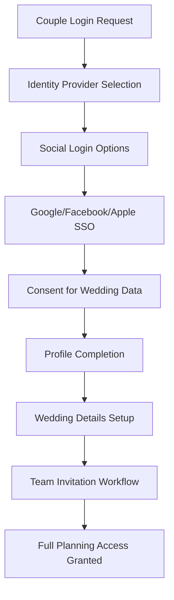
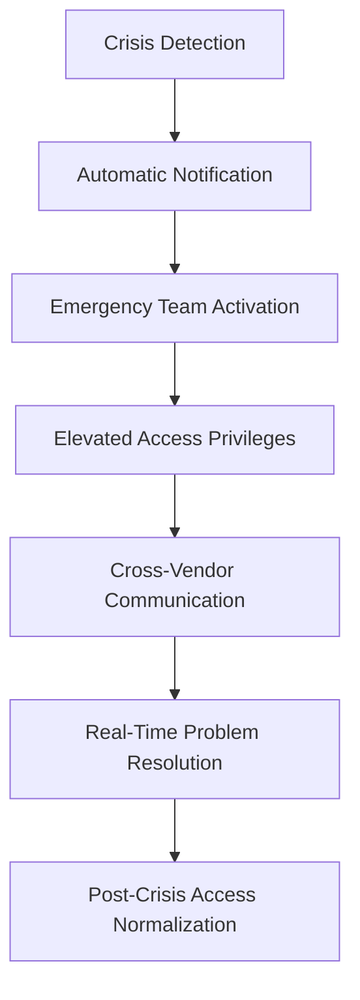
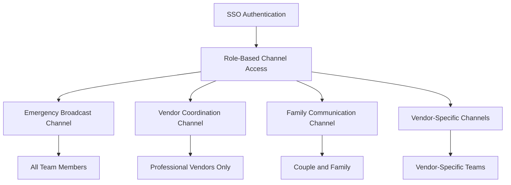
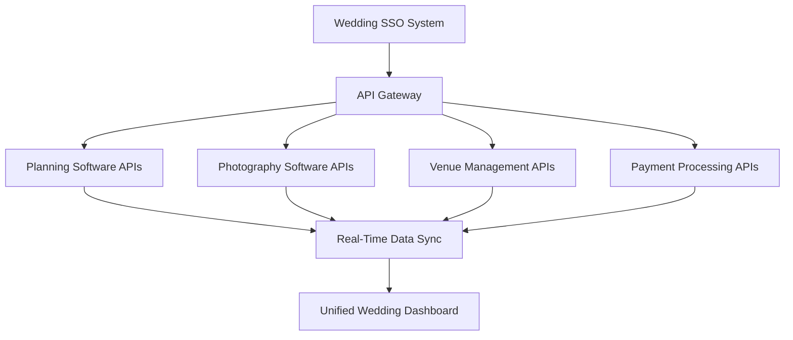

# Wedding Team SSO Workflows
## WS-251 Enterprise SSO Integration System - Team E Implementation

### Document Information
- **Document ID**: WS-251-DOC-004
- **Version**: 1.0.0
- **Created**: 2025-01-24
- **Team**: Team E (QA/Testing & Documentation Specialists)
- **Classification**: Internal - Operational Procedures

## 1. Executive Summary

This document defines comprehensive Single Sign-On workflows specifically designed for wedding industry teams, addressing the unique collaborative requirements where multiple vendors, family members, and service providers must coordinate seamlessly while maintaining appropriate security boundaries and access controls throughout the wedding planning and execution phases.

## 2. Wedding Team Structure and SSO Integration

### 2.1 Multi-Disciplinary Wedding Team Composition

#### 2.1.1 Core Wedding Team Roles
```typescript
interface WeddingTeamStructure {
  primaryStakeholders: {
    couple: ['bride', 'groom', 'partner1', 'partner2'];
    familyCoordinators: ['bride-family', 'groom-family', 'joint-coordination'];
  };
  professionalServices: {
    planningServices: ['wedding-planner', 'day-of-coordinator', 'assistant-planner'];
    venueServices: ['venue-manager', 'catering-manager', 'bar-manager', 'maintenance'];
    creativeServices: ['photographer', 'videographer', 'florist', 'decorator'];
    entertainmentServices: ['dj', 'band', 'mc', 'lighting-technician'];
    supportServices: ['transportation', 'security', 'medical-standby'];
  };
  emergencyRoles: ['emergency-coordinator', 'backup-planner', 'vendor-substitute'];
}
```

#### 2.1.2 Dynamic Team Composition
- **Pre-Wedding Phase**: Gradual team assembly over 6-18 months
- **Final Month**: Full team activation with daily coordination
- **Wedding Week**: 24/7 team availability and communication
- **Wedding Day**: Real-time coordination with location-based access
- **Post-Wedding**: Reduced team with cleanup and final deliverables

### 2.2 SSO Workflow Patterns

#### 2.2.1 Progressive Team Onboarding
```typescript
interface TeamOnboardingWorkflow {
  phases: {
    initial: {
      duration: 'months-12-to-6-before';
      teamSize: '3-5-core-members';
      accessLevel: 'basic-planning-tools';
      ssoRequirement: 'standard-authentication';
    };
    planning: {
      duration: 'months-6-to-1-before';
      teamSize: '8-12-active-members';
      accessLevel: 'full-planning-collaboration';
      ssoRequirement: 'role-based-access-control';
    };
    execution: {
      duration: 'week-before-to-day-after';
      teamSize: '15-25-all-hands';
      accessLevel: 'real-time-operational-access';
      ssoRequirement: 'emergency-access-protocols';
    };
  };
}
```

## 3. Role-Specific SSO Workflows

### 3.1 Couple and Family Workflows

#### 3.1.1 Couple Primary Access Flow


#### 3.1.2 Family Coordinator Integration
```typescript
interface FamilyCoordinatorSSO {
  invitationMethod: 'couple-initiated-invitation';
  verificationRequired: 'phone-or-email-verification';
  accessScope: {
    viewPermissions: ['timeline', 'vendor-contacts', 'guest-lists'];
    editPermissions: ['family-specific-tasks', 'guest-rsvp'];
    restrictedAccess: ['financial-information', 'contracts'];
  };
  delegationCapabilities: 'invite-family-members-with-limited-scope';
}
```

### 3.2 Professional Vendor Workflows

#### 3.2.1 Wedding Planner Master Access
```typescript
interface WeddingPlannerSSO {
  authenticationLevel: 'enterprise-grade-required';
  businessVerification: 'professional-license-validation';
  accessScope: {
    clientManagement: 'multiple-wedding-access';
    vendorCoordination: 'full-vendor-network-access';
    financialTools: 'budget-management-invoice-processing';
    emergencyOverrides: 'day-of-emergency-access-all-systems';
  };
  multiTenantCapabilities: 'cross-wedding-context-switching';
}
```

#### 3.2.2 Vendor Collaborative Access Flow


### 3.3 Venue Team Integration

#### 3.3.1 Venue Management Workflow
```typescript
interface VenueManagementSSO {
  organizationalStructure: {
    venueManager: 'full-facility-access-financial-authority';
    eventCoordinator: 'wedding-day-operational-access';
    supportStaff: 'task-specific-limited-access';
    maintenanceTeam: 'facility-systems-access-only';
  };
  locationBasedAccess: {
    onSiteAuthentication: 'proximity-based-automatic-login';
    emergencyAccess: 'master-key-override-capabilities';
    guestNetworkIsolation: 'separate-guest-wifi-no-operational-access';
  };
}
```

## 4. Temporal SSO Workflow Automation

### 4.1 Timeline-Based Access Control

#### 4.1.1 Automated Access Progression
```typescript
interface TemporalAccessControl {
  phases: {
    earlyPlanning: {
      timeframe: '12-months-to-6-months-before';
      activeRoles: ['couple', 'wedding-planner', 'key-venues'];
      automatedTasks: ['vendor-research-access', 'budget-tool-activation'];
    };
    detailedPlanning: {
      timeframe: '6-months-to-1-month-before';
      activeRoles: 'all-major-vendors';
      automatedTasks: ['timeline-sharing', 'collaborative-editing'];
    };
    finalPreparation: {
      timeframe: '1-month-to-wedding-day';
      activeRoles: 'complete-wedding-team';
      automatedTasks: ['daily-checklist-access', 'emergency-contact-activation'];
    };
    weddingDay: {
      timeframe: 'wedding-day-24-hour-window';
      activeRoles: 'all-personnel-including-backup';
      automatedTasks: ['real-time-updates', 'location-based-access'];
    };
  };
}
```

#### 4.1.2 Seasonal Access Patterns
```typescript
interface SeasonalAccessManagement {
  weddingSeason: {
    peakSeason: 'april-to-october';
    accessPattern: 'extended-hours-weekend-availability';
    teamScaling: 'temporary-staff-rapid-onboarding';
  };
  offSeason: {
    reducedOperations: 'november-to-march';
    accessPattern: 'business-hours-only';
    teamMaintenance: 'permanent-staff-training-updates';
  };
}
```

### 4.2 Event-Driven Access Workflows

#### 4.2.1 Crisis Response Access Escalation


#### 4.2.2 Weather Emergency Protocols
```typescript
interface WeatherEmergencySSO {
  triggers: ['severe-weather-alert', 'venue-evacuation', 'outdoor-event-relocation'];
  automaticActivation: {
    emergencyTeam: 'instant-access-all-backup-systems';
    communicationChannels: 'mass-notification-system-activation';
    decisionAuthority: 'temporary-elevated-permissions';
  };
  fallbackProcedures: {
    offlineCapability: 'local-device-cached-critical-info';
    satelliteComms: 'backup-communication-for-remote-venues';
  };
}
```

## 5. Multi-Vendor Collaboration Workflows

### 5.1 Vendor Network Integration

#### 5.1.1 Cross-Vendor SSO Federation
```typescript
interface VendorFederationSSO {
  networkStructure: {
    primaryVendors: 'direct-client-relationship';
    subVendors: 'contractor-relationship-through-primary';
    emergencyVendors: 'on-call-backup-services';
  };
  authenticationChain: {
    primaryAuth: 'vendor-business-sso-system';
    weddingAuth: 'wedding-specific-project-access';
    guestAuth: 'temporary-day-of-event-access';
  };
  dataSharing: {
    timeline: 'read-access-for-coordination';
    contacts: 'relevant-contact-info-only';
    requirements: 'specific-vendor-needs-and-constraints';
  };
}
```

#### 5.1.2 Vendor Hierarchy and Permissions
```typescript
enum VendorAccessLevel {
  TIER1_PRIMARY = 'full-wedding-access-financial-authority',
  TIER2_SECONDARY = 'coordination-access-no-financial',
  TIER3_SUPPORT = 'task-specific-limited-timeframe',
  TIER4_EMERGENCY = 'emergency-only-supervised-access'
}

interface VendorPermissionMatrix {
  photographyTeam: {
    lead: VendorAccessLevel.TIER1_PRIMARY;
    second: VendorAccessLevel.TIER2_SECONDARY;
    assistant: VendorAccessLevel.TIER3_SUPPORT;
  };
  cateringTeam: {
    manager: VendorAccessLevel.TIER1_PRIMARY;
    chef: VendorAccessLevel.TIER2_SECONDARY;
    servers: VendorAccessLevel.TIER3_SUPPORT;
  };
}
```

### 5.2 Real-Time Collaboration Features

#### 5.2.1 Live Wedding Day Dashboard
```typescript
interface WeddingDayDashboard {
  realTimeUpdates: {
    timelineStatus: 'live-progress-tracking';
    vendorCheckins: 'arrival-and-setup-confirmation';
    issueTracking: 'problem-reporting-and-resolution';
    guestFlow: 'arrival-patterns-and-special-needs';
  };
  collaborativeTools: {
    instantMessaging: 'team-chat-with-priority-channels';
    taskManagement: 'real-time-task-assignment-completion';
    documentSharing: 'live-document-updates';
    photoSharing: 'real-time-photo-uploads-approval';
  };
}
```

#### 5.2.2 Communication Channel Management


## 6. Mobile-First Wedding Workflows

### 6.1 Mobile SSO Optimization

#### 6.1.1 Mobile Authentication Flows
```typescript
interface MobileWeddingSSO {
  quickAccess: {
    biometricLogin: 'fingerprint-face-id-voice';
    wearableIntegration: 'apple-watch-quick-actions';
    offlineCapability: 'cached-credentials-emergency-access';
  };
  locationAwareness: {
    venueProximity: 'automatic-context-switching';
    geoFencing: 'location-based-feature-activation';
    emergencyLocation: 'automatic-location-sharing-crisis';
  };
  batteryOptimization: {
    backgroundSync: 'efficient-data-synchronization';
    powerSaving: 'essential-features-low-battery-mode';
    offlineFirst: 'local-storage-sync-when-available';
  };
}
```

#### 6.1.2 Progressive Web App Integration
```typescript
interface WeddingPWA {
  installationPrompts: {
    coupleOnboarding: 'install-during-first-planning-session';
    vendorOnboarding: 'install-during-contract-signing';
    weddingWeek: 'mandatory-installation-all-team-members';
  };
  offlineCapabilities: {
    criticalData: 'timeline-contacts-emergency-procedures';
    mediaCache: 'venue-layouts-important-photos';
    formData: 'offline-form-completion-sync-later';
  };
}
```

### 6.2 Wearable Device Integration

#### 6.2.1 Wedding Day Wearable Support
```typescript
interface WearableIntegration {
  supportedDevices: ['apple-watch', 'samsung-galaxy-watch', 'fitbit-sense'];
  quickActions: {
    emergencyAlert: 'panic-button-immediate-help';
    statusUpdate: 'timeline-progress-quick-update';
    teamMessage: 'voice-to-text-team-communication';
  };
  notifications: {
    timelineReminders: 'gentle-vibration-upcoming-events';
    emergencyAlerts: 'strong-vibration-immediate-attention';
    vendorUpdates: 'smart-filtering-relevant-only';
  };
}
```

## 7. Security and Privacy Workflows

### 7.1 Privacy-First Team Collaboration

#### 7.1.1 Selective Information Sharing
```typescript
interface PrivacyControlledSharing {
  informationTiers: {
    publicInfo: ['couple-names', 'wedding-date', 'venue-name'];
    vendorInfo: ['timeline', 'requirements', 'contact-methods'];
    familyInfo: ['guest-preferences', 'special-accommodations'];
    privateInfo: ['financial-details', 'personal-conflicts', 'medical-info'];
  };
  accessControls: {
    viewRestrictions: 'role-based-information-filtering';
    editPermissions: 'owner-approval-required-sensitive-data';
    auditTrails: 'complete-access-history-privacy-compliance';
  };
}
```

#### 7.1.2 GDPR-Compliant Wedding Workflows


### 7.2 Vendor Background Verification

#### 7.2.1 Automated Vendor Verification
```typescript
interface VendorVerificationSSO {
  verificationLevels: {
    basic: ['business-license', 'insurance-certificate'];
    enhanced: ['background-check', 'reference-verification'];
    premium: ['bonding-verification', 'financial-stability'];
  };
  automatedChecks: {
    licenseValidation: 'real-time-government-database-check';
    insuranceVerification: 'carrier-api-policy-status';
    reputationCheck: 'industry-review-aggregation';
  };
  ongoingMonitoring: {
    licenseRenewal: 'automatic-renewal-tracking';
    insuranceLapse: 'immediate-notification-policy-changes';
    reputationAlerts: 'negative-review-escalation';
  };
}
```

## 8. Integration with Wedding Management Systems

### 8.1 CRM and Planning Tool Integration

#### 8.1.1 Popular Wedding Software Integrations
```typescript
interface WeddingToolIntegrations {
  planningSoftware: {
    'AllSeated': 'seating-chart-real-time-sync';
    'HoneyBook': 'client-management-seamless-handoff';
    'WeddingWire': 'vendor-directory-verified-connections';
    'TheKnot': 'planning-checklist-progress-sync';
  };
  photographySoftware: {
    'ShootProof': 'gallery-sharing-automated-delivery';
    'Pixieset': 'client-gallery-sso-integration';
    'CloudSpot': 'wedding-day-live-sharing';
  };
  venueSoftware: {
    'EventTemple': 'venue-booking-integration';
    'Planning Pod': 'event-timeline-synchronization';
  };
}
```

#### 8.1.2 Data Synchronization Workflows


### 8.2 Financial System Integration

#### 8.2.1 Payment and Invoicing Workflows
```typescript
interface WeddingFinancialSSO {
  paymentProcessors: {
    stripe: 'primary-payment-processing';
    square: 'vendor-payment-splitting';
    paypal: 'family-contribution-management';
  };
  invoicingAutomation: {
    milestoneInvoicing: 'contract-milestone-automatic-billing';
    vendorPayments: 'progress-based-vendor-payment-release';
    expenseTracking: 'real-time-budget-vs-actual-tracking';
  };
  financialReporting: {
    budgetDashboard: 'real-time-budget-status-all-stakeholders';
    paymentSchedule: 'upcoming-payment-reminders';
    taxDocumentation: 'automatic-tax-document-generation';
  };
}
```

## 9. Testing and Quality Assurance Workflows

### 9.1 Wedding Simulation Testing

#### 9.1.1 End-to-End Wedding Scenario Testing
```typescript
interface WeddingSimulationTests {
  scenarioTypes: {
    smoothWedding: 'ideal-conditions-all-systems-working';
    weatherEmergency: 'outdoor-wedding-rain-backup-venue';
    vendorNoShow: 'critical-vendor-emergency-replacement';
    technicalFailure: 'internet-outage-offline-mode-testing';
    medicalEmergency: 'guest-medical-issue-emergency-response';
  };
  testingPhases: {
    planningPhase: 'multi-month-planning-simulation';
    finalWeek: 'intensive-preparation-stress-testing';
    weddingDay: 'real-time-crisis-management-testing';
    postWedding: 'cleanup-and-final-delivery-testing';
  };
}
```

#### 9.1.2 Performance Testing Under Wedding Conditions
```typescript
interface WeddingPerformanceTests {
  loadConditions: {
    normalOperations: '50-concurrent-users-standard-response';
    weddingDay: '200-concurrent-users-degraded-network';
    crisis: '500-concurrent-users-emergency-conditions';
  };
  networkConditions: {
    venueFiberOptic: 'high-speed-reliable-connection';
    venueWifi: 'shared-bandwidth-variable-quality';
    mobileTethering: 'limited-bandwidth-high-latency';
    satelliteBackup: 'very-limited-bandwidth-emergency-only';
  };
}
```

## 10. Training and Onboarding Workflows

### 10.1 Role-Specific Training Programs

#### 10.1.1 Couple and Family Training
```typescript
interface CoupleTrainingWorkflow {
  onboardingPhases: {
    initial: {
      duration: '1-hour-interactive-demo';
      content: ['basic-navigation', 'team-invitation', 'privacy-settings'];
    };
    planning: {
      duration: '30-minute-monthly-check-ins';
      content: ['new-features', 'vendor-coordination', 'timeline-management'];
    };
    weddingWeek: {
      duration: '15-minute-daily-briefings';
      content: ['day-of-features', 'emergency-procedures', 'communication-channels'];
    };
  };
}
```

#### 10.1.2 Vendor Professional Training
```typescript
interface VendorTrainingProgram {
  certificationLevels: {
    basic: 'platform-navigation-client-communication';
    advanced: 'workflow-integration-automation-features';
    expert: 'crisis-management-emergency-procedures';
  };
  continuingEducation: {
    monthlyUpdates: 'new-feature-training-sessions';
    seasonalRefresh: 'peak-season-preparation-intensive';
    emergencyDrills: 'crisis-simulation-response-training';
  };
}
```

## 11. Success Metrics and KPIs

### 11.1 Wedding Team Collaboration Metrics

#### 11.1.1 Team Engagement Indicators
```typescript
interface WeddingTeamKPIs {
  collaborationMetrics: {
    teamActivationRate: '> 90% of invited members active';
    dailyEngagement: '> 80% daily active during wedding week';
    communicationEffectiveness: '< 15 minutes average response time';
    taskCompletionRate: '> 95% on-time task completion';
  };
  qualityMetrics: {
    customerSatisfaction: '> 4.8/5 overall wedding experience';
    vendorSatisfaction: '> 4.5/5 collaboration experience';
    errorRate: '< 1% critical errors during wedding events';
    emergencyResponseTime: '< 5 minutes crisis acknowledgment';
  };
}
```

### 11.2 Business Impact Measurements

#### 11.2.1 ROI and Efficiency Gains
```typescript
interface WeddingBusinessMetrics {
  efficiencyGains: {
    planningTimeReduction: '30% reduction in coordination time';
    communicationEfficiency: '50% reduction in miscommunications';
    vendorOnboardingSpeed: '75% faster vendor integration';
    emergencyResponseTime: '60% faster crisis resolution';
  };
  businessOutcomes: {
    repeatBookings: '40% increase in vendor repeat business';
    referralIncrease: '25% increase in word-of-mouth referrals';
    upsellOpportunities: '15% increase in additional service sales';
    customerRetention: '90% customer retention for anniversary services';
  };
}
```

## 12. Future Enhancement Roadmap

### 12.1 AI-Powered Workflow Optimization

#### 12.1.1 Intelligent Team Assembly
```typescript
interface AIWorkflowEnhancements {
  intelligentMatching: {
    vendorRecommendations: 'ai-powered-vendor-couple-matching';
    teamOptimization: 'optimal-team-size-composition-analysis';
    conflictPrevention: 'personality-compatibility-analysis';
  };
  predictiveAnalytics: {
    riskAssessment: 'wedding-day-risk-factor-analysis';
    resourceOptimization: 'optimal-resource-allocation-prediction';
    timelineOptimization: 'ai-optimized-wedding-day-scheduling';
  };
}
```

### 12.2 Emerging Technology Integration

#### 12.2.1 Next-Generation Authentication
```typescript
interface FutureAuthTechnologies {
  emergingTechnologies: {
    blockchainIdentity: 'decentralized-identity-verification';
    biometricAdvanced: 'gait-recognition-continuous-authentication';
    quantumSecurity: 'quantum-resistant-encryption-methods';
    aiPoweredSecurity: 'behavioral-biometric-continuous-verification';
  };
  weddingSpecificInnovations: {
    emotionalAuthentication: 'stress-level-based-access-adjustment';
    contextualSecurity: 'wedding-phase-adaptive-security-levels';
    collaborativeVerification: 'multi-party-authorization-critical-decisions';
  };
}
```

---

## Document Control

**Document Owner**: Wedding Technology Integration Team  
**Last Reviewed**: 2025-01-24  
**Next Review**: 2025-04-24  
**Version History**:
- v1.0.0 - Initial workflow documentation creation
- Document Classification: Internal - Operational Procedures
- Distribution: Wedding Planning Teams, Vendor Networks, Training Departments

**Approval Signatures**:
- Head of Wedding Technology: [Digital Signature Required]
- Director of Vendor Relations: [Digital Signature Required]
- Chief Experience Officer: [Digital Signature Required]
- Wedding Industry Compliance Lead: [Digital Signature Required]