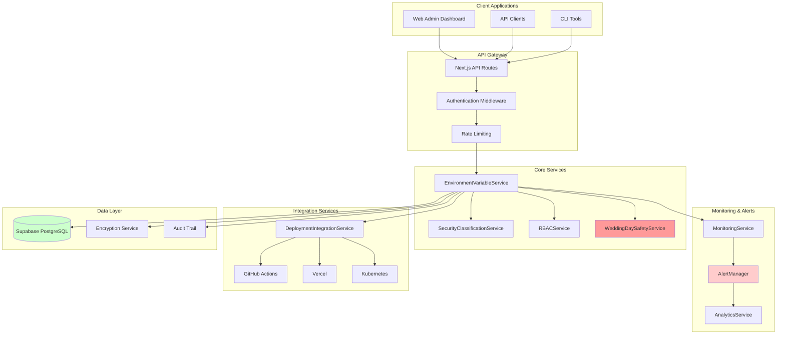

# WS-256 Environment Variables Management System

## System Overview

The WedSync Environment Variables Management System provides enterprise-grade environment variable management with encryption, security classification, audit trails, and wedding day protection protocols. Built specifically for the wedding industry with zero-tolerance for Saturday disruptions.

## 🎯 Key Features

### Core Functionality
- **Secure Variable Management**: Create, read, update, delete environment variables with full audit trails
- **Multi-Environment Support**: Manage variables across development, staging, production environments
- **Enterprise-Grade Encryption**: AES-256-GCM encryption for sensitive values
- **Security Classification**: 5-tier classification system (PUBLIC to WEDDING_DAY_CRITICAL)
- **Role-Based Access Control**: 4-role RBAC system with granular permissions

### Wedding Industry Specific
- **Saturday Protection**: Automatic read-only mode on wedding days (Saturdays)
- **Emergency Override System**: Controlled emergency access during critical situations
- **Wedding Day Monitoring**: Enhanced monitoring and alerting for wedding-critical variables
- **Instant Rollback**: Emergency rollback procedures for wedding day incidents

### Enterprise Integration
- **Deployment Pipelines**: GitHub Actions, Vercel, Docker, Kubernetes integration
- **Real-time Monitoring**: System health, performance metrics, and alerts
- **Audit & Compliance**: SOC2, GDPR, ISO27001 compliance reporting
- **Multi-channel Alerts**: Email, SMS, Slack, Webhook notifications

## 📊 System Architecture



## 🛡️ Security Classification System

### Classification Levels (0-10)

| Level | Name | Description | Access Requirements | Wedding Day Impact |
|-------|------|-------------|-------------------|-------------------|
| 0 | PUBLIC | Public information | Any authenticated user | None |
| 1 | INTERNAL | Internal use only | Organization members | None |
| 2 | RESTRICTED | Restricted access | Specific teams | None |
| 3 | CONFIDENTIAL | Confidential information | Managers+ | None |
| 4 | SECRET | Secret information | Senior staff | Minor |
| 5 | TOP_SECRET | Top secret information | Executives | Moderate |
| 6 | BUSINESS_CRITICAL | Business critical systems | Admin users | High |
| 7 | PAYMENT_SENSITIVE | Payment/financial data | Payment admins | Critical |
| 8 | PERSONAL_DATA | Personal/private data | Data officers | Critical |
| 9 | WEDDING_CRITICAL | Wedding day critical | Emergency contacts | Maximum |
| 10 | EMERGENCY_ONLY | Emergency access only | CTO/Emergency team | Maximum |

### Variable Types

- **API Keys**: External service authentication tokens
- **Database**: Database connection strings and credentials
- **Secrets**: General secret values requiring encryption
- **Configuration**: Non-sensitive configuration values
- **Feature Flags**: Boolean flags for feature toggles

## 👥 Role-Based Access Control (RBAC)

### Role Hierarchy

| Role | Permissions | Max Classification | Special Access |
|------|-------------|-------------------|----------------|
| READ_ONLY | Read variables (levels 0-5) | 5 | None |
| DEVELOPER | Read/Write variables (levels 0-7) | 7 | Deployment sync |
| ADMIN | Full variable management (levels 0-9) | 9 | Emergency override |
| WEDDING_DAY_EMERGENCY | Emergency access all levels | 10 | Saturday operations |

### Permission Matrix

| Action | READ_ONLY | DEVELOPER | ADMIN | WEDDING_DAY_EMERGENCY |
|--------|-----------|-----------|-------|----------------------|
| Read variables | ✅ (0-5) | ✅ (0-7) | ✅ (0-9) | ✅ (0-10) |
| Create variables | ❌ | ✅ (0-7) | ✅ (0-9) | ✅ (0-10) |
| Update variables | ❌ | ✅ (0-7) | ✅ (0-9) | ✅ (0-10) |
| Delete variables | ❌ | ✅ (0-6) | ✅ (0-9) | ✅ (0-10) |
| Emergency override | ❌ | ❌ | ✅ | ✅ |
| Saturday operations | ❌ | ❌ | Override only | ✅ |

## 📅 Wedding Day Protection

### Saturday Protection Protocol

1. **Automatic Detection**: System automatically detects Saturday (day 6)
2. **Read-Only Mode**: All write operations blocked for classification 6+
3. **Enhanced Monitoring**: Monitoring frequency increased to 15-second intervals
4. **Alert Sensitivity**: Alert thresholds reduced by 50% for maximum sensitivity
5. **Emergency Contacts**: Wedding day emergency contacts on standby

### Emergency Override Process

1. **Authorization Required**: Only ADMIN or WEDDING_DAY_EMERGENCY roles
2. **Justification**: Detailed reason and rollback plan required
3. **Emergency Contact**: Must specify authorized emergency contact
4. **Time Limited**: Maximum 8-hour override duration
5. **Enhanced Logging**: All actions logged with maximum detail
6. **Automatic Expiry**: Override expires automatically unless extended

## 🔧 Installation & Setup

### Prerequisites

- Node.js 18+ and npm/yarn
- Next.js 15+ application
- Supabase project with PostgreSQL 15+
- Environment variables configured

### Database Migration

```bash
# Apply the WS-256 migration
npx supabase migration up --file 20250903154500_ws256_environment_variables_management_system.sql
```

### Service Integration

```typescript
// In your Next.js application
import { EnvironmentVariableService } from '@/lib/services/environment/EnvironmentVariableService'

const envService = new EnvironmentVariableService()

// Create environment variable
const result = await envService.createVariable(organizationId, {
  key: 'STRIPE_SECRET_KEY',
  description: 'Stripe payment processing secret key',
  classification_level: 7,
  variable_type: 'api_key',
  is_required: true,
  validation_pattern: '^sk_(test_|live_)[a-zA-Z0-9]{24}$'
})
```

### API Endpoints

All API endpoints are documented in `/docs/environment-variables/api/` directory:

- **Variables API**: `/docs/environment-variables/api/variables.md`
- **Environments API**: `/docs/environment-variables/api/environments.md`
- **Security API**: `/docs/environment-variables/api/security.md`
- **Monitoring API**: `/docs/environment-variables/api/monitoring.md`
- **Wedding Safety API**: `/docs/environment-variables/api/wedding-safety.md`

## 🔍 Monitoring & Alerts

### Health Check Endpoints

- `GET /api/environment/health` - Overall system health
- `GET /api/environment/variables/health/{environmentId}` - Environment-specific health
- `GET /api/environment/monitoring/metrics` - Performance metrics

### Alert Channels

| Channel | Use Case | Response Time |
|---------|----------|---------------|
| Email | Standard alerts, reports | < 2 minutes |
| SMS | Critical alerts, emergencies | < 30 seconds |
| Slack | Team notifications, warnings | < 1 minute |
| Webhook | System integrations | < 10 seconds |
| Dashboard | Real-time status | Real-time |

### Wedding Day Monitoring

During Saturdays (wedding days):
- **Check Interval**: 15 seconds (vs 60 seconds normal)
- **Alert Threshold**: 50% reduced sensitivity
- **Escalation Speed**: 3x faster escalation
- **Emergency Contacts**: All emergency contacts notified immediately
- **Monitoring Channels**: All channels active simultaneously

## 📚 Documentation Index

### For Developers
- [API Reference](/docs/environment-variables/api/README.md)
- [Service Integration Guide](/docs/environment-variables/integration/README.md)
- [Testing Guide](/docs/environment-variables/testing/README.md)
- [Troubleshooting](/docs/environment-variables/troubleshooting/README.md)

### For Operations
- [Deployment Guide](/docs/environment-variables/deployment/README.md)
- [Monitoring Runbook](/docs/environment-variables/operations/monitoring.md)
- [Wedding Day Procedures](/docs/environment-variables/operations/wedding-day.md)
- [Emergency Procedures](/docs/environment-variables/operations/emergency.md)

### For Compliance
- [Security Protocols](/docs/environment-variables/compliance/security.md)
- [Audit Procedures](/docs/environment-variables/compliance/audit.md)
- [GDPR Compliance](/docs/environment-variables/compliance/gdpr.md)
- [SOC2 Requirements](/docs/environment-variables/compliance/soc2.md)

## 🚨 Emergency Contacts

### Wedding Day Emergency Team

| Role | Responsibility | Contact Method |
|------|---------------|----------------|
| System Administrator | System operations | SMS, Phone |
| Security Officer | Security incidents | SMS, Email |
| CTO | Major decisions | Phone, SMS |
| Emergency Coordinator | Incident coordination | All channels |

### Escalation Matrix

1. **Level 1** (5 min): Development team, Slack
2. **Level 2** (15 min): Team lead, SMS + Email
3. **Level 3** (30 min): Manager, Phone + SMS
4. **Level 4** (60 min): CTO, All channels + stakeholders

## 📊 Performance Requirements

### Response Time Targets

| Operation | Target | Maximum | Wedding Day |
|-----------|--------|---------|-------------|
| Variable read | < 100ms | < 200ms | < 50ms |
| Variable write | < 500ms | < 1000ms | N/A (blocked) |
| Health check | < 200ms | < 500ms | < 100ms |
| Emergency override | < 2s | < 5s | < 1s |
| Alert delivery | < 30s | < 60s | < 10s |

### Availability Targets

- **Overall System**: 99.9% uptime
- **Wedding Days**: 100% uptime (zero tolerance)
- **Emergency Override**: 99.99% availability
- **Monitoring System**: 99.95% availability

## 🔄 Version History

- **v1.0.0** (2025-09-03): Initial release with core functionality
- **v1.1.0** (TBD): Enhanced monitoring and alerting
- **v1.2.0** (TBD): Advanced deployment integrations
- **v2.0.0** (TBD): Multi-region support and advanced security

---

## Support

For technical support or emergencies:
- **Development Issues**: Create GitHub issue
- **Security Concerns**: security@wedsync.com
- **Wedding Day Emergencies**: Call emergency hotline
- **General Support**: support@wedsync.com

**Built with ❤️ for the wedding industry by the WedSync Team**