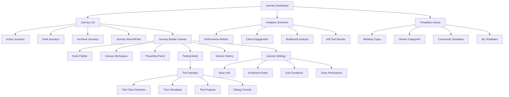
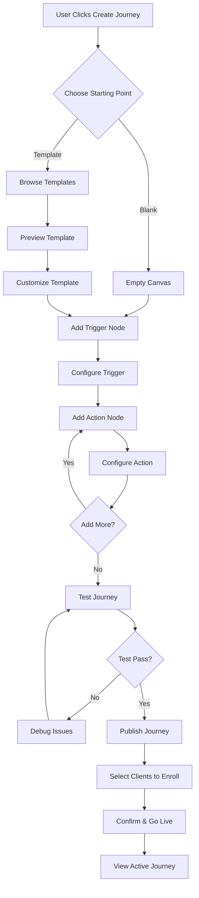
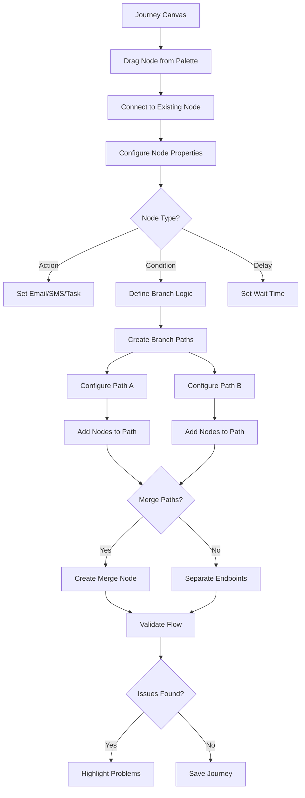
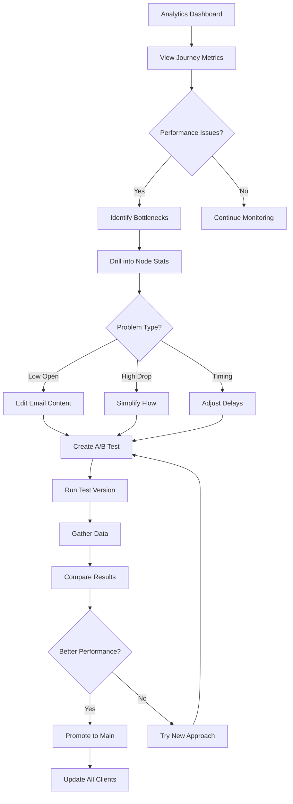

# Customer Journey Builder UI/UX Specification

## Introduction

This document defines the user experience goals, information architecture, user flows, and visual design specifications for Customer Journey Builder's user interface. It serves as the foundation for visual design and frontend development, ensuring a cohesive and user-centered experience.

### Overall UX Goals & Principles

#### Target User Personas

**Primary Persona - Sarah, Wedding Photographer**
- Non-technical creative professional managing 30-40 weddings annually
- Values efficiency but prioritizes maintaining personal client relationships
- Needs visual, intuitive tools that don't require coding knowledge
- Seeks to automate repetitive tasks while preserving flexibility for different packages

**Secondary Persona - Michael, DJ/Entertainment**  
- High-volume event manager (60+ events annually)
- Focuses on operational efficiency and timeline coordination
- Needs quick setup and reliable automation
- Values integration with other vendor tools

**Tertiary Persona - Wedding Planner/Coordinator**
- Manages multiple vendor relationships simultaneously
- Requires overview visibility and control
- Needs collaborative features and client communication tracking

#### Usability Goals

- **Intuitive Visual Building**: Users can create their first journey within 10 minutes without tutorials
- **Error Prevention**: Visual validation prevents broken journeys with clear indicators of issues
- **Efficient Power Use**: Expert users can build complex journeys in under 5 minutes using keyboard shortcuts
- **Immediate Feedback**: Every action provides instant visual confirmation with smooth animations
- **Graceful Learning Curve**: Progressive disclosure from simple linear flows to complex branching logic

#### Design Principles

1. **Visual Clarity First** - The canvas should tell the story of the customer journey at a glance, using clear visual hierarchy and meaningful icons
2. **Non-Technical by Design** - Hide complexity behind intuitive visual metaphors that wedding professionals naturally understand
3. **Confidence Through Preview** - Users can always see and test exactly what their clients will experience before going live
4. **Smart Defaults, Full Control** - Provide wedding-optimized templates and suggestions while allowing complete customization
5. **Mobile-Conscious Creation** - Design for monitoring and quick edits on mobile, even if primary creation happens on desktop

#### Performance Perception Principles

**1. Instant Visual Feedback (0-100ms)**
- Every drag, click, or keyboard action shows immediate visual response
- Node highlights on hover, connection previews while dragging
- Cursor changes to indicate available actions
- Micro-animations confirm state changes

**2. Optimistic UI Updates (100-300ms)**
- Show success states immediately, reconcile with server later
- Add nodes to canvas instantly while saving in background
- Display email preview immediately while template loads
- Update journey stats optimistically before server confirmation

**3. Progressive Loading with Skeleton States**
- Load canvas structure first, then populate node details
- Show journey outline immediately, lazy-load analytics
- Display placeholder content during data fetches
- Prioritize visible viewport content over off-screen elements

**4. Perceived Speed Through Animation**
- Smooth 60fps canvas panning and zooming
- Spring animations for node connections (300ms easing)
- Staggered animations when loading multiple elements
- Momentum scrolling for natural canvas navigation

**5. Background Processing Transparency**
- Progress indicators for journey publishing (with time estimates)
- Real-time status updates during test runs
- Queue visualization for bulk operations
- "Working" states that show specific actions ("Validating connections...")

**6. Smart Preloading & Caching**
- Preload common node templates on canvas open
- Cache recently used email templates and forms
- Prefetch next likely actions based on user patterns
- Store journey drafts locally for instant recovery

**7. Responsive Performance Degradation**
- Simplify animations on slower devices
- Reduce visual effects when journey exceeds 50 nodes
- Offer "performance mode" for complex journeys
- Auto-switch to simplified view on mobile

### Change Log

| Date | Version | Description | Author |
|------|---------|-------------|--------|
| 2025-01-20 | 1.0 | Initial specification created | UX Expert |

## Information Architecture (IA)

### Site Map / Screen Inventory

### Navigation Structure

**Primary Navigation:** 
- Persistent left sidebar with Journey Dashboard, My Journeys, Templates, Analytics, and Settings
- Collapsible on mobile to icon-only view
- Visual indicators for active section and journey counts

**Secondary Navigation:** 
- Contextual toolbar within Journey Canvas (Save, Test, Publish, Share, Settings)
- Tab navigation for journey versions and A/B variants
- Breadcrumb trail showing: Dashboard > Journey Name > Current View

**Breadcrumb Strategy:** 
- Always visible below primary header
- Clickable navigation to any previous level
- Shows journey status (Draft/Active/Testing) inline
- Mobile: Compressed to show only current + parent

## User Flows

### Flow 1: Creating First Journey (New User)

**User Goal:** Successfully create and publish their first automated customer journey

**Entry Points:** 
- Dashboard "Create Journey" CTA
- Empty state "Get Started" button
- Templates library "Use Template"

**Success Criteria:** 
- Journey is published and active
- At least one client enrolled
- User understands how to monitor progress

#### Flow Diagram

#### Edge Cases & Error Handling:
- No clients available to enroll → Prompt to add clients first
- Invalid node configuration → Inline validation with helpful error messages
- Test fails → Highlight problematic nodes with specific fix suggestions
- Network error during save → Local draft preservation with retry option

**Notes:** First-time users should see contextual tooltips and a progress indicator showing journey completeness

### Flow 2: Journey Building & Configuration

**User Goal:** Build a complex multi-branch journey with conditions

**Entry Points:** 
- Canvas workspace
- Edit existing journey
- Duplicate and modify

**Success Criteria:** 
- Multiple branches configured correctly
- All paths lead to valid endpoints
- Conditions are testable

#### Flow Diagram

#### Edge Cases & Error Handling:
- Circular references → Prevent connection with warning
- Orphaned nodes → Highlight and offer to connect or remove
- Conflicting conditions → Warning with resolution suggestions
- Performance degradation (100+ nodes) → Suggest splitting into sub-journeys

**Notes:** Power users need keyboard shortcuts for rapid building (Cmd+D duplicate, Tab to cycle nodes)

### Flow 3: Monitoring & Optimization

**User Goal:** Monitor journey performance and optimize based on data

**Entry Points:** 
- Journey dashboard metrics
- Alert notifications
- Scheduled reports

**Success Criteria:** 
- Identified bottlenecks resolved
- Improved completion rates
- Data-driven improvements made

#### Flow Diagram

#### Edge Cases & Error Handling:
- Insufficient data → Show minimum data requirements
- A/B test conflicts → Prevent overlapping tests
- Mass update impacts → Preview affected clients before applying
- Historical data loss → Preserve analytics when editing journeys

**Notes:** Analytics should update in real-time with websocket connections for live monitoring

## Wireframes & Mockups

**Primary Design Files:** Figma - Customer Journey Builder Design System
- Master component library: `figma.com/wedsync-journey-components`
- Screen designs: `figma.com/wedsync-journey-screens`
- Interactive prototype: `figma.com/wedsync-journey-prototype`

### Key Screen Layouts

#### Journey Canvas (Main Workspace)

**Purpose:** Primary interface for building and editing customer journeys visually

**Key Elements:**
- Left sidebar: Collapsible node palette with categories (Triggers, Actions, Logic, etc.)
- Center canvas: Infinite scrollable workspace with grid background
- Right panel: Context-sensitive properties for selected node
- Top toolbar: Journey name, status indicator, Test/Publish buttons, version selector
- Bottom bar: Zoom controls, minimap toggle, canvas coordinates, auto-save indicator

**Interaction Notes:** 
- Drag nodes from palette drops them at cursor position with spring animation
- Double-click canvas for quick-add node menu
- Space+drag for pan, pinch/scroll for zoom
- Hover shows connection points, drag between points creates connections
- Right-click nodes for context menu (duplicate, delete, disable)

**Design File Reference:** `Figma: Journey Canvas - Main View (Desktop & Tablet)`

#### Node Configuration Modal

**Purpose:** Detailed configuration interface for individual journey nodes

**Key Elements:**
- Modal header: Node type icon, editable name field, close button
- Configuration tabs: Basic, Advanced, Conditions, Testing
- Preview pane: Live preview of email/SMS/form content
- Merge tag selector: Dropdown with available personalization fields
- Action buttons: Cancel, Save as Draft, Save & Close

**Interaction Notes:**
- Changes auto-save after 2 seconds of inactivity
- Tab key navigates between fields
- Preview updates in real-time as content is edited
- Escape key closes with confirmation if unsaved changes

**Design File Reference:** `Figma: Node Configuration - Email Module`

#### Journey Dashboard

**Purpose:** Overview of all journeys with quick actions and performance metrics

**Key Elements:**
- Grid/List toggle for journey cards
- Filter bar: Status (Active/Draft/Paused), Type, Date range
- Journey cards: Name, preview thumbnail, status, key metrics, quick actions
- Global actions: Create New Journey, Import Template
- Performance summary: Total active journeys, clients in journeys, messages sent today

**Interaction Notes:**
- Cards expand on hover to show more metrics
- Click card to open journey, click metrics to jump to analytics
- Drag to reorder journeys in custom order
- Bulk selection mode for archiving/duplicating multiple journeys

**Design File Reference:** `Figma: Journey Dashboard - Grid & List Views`

#### Testing Interface

**Purpose:** Safe environment to test journey logic before going live

**Key Elements:**
- Test control bar: Play/Pause, Step Forward, Speed selector, Reset
- Journey visualization: Highlighted current position, path taken
- Test log: Timestamped events, node outputs, condition evaluations
- Variable inspector: Current values of all client data fields
- Issue panel: Warnings, errors, suggestions

**Interaction Notes:**
- Click any node to jump test to that point
- Hover over conditions to see evaluation logic
- Test log is searchable and filterable by node or event type
- Can modify variables on-the-fly to test different paths

**Design File Reference:** `Figma: Testing Mode - Interactive Debugger`

#### Mobile Journey Monitor

**Purpose:** Monitor and manage journeys from mobile devices

**Key Elements:**
- Compact journey list with status indicators
- Swipe actions: Pause, Edit, View Analytics
- Quick stats: Active clients, Today's sends, Completion rate
- Alert notifications: Stuck clients, Failed sends, A/B test complete
- Bottom navigation: Journeys, Analytics, Alerts, Settings

**Interaction Notes:**
- Pull to refresh updates all metrics
- Long press for batch operations
- Shake to report issue (screenshot + logs)
- 3D touch/long press for journey preview

**Design File Reference:** `Figma: Mobile App - iOS & Android Designs`

### Form Input Components

#### Smart Text Input Component

**Purpose:** Intelligent text input with merge tag support and validation

**Variants:**
- Single line (email subject, node name)
- Multi-line (email body, SMS content)
- Rich text (with formatting toolbar)
- Code editor (for advanced conditions)

**States:**
- Default (empty)
- Focused (blue border, helper text visible)
- Filled (content visible)
- Error (red border, error message)
- Success (green checkmark)
- Loading (validating)

**Usage Guidelines:**
- Always show field label above input
- Helper text appears on focus, max 1 line
- Error messages replace helper text when validation fails
- Merge tags highlighted in purple within text
- Character counter for limited fields (SMS: 160 chars)

#### Condition Builder Component

**Purpose:** Visual interface for building if/then logic without code

**Variants:**
- Simple (single condition)
- Compound (AND/OR groups)
- Advanced (nested conditions)

**States:**
- Building (adding conditions)
- Valid (green indicator)
- Invalid (red indicator with specific issue)
- Testing (shows evaluation with sample data)

**Usage Guidelines:**
- Indent nested conditions by 24px
- Color-code AND (blue) vs OR (green) groups
- Show data type icons next to fields
- Validate in real-time as conditions are built

#### Date/Time Picker Component

**Purpose:** Select dates and times relative to wedding date or absolute

**Variants:**
- Relative picker (X days before/after wedding)
- Absolute picker (specific date/time)
- Recurring picker (every X days/weeks)
- Time zone aware

**States:**
- Default (common presets shown)
- Expanded (full calendar/options)
- Calculated (shows actual date preview)

**Usage Guidelines:**
- Always show calculated date preview
- Highlight wedding date on calendars
- Default to business hours (9am-5pm)
- Show timezone differences clearly

#### Email Template Selector Component

**Purpose:** Choose and customize email templates

**Variants:**
- Grid view (visual thumbnails)
- List view (name and preview)
- Category filtered (by journey stage)

**States:**
- Browsing (templates displayed)
- Previewing (selected template shown)
- Editing (template customization mode)
- Validating (checking merge tags)

**Usage Guidelines:**
- Show 6 templates per row in grid view
- Preview updates as user types
- Flag missing merge tag data
- Allow saving custom templates

#### Audience Selector Component

**Purpose:** Define which clients enter the journey

**Variants:**
- All clients
- Filtered segment
- Manual selection
- Dynamic conditions

**States:**
- Calculating (counting matches)
- Valid selection
- Empty results (no matches)
- Over limit (too many selected)

**Usage Guidelines:**
- Always show count of affected clients
- Live preview as filters change
- Warn if selection is very small (<3) or large (>100)
- Allow saving segments for reuse

## Component Library / Design System

**Design System Approach:** Atomic Design methodology with wedding-industry specific patterns
- Foundation: WedSync Design Tokens (colors, typography, spacing)
- Atoms: Basic UI elements (buttons, inputs, badges)
- Molecules: Composite components (node cards, connection lines)
- Organisms: Complex patterns (canvas toolbar, journey cards)
- Templates: Full screen layouts
- Wedding-specific: Industry patterns (timeline components, vendor badges)

### Core Components

#### Journey Node Component

**Purpose:** Visual representation of actions, triggers, and logic in the journey

**Variants:** 
- Trigger (green border, play icon)
- Action (blue border, specific icon per type)
- Condition (orange border, branch icon)
- Delay (gray border, clock icon)
- End (red border, flag icon)

**States:** 
- Default (idle)
- Hover (elevated shadow, connection points visible)
- Selected (highlighted border, resize handles)
- Active (pulsing animation during test)
- Error (red background, error icon)
- Disabled (grayed out, dashed border)

**Usage Guidelines:** 
- Nodes should be 200px wide by default, auto-height based on content
- Icons should be 24px, centered in 40px circular background
- Labels truncate with ellipsis after 2 lines
- Connection points appear on hover, 12px circles

#### Connection Line Component

**Purpose:** Visual representation of flow between nodes

**Variants:**
- Straight path (direct connection)
- Curved path (default, uses bezier curves)
- Conditional (dashed line with label)
- Active flow (animated dots during testing)

**States:**
- Default (2px solid line)
- Hover (4px width, tooltip with connection info)
- Selected (highlighted color, delete option)
- Animated (moving dots showing flow direction)

**Usage Guidelines:**
- Use curved paths by default for better visual flow
- Conditional connections show percentage or condition label
- Minimum curve radius of 20px to prevent sharp angles
- Arrow heads at destination, 8px size

## Branding & Style Guide

### Visual Identity

**Brand Guidelines:** WedSync Brand System v2.0
- Modern, professional, yet approachable
- Wedding industry appropriate without being overly romantic
- Gender-neutral color palette
- Clear hierarchy and strong typography

### Color Palette

| Color Type | Hex Code | Usage |
|------------|----------|--------|
| Primary | #3B82F6 | Primary actions, active states, links |
| Secondary | #8B5CF6 | Secondary actions, accents |
| Accent | #EC4899 | Special highlights, celebrations |
| Success | #10B981 | Confirmations, completions, triggers |
| Warning | #F59E0B | Cautions, important notices, conditions |
| Error | #EF4444 | Errors, stops, destructive actions |
| Neutral | #6B7280, #9CA3AF, #F3F4F6 | Text, borders, backgrounds |

### Typography

#### Font Families
- **Primary:** Inter (system fallback: -apple-system, BlinkMacSystemFont)
- **Secondary:** Plus Jakarta Sans (headings and emphasis)
- **Monospace:** JetBrains Mono (code, IDs, technical values)

#### Type Scale

| Element | Size | Weight | Line Height |
|---------|------|--------|-------------|
| H1 | 32px | 700 | 40px |
| H2 | 24px | 600 | 32px |
| H3 | 20px | 600 | 28px |
| Body | 14px | 400 | 20px |
| Small | 12px | 400 | 16px |

### Iconography

**Icon Library:** Heroicons v2 + Custom wedding industry icons

**Usage Guidelines:** 
- Use outline icons for navigation and actions
- Use solid icons for status and emphasis
- Maintain 24px standard size, 20px for inline, 16px for small contexts
- Custom wedding icons for: venue, photography, catering, music, flowers

### Spacing & Layout

**Grid System:** 8px base unit system
- Micro: 4px (tight groupings)
- Small: 8px (related elements)
- Medium: 16px (sections)
- Large: 24px (major sections)
- XLarge: 32px (page sections)

**Spacing Scale:** 0, 4, 8, 12, 16, 20, 24, 32, 40, 48, 64, 80, 96

## Accessibility Requirements

### Compliance Target

**Standard:** WCAG 2.1 Level AA compliance with Level AAA for critical paths

### Key Requirements

**Visual:**
- Color contrast ratios: 4.5:1 for normal text, 3:1 for large text, 3:1 for UI components
- Focus indicators: 2px solid outline with 2px offset, high contrast color
- Text sizing: Minimum 14px body text, scalable to 200% without horizontal scroll

**Interaction:**
- Keyboard navigation: All interactive elements accessible via keyboard
- Screen reader support: Proper ARIA labels, live regions for dynamic content
- Touch targets: Minimum 44x44px on mobile, 24x24px on desktop with adequate spacing

**Content:**
- Alternative text: Descriptive alt text for all informative images
- Heading structure: Logical h1-h6 hierarchy, no skipped levels
- Form labels: Every input has associated label, required fields marked clearly

### Testing Strategy

- Automated testing with axe-core in CI/CD pipeline
- Manual keyboard navigation testing for all critical flows
- Screen reader testing with NVDA (Windows) and VoiceOver (Mac)
- Color contrast validation in design phase
- Monthly accessibility audits with user testing

## Responsiveness Strategy

### Breakpoints

| Breakpoint | Min Width | Max Width | Target Devices |
|------------|-----------|-----------|----------------|
| Mobile | 320px | 639px | Phones |
| Tablet | 640px | 1023px | Tablets, small laptops |
| Desktop | 1024px | 1279px | Laptops, desktops |
| Wide | 1280px | - | Large monitors |

### Adaptation Patterns

**Layout Changes:** 
- Mobile: Single column, stacked navigation, bottom sheets for modals
- Tablet: Two column where appropriate, side navigation
- Desktop: Full canvas with panels, persistent navigation
- Wide: Extended canvas space, additional detail panels

**Navigation Changes:** 
- Mobile: Bottom tab bar, hamburger menu for secondary
- Tablet: Collapsible sidebar, visible primary actions
- Desktop: Full sidebar, breadcrumbs, contextual toolbars

**Content Priority:** 
- Mobile: Core journey stats only, hide advanced options
- Tablet: Show more metrics, simplified node palette
- Desktop: Full feature set, all configuration options visible

**Interaction Changes:** 
- Mobile: Touch-optimized, swipe gestures, long-press menus
- Tablet: Touch + mouse support, hover states on stylus
- Desktop: Full mouse/keyboard, drag-and-drop, keyboard shortcuts

## Animation & Micro-interactions

### Motion Principles

1. **Purposeful** - Every animation has a clear function
2. **Fast** - Most animations complete in 200-300ms
3. **Smooth** - Use easing functions for natural movement
4. **Subtle** - Enhance, don't distract from the task
5. **Consistent** - Same actions produce same animations

### Key Animations

- **Node Addition:** Scale up from 0 to 100% with spring easing (Duration: 300ms, Easing: cubic-bezier(0.68, -0.55, 0.265, 1.55))
- **Connection Creation:** Draw line from start to end (Duration: 200ms, Easing: ease-out)
- **Canvas Pan:** Momentum scrolling with deceleration (Duration: 1000ms, Easing: cubic-bezier(0.25, 0.46, 0.45, 0.94))
- **Modal Open:** Fade in background, slide up content (Duration: 250ms, Easing: ease-out)
- **Success State:** Checkmark draw animation (Duration: 400ms, Easing: ease-in-out)
- **Loading State:** Pulsing opacity 0.5 to 1 (Duration: 1500ms, Easing: ease-in-out)

## Performance Considerations

### Performance Goals

- **Page Load:** Initial canvas render < 1s, full load < 3s
- **Interaction Response:** < 100ms for all user actions
- **Animation FPS:** Maintain 60fps for all animations

### Design Strategies

- Virtual rendering for journeys with >50 nodes
- Lazy load node configuration panels
- Debounce search and filter operations by 300ms
- Progressive image loading for email templates
- Use CSS transforms for animations (GPU accelerated)
- Implement skeleton screens during data fetches
- Cache journey thumbnails and frequently used templates

## Next Steps

### Immediate Actions

1. Create high-fidelity mockups in Figma based on this specification
2. Build component library with Storybook documentation
3. Implement responsive canvas prototype
4. Conduct usability testing with 5 wedding suppliers
5. Create onboarding flow for first-time users

### Design Handoff Checklist

- [x] All user flows documented
- [x] Component inventory complete
- [x] Accessibility requirements defined
- [x] Responsive strategy clear
- [x] Brand guidelines incorporated
- [x] Performance goals established

## Checklist Results

The UI/UX specification for the Customer Journey Builder has been completed with comprehensive coverage of user experience design, information architecture, component specifications, and implementation guidelines. The design prioritizes non-technical wedding suppliers while providing powerful automation capabilities through intuitive visual interfaces.
