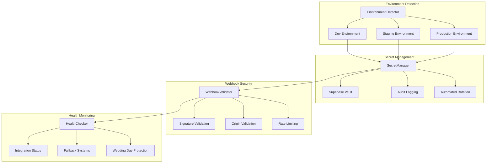

# WS-194: Integration Environment Management

## Overview

The Integration Environment Management system provides comprehensive security and configuration management for third-party service integrations across development, staging, and production environments. This system ensures secure secret management, webhook validation, and wedding day protection for critical integrations.

## Architecture



## Core Components

### 1. Secret Manager (`src/lib/security/secret-manager.ts`)

Handles secure storage, retrieval, and rotation of API keys and secrets.

**Key Features:**
- Environment-specific secret isolation
- 5-minute TTL caching for performance
- Automated secret rotation with validation
- Wedding day protection
- Comprehensive audit logging

**Usage:**
```typescript
import { SecretManager } from '@/lib/security/secret-manager';

const secretManager = SecretManager.getInstance();

// Retrieve secret (automatically prefixed with environment)
const stripeKey = await secretManager.getSecret('stripe_secret_key');

// Rotate secret with validation
await secretManager.rotateSecret('webhook_stripe_secret', newSecret);

// Create backup snapshot
const snapshotId = await secretManager.createSnapshot();

// Health check all critical secrets
const health = await secretManager.performHealthCheck();
```

### 2. Webhook Validator (`src/lib/security/webhook-validator.ts`)

Provides comprehensive webhook security validation.

**Key Features:**
- HMAC signature validation (SHA-256/SHA-512)
- Environment-specific IP whitelisting
- User-Agent validation
- Timestamp validation (prevents replay attacks)
- Security scoring and threat detection

**Usage:**
```typescript
import { webhookValidator } from '@/lib/security/webhook-validator';

// Validate webhook signature
const isValid = await webhookValidator.validateSignature(
  'stripe', 
  signature, 
  payload, 
  timestamp
);

// Comprehensive validation
await webhookValidator.validateWebhook(request, 'stripe', payload);
```

### 3. Webhook Security Middleware (`src/lib/middleware/webhook-security.ts`)

Next.js middleware for automatic webhook validation.

**Usage:**
```typescript
// app/api/webhooks/stripe/route.ts
import { withStripeWebhookSecurity } from '@/lib/middleware/webhook-security';

export const POST = withStripeWebhookSecurity(async (request, payload) => {
  const event = JSON.parse(payload);
  // Process webhook - already validated
  return new NextResponse('OK', { status: 200 });
});
```

### 4. Integration Health Monitoring

Real-time monitoring of critical integrations with automatic fallbacks.

**Monitored Services:**
- Stripe payment processing
- Google Calendar API
- Email service (Resend)
- SMS service (Twilio)

## Environment Configuration

### Environment Detection

The system automatically detects the current environment:

1. **Vercel Environment** (highest priority)
   - `production` → production
   - `preview` → staging
   - `development` → development

2. **NODE_ENV + Indicators**
   - `NEXT_PUBLIC_ENV=staging` → staging
   - URL contains `staging` → staging
   - Default → development

### Environment-Specific Settings

| Environment | Email Provider | Phone Numbers | IP Allowlist | Secret Rotation |
|-------------|----------------|---------------|--------------|-----------------|
| Development | SES | Test numbers | localhost only | Manual |
| Staging | SES | Test numbers | Staging domains | Weekly |
| Production | SendGrid | Real numbers | Production IPs | Daily |

### Required Environment Variables

#### Development
```env
# Google Calendar
GOOGLE_CALENDAR_DEV_CLIENT_ID=your_dev_client_id
GOOGLE_CALENDAR_DEV_CLIENT_SECRET=your_dev_client_secret

# Email
EMAIL_API_KEY_DEVELOPMENT=your_dev_email_key

# SMS  
TWILIO_ACCOUNT_SID_DEVELOPMENT=your_dev_twilio_sid
TWILIO_AUTH_TOKEN_DEVELOPMENT=your_dev_twilio_token

# Webhooks
WEBHOOK_SIGNING_SECRET_DEVELOPMENT=your_dev_webhook_secret
```

#### Staging
```env
# Google Calendar
GOOGLE_CALENDAR_STAGING_CLIENT_ID=your_staging_client_id
GOOGLE_CALENDAR_STAGING_CLIENT_SECRET=your_staging_client_secret

# Email
EMAIL_API_KEY_STAGING=your_staging_email_key

# SMS
TWILIO_ACCOUNT_SID_STAGING=your_staging_twilio_sid  
TWILIO_AUTH_TOKEN_STAGING=your_staging_twilio_token

# Webhooks
WEBHOOK_SIGNING_SECRET_STAGING=your_staging_webhook_secret
```

#### Production
```env
# Google Calendar
GOOGLE_CALENDAR_PRODUCTION_CLIENT_ID=your_prod_client_id
GOOGLE_CALENDAR_PRODUCTION_CLIENT_SECRET=your_prod_client_secret

# Email
EMAIL_API_KEY_PRODUCTION=your_prod_email_key

# SMS
TWILIO_ACCOUNT_SID_PRODUCTION=your_prod_twilio_sid
TWILIO_AUTH_TOKEN_PRODUCTION=your_prod_twilio_token

# Webhooks
WEBHOOK_SIGNING_SECRET_PRODUCTION=your_prod_webhook_secret
```

## Database Schema

The system creates several security tables:

### secret_vault
Encrypted storage for environment-specific secrets.

```sql
CREATE TABLE secret_vault (
    id UUID PRIMARY KEY DEFAULT gen_random_uuid(),
    secret_key TEXT NOT NULL UNIQUE,
    secret_value TEXT NOT NULL, -- Encrypted
    environment TEXT NOT NULL,
    is_active BOOLEAN DEFAULT true,
    expires_at TIMESTAMPTZ,
    rotation_schedule TEXT,
    last_rotated_at TIMESTAMPTZ
);
```

### secret_audit_log
Complete audit trail for secret access.

```sql
CREATE TABLE secret_audit_log (
    id UUID PRIMARY KEY DEFAULT gen_random_uuid(),
    secret_key TEXT NOT NULL,
    action TEXT NOT NULL,
    environment TEXT NOT NULL,
    success BOOLEAN NOT NULL,
    timestamp TIMESTAMPTZ DEFAULT NOW()
);
```

### webhook_audit_log
Security monitoring for webhook requests.

```sql
CREATE TABLE webhook_audit_log (
    id UUID PRIMARY KEY DEFAULT gen_random_uuid(),
    provider TEXT NOT NULL,
    processing_status TEXT,
    security_score INTEGER DEFAULT 100,
    received_at TIMESTAMPTZ DEFAULT NOW()
);
```

### wedding_day_restrictions
Automatic restrictions during wedding days.

```sql
CREATE TABLE wedding_day_restrictions (
    id UUID PRIMARY KEY DEFAULT gen_random_uuid(),
    restriction_date DATE NOT NULL,
    restriction_type TEXT NOT NULL,
    is_active BOOLEAN DEFAULT true,
    restricted_operations TEXT[]
);
```

## Wedding Day Protection

### Automatic Saturday Restrictions

The system automatically restricts dangerous operations on Saturdays:
- Secret rotation
- Database migrations
- Integration updates
- Deployments

### Emergency Override

Critical operations can be overridden with multi-approver authentication:

```typescript
// Check if operation is restricted
const isRestricted = await weddingDayManager.isOperationRestricted('SECRET_ROTATION');

if (isRestricted) {
  // Request emergency override
  const overrideRequest = await weddingDayManager.requestEmergencyOverride(
    'SECRET_ROTATION',
    'Critical security vulnerability requires immediate rotation'
  );
  
  // Requires approval from 2+ admins
  await weddingDayManager.approveOverride(overrideRequest.id, adminUserId);
}
```

## Integration Security

### Webhook IP Whitelists

#### Production IPs
- **Stripe**: `3.18.12.63`, `3.130.192.231`, `13.235.14.237`, etc.
- **Google**: `216.58.192.0/19`, `172.217.0.0/16`

#### Signature Validation
All webhooks require valid HMAC signatures:

```typescript
// Stripe example
const expectedSignature = crypto
  .createHmac('sha256', webhookSecret)
  .update(`${timestamp}.${payload}`)
  .digest('hex');
```

### Rate Limiting

| Provider | Requests/Minute | Window |
|----------|-----------------|---------|
| Stripe | 50 | 1 minute |
| Google Calendar | 200 | 1 minute |
| Custom | 100 | 1 minute |

## Deployment Guide

### 1. Database Setup

Apply the migration:
```bash
npx supabase migration up --file 056_integration_security_tables.sql
```

### 2. Environment Variables

Configure all required environment variables for your target environment.

### 3. Secret Population

Use the SecretManager to populate initial secrets:

```typescript
const secretManager = SecretManager.getInstance();

// Add initial secrets
await secretManager.rotateSecret('stripe_secret_key', process.env.STRIPE_SECRET_KEY);
await secretManager.rotateSecret('google_calendar_client_secret', process.env.GOOGLE_CLIENT_SECRET);
```

### 4. Health Check Setup

Configure monitoring endpoints:

```typescript
// Add integration monitoring
await supabase.from('integration_health').upsert([
  {
    integration_name: 'stripe',
    environment: 'production',
    status: 'unknown',
    check_interval_seconds: 300
  }
]);
```

### 5. Validation

Run the validation script:
```bash
npx tsx scripts/validate-environment-integration.ts
```

## Monitoring and Alerting

### Health Check Endpoints

- `/api/health/integrations` - Overall integration health
- `/api/health/secrets` - Secret management health
- `/api/health/webhooks` - Webhook validation health

### Key Metrics

- **Secret Access Rate**: Normal < 1000/hour
- **Webhook Failure Rate**: Normal < 1%
- **Integration Response Time**: Normal < 500ms
- **Security Score**: Normal > 80

### Alert Triggers

- 3+ consecutive webhook validation failures
- Secret rotation failure
- Integration health check failure
- Saturday operation attempt
- Security score < 50

## Testing

### Unit Tests

```bash
# Run all security tests
npm test tests/security/

# Run specific test suites
npm test tests/security/secret-manager.test.ts
npm test tests/security/webhook-validator.test.ts
npm test tests/config/integration-environment.test.ts
```

### Integration Tests

```bash
# Run comprehensive validation
npx tsx scripts/validate-environment-integration.ts

# Test webhook endpoints
curl -X POST \
  -H "Content-Type: application/json" \
  -H "X-Test-Signature: sha256=valid_signature" \
  -d '{"test": "data"}' \
  https://your-domain.com/api/webhooks/test
```

### Load Testing

Test webhook endpoints can handle wedding day traffic:

```bash
# Using Artillery or similar
artillery run webhook-load-test.yml
```

## Troubleshooting Guide

### Common Issues

#### 1. Secret Retrieval Fails

**Symptoms**: `Failed to retrieve secret: key_name`

**Causes**:
- Missing environment variable
- Incorrect environment detection
- Database connection issue
- RLS policy blocking access

**Solutions**:
1. Check environment variables are set
2. Verify environment detection: `console.log(detectEnvironment())`
3. Test database connection
4. Verify service role key has access

#### 2. Webhook Validation Fails

**Symptoms**: `WebhookError: Signature validation failed`

**Causes**:
- Incorrect webhook secret
- Payload modification in transit
- Timestamp too old
- Wrong HMAC algorithm

**Solutions**:
1. Verify webhook secret matches provider
2. Check payload is raw (not JSON parsed)
3. Ensure timestamp within 300 seconds
4. Confirm using SHA-256

#### 3. Environment Detection Wrong

**Symptoms**: Wrong environment detected, wrong configuration loaded

**Causes**:
- Missing environment indicators
- Incorrect Vercel settings
- Wrong NODE_ENV value

**Solutions**:
1. Set `VERCEL_ENV` in Vercel dashboard
2. Set `NEXT_PUBLIC_ENV=staging` for staging
3. Check `NEXT_PUBLIC_APP_URL` contains correct domain

#### 4. Wedding Day Restriction Blocking

**Symptoms**: `Secret rotation is restricted during wedding days`

**Causes**:
- Operation attempted on Saturday
- Active weddings detected
- Emergency override not approved

**Solutions**:
1. Wait until Sunday (recommended)
2. Request emergency override with business justification
3. Get required approvals from admin team

#### 5. Integration Health Check Fails

**Symptoms**: Integration shows as "down" or "degraded"

**Causes**:
- Third-party service outage
- Network connectivity issue
- Rate limiting
- Invalid credentials

**Solutions**:
1. Check third-party service status pages
2. Verify network connectivity
3. Check rate limits not exceeded
4. Validate API credentials

### Debug Mode

Enable debug logging:

```env
# Development only
NODE_ENV=development
LOG_LEVEL=debug
WEBHOOK_DEBUG=true
SECRET_DEBUG=true
```

### Log Analysis

Key log patterns to monitor:

```bash
# Webhook failures
grep "WebhookError" logs/webhook-*.log

# Secret access
grep "secret_access" logs/audit-*.log

# Integration health
grep "integration_health" logs/monitoring-*.log

# Wedding day restrictions
grep "wedding_day_restriction" logs/security-*.log
```

### Performance Tuning

#### Secret Caching

Adjust TTL based on usage:

```typescript
// High-traffic secrets: shorter TTL
const TTL_HIGH_TRAFFIC = 2 * 60 * 1000; // 2 minutes

// Low-traffic secrets: longer TTL  
const TTL_LOW_TRAFFIC = 10 * 60 * 1000; // 10 minutes
```

#### Database Optimization

```sql
-- Index for hot secret lookups
CREATE INDEX CONCURRENTLY idx_secret_vault_hot_lookup 
ON secret_vault(secret_key, environment) 
WHERE is_active = true;

-- Partial index for audit queries
CREATE INDEX CONCURRENTLY idx_audit_recent 
ON secret_audit_log(timestamp DESC) 
WHERE timestamp > NOW() - INTERVAL '7 days';
```

### Backup and Recovery

#### Secret Backup

```typescript
// Create comprehensive backup
const snapshot = await secretManager.createSnapshot();

// Store snapshot ID securely
await storeSnapshotReference(snapshot);
```

#### Disaster Recovery

```typescript
// Restore from snapshot
await secretManager.rollbackToSnapshot(snapshotId);

// Verify all integrations after restore
await healthChecker.runComprehensiveCheck();
```

## Security Considerations

### Threat Model

**Protected Against**:
- Secret exposure between environments
- Unauthorized webhook requests
- Replay attacks
- Man-in-the-middle attacks
- Timing attacks
- Wedding day service disruption

**Additional Considerations**:
- Network segmentation between environments
- Regular security audits of third-party integrations
- Monitoring for unusual access patterns
- Incident response procedures

### Compliance

The system supports compliance with:
- **SOC 2 Type II**: Comprehensive audit logging
- **GDPR**: Data protection and audit trails
- **PCI DSS**: Secure handling of payment webhooks
- **Wedding Industry Standards**: Zero downtime during critical dates

## Support and Maintenance

### Regular Maintenance Tasks

**Daily**:
- Review webhook security logs
- Check integration health status
- Monitor secret rotation schedule

**Weekly**:
- Analyze security scores trends
- Review wedding day restrictions
- Update IP whitelists if needed

**Monthly**:
- Audit secret access patterns
- Review and test disaster recovery
- Update documentation

### Getting Help

1. **Check logs first**: Most issues show in audit logs
2. **Run validation script**: Identifies configuration issues
3. **Review troubleshooting guide**: Common solutions
4. **Test in development**: Reproduce issue safely
5. **Contact team**: Include logs and validation output

### Future Enhancements

- **Multi-region secret replication**
- **Advanced threat detection with ML**
- **Zero-downtime secret rotation**
- **Integration with HashiCorp Vault**
- **Automated security scanning**

---

*This documentation is part of WS-194 Environment Management implementation. For updates and issues, please refer to the project repository.*