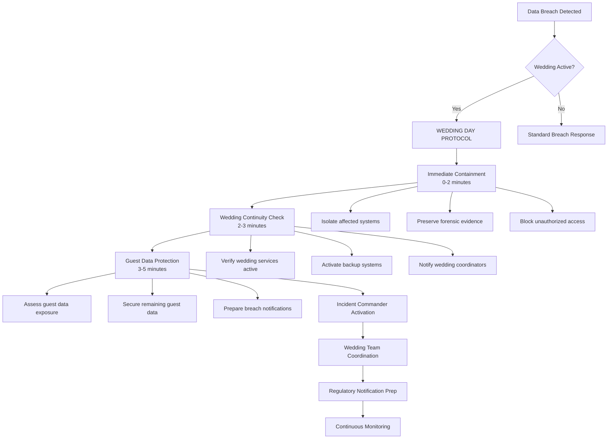
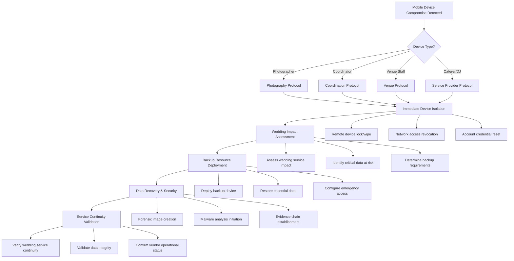
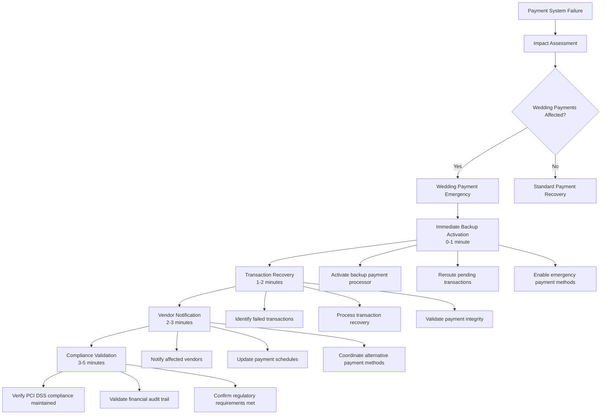
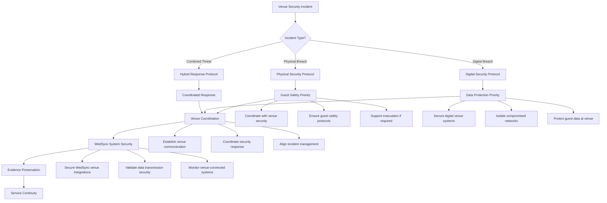
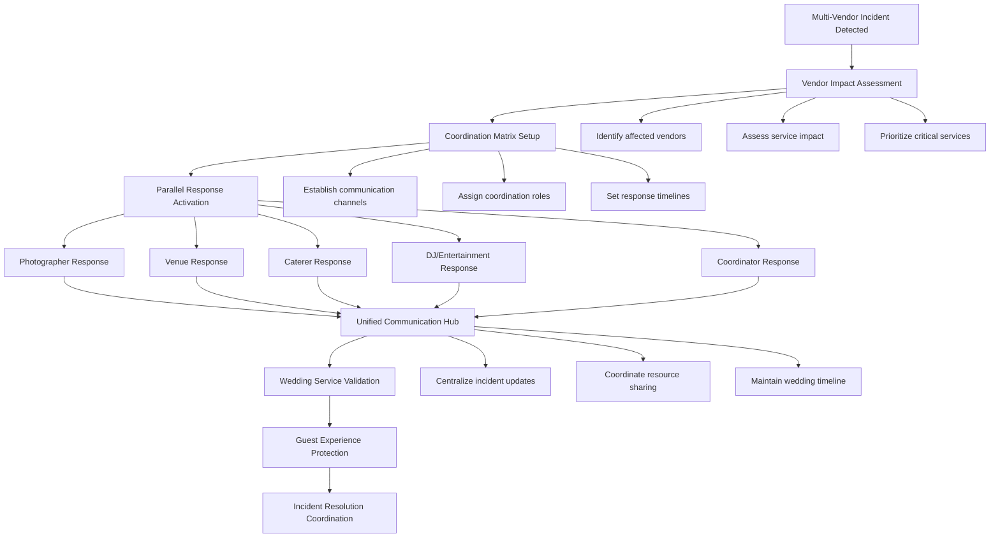
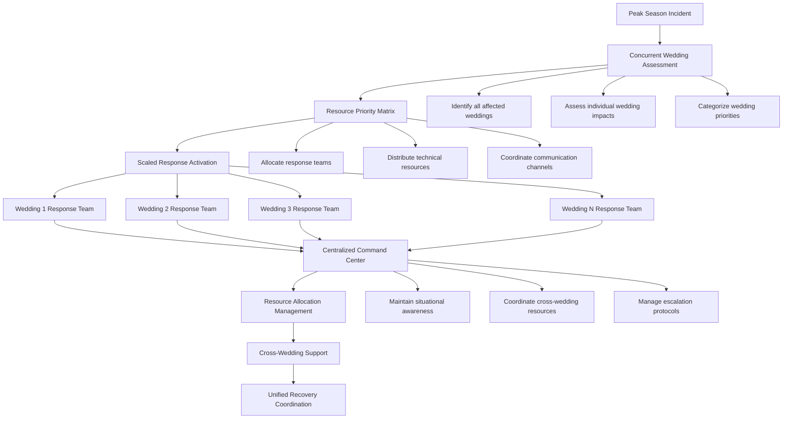
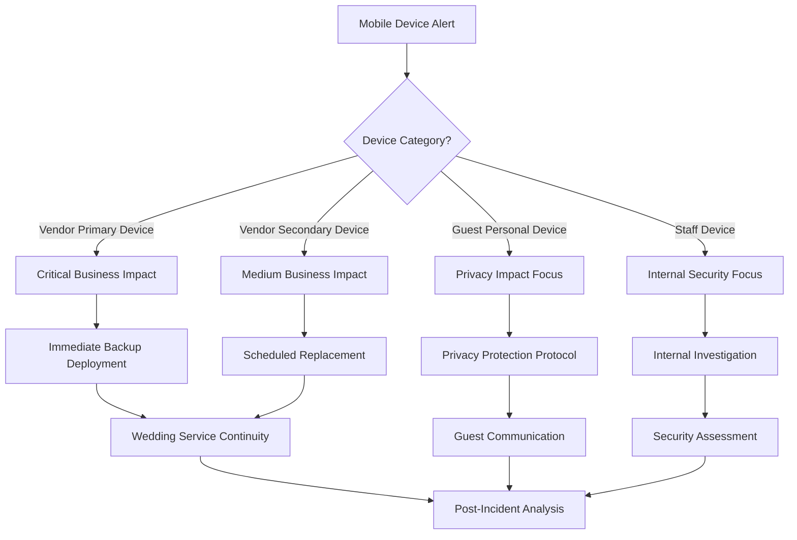
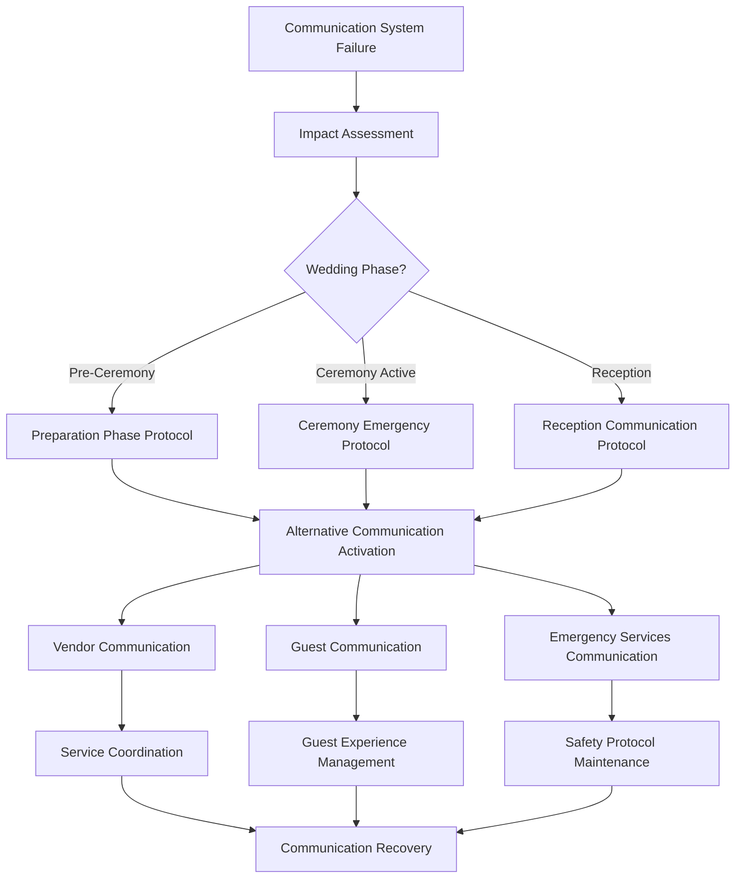

# WS-190 Emergency Workflow Procedures

## 🚨 P1 Incident Emergency Workflows

**Document Version**: 1.0  
**Last Updated**: 2025-01-20  
**Classification**: CONFIDENTIAL - Emergency Operations  
**Team**: WS-190 Team E - QA/Testing & Documentation  

---

## 🎯 Wedding Day Critical Response Workflows

### Workflow 1: Wedding Day Data Breach Response
**Trigger**: Guest personal data exposed during active wedding
**Response Time Target**: <5 minutes to containment



#### Detailed Steps:

**Phase 1: Immediate Response (0-2 minutes)**
1. **Alert Reception**
   ```bash
   # Automated Alert Processing
   ALERT_TYPE="DATA_BREACH"
   WEDDING_STATUS=$(check_active_weddings)
   SEVERITY="P1_WEDDING_CRITICAL"
   
   if [ "$WEDDING_STATUS" == "ACTIVE" ]; then
       trigger_wedding_emergency_protocol
   fi
   ```

2. **System Isolation**
   - Activate network segmentation
   - Throttle database connections to affected tables
   - Enable enhanced logging and monitoring
   - Preserve current system state for forensics

**Phase 2: Wedding Continuity (2-3 minutes)**
1. **Service Impact Assessment**
   ```bash
   # Wedding Service Verification
   check_ceremony_status()
   check_reception_status()  
   verify_vendor_connectivity()
   validate_guest_services()
   ```

2. **Backup System Activation**
   - Activate redundant guest data systems
   - Switch to backup payment processing
   - Enable offline mode for critical vendor tools
   - Provision emergency communication channels

**Phase 3: Data Protection (3-5 minutes)**
1. **Guest Data Securing**
   - Complete isolation of compromised guest data
   - Verification of remaining guest data integrity
   - Enhanced access controls on guest information
   - Real-time monitoring of guest data access attempts

2. **Evidence Preservation**
   - Automated database snapshots
   - Log file preservation and archiving
   - Network traffic capture initiation
   - Chain of custody documentation start

---

### Workflow 2: Vendor Mobile Device Compromise
**Trigger**: Wedding vendor device security breach
**Response Time Target**: <5 minutes to containment



#### Device-Specific Response Protocols:

**Photographer Device Compromise**
```bash
# Photographer Emergency Response
photographer_device_emergency() {
    # Immediate actions
    remote_lock_device "$DEVICE_ID"
    backup_wedding_photos_to_cloud
    provision_emergency_camera_equipment
    
    # Data protection
    isolate_guest_photo_access
    secure_couple_private_gallery
    preserve_photo_metadata_evidence
    
    # Service continuity
    activate_backup_photographer_account
    sync_wedding_timeline_to_backup_device
    notify_wedding_coordinator_of_situation
    
    # Recovery planning
    schedule_device_forensic_analysis
    plan_photo_recovery_procedures
    coordinate_alternative_delivery_methods
}
```

**Wedding Coordinator Device Compromise**
```bash
# Coordinator Emergency Response
coordinator_device_emergency() {
    # Critical system access
    elevate_backup_coordinator_permissions
    transfer_wedding_day_schedules
    migrate_guest_communication_access
    
    # Vendor coordination
    notify_all_wedding_vendors_of_change
    update_emergency_contact_information
    distribute_backup_communication_channels
    
    # Guest services
    maintain_guest_information_access
    preserve_dietary_requirement_data
    secure_seating_arrangement_details
}
```

---

### Workflow 3: Payment System Emergency Response
**Trigger**: Payment processing failure during wedding transactions
**Response Time Target**: <3 minutes to backup activation



**Payment Emergency Response Script**:
```bash
# Payment System Emergency Recovery
payment_emergency_recovery() {
    local INCIDENT_ID=$1
    local FAILURE_TYPE=$2
    
    # Immediate backup activation
    echo "Activating backup payment processor..."
    activate_backup_stripe_account
    reroute_webhook_endpoints
    
    # Transaction analysis
    echo "Analyzing failed transactions..."
    FAILED_TRANSACTIONS=$(identify_failed_payments "$INCIDENT_ID")
    
    # Wedding-specific recovery
    for wedding in $(get_affected_weddings); do
        echo "Processing wedding $wedding emergency payments..."
        
        # Vendor deposit recovery
        recover_vendor_deposits "$wedding"
        
        # Final payment processing
        process_emergency_final_payments "$wedding"
        
        # Communication
        notify_wedding_stakeholders "$wedding" "Payment system backup activated"
    done
    
    # Compliance verification
    verify_pci_compliance_maintained
    log_financial_audit_trail "$INCIDENT_ID"
    
    echo "Payment emergency recovery completed"
}
```

---

### Workflow 4: Venue Security Incident Response
**Trigger**: Physical or digital security breach at wedding venue
**Response Time Target**: <5 minutes coordination with venue security



**Venue Security Coordination Protocol**:
```bash
# Venue Security Incident Coordination
venue_security_incident() {
    local VENUE_ID=$1
    local INCIDENT_TYPE=$2
    local WEDDING_ID=$3
    
    # Immediate venue coordination
    echo "Initiating venue security coordination..."
    establish_venue_security_contact "$VENUE_ID"
    
    # Guest safety prioritization
    if [ "$INCIDENT_TYPE" == "PHYSICAL_BREACH" ]; then
        prioritize_guest_safety_protocols "$VENUE_ID"
        coordinate_with_venue_emergency_procedures
        support_potential_evacuation_planning "$WEDDING_ID"
    fi
    
    # Digital security measures
    if [ "$INCIDENT_TYPE" == "DIGITAL_BREACH" ]; then
        secure_venue_connected_systems "$VENUE_ID"
        isolate_compromised_venue_networks
        validate_wedsync_data_transmission_security
    fi
    
    # Wedding continuity planning
    assess_wedding_service_impact "$WEDDING_ID"
    activate_alternative_venue_procedures
    maintain_guest_communication_capabilities
    
    # Law enforcement coordination (if required)
    if [ "$SEVERITY" == "CRIMINAL_ACTIVITY" ]; then
        coordinate_law_enforcement_response "$VENUE_ID"
        preserve_physical_and_digital_evidence
        support_investigation_procedures
    fi
    
    echo "Venue security coordination established"
}
```

---

## 🔄 Cross-Functional Emergency Workflows

### Workflow 5: Multi-Vendor Security Coordination
**Trigger**: Security incident affecting multiple wedding vendors
**Response Time Target**: <10 minutes full coordination establishment



**Multi-Vendor Coordination Script**:
```bash
# Multi-Vendor Security Incident Coordination
multi_vendor_coordination() {
    local WEDDING_ID=$1
    local AFFECTED_VENDORS=($2)
    
    echo "Initiating multi-vendor security coordination for wedding $WEDDING_ID"
    
    # Setup coordination matrix
    setup_vendor_communication_hub "$WEDDING_ID"
    
    # Parallel vendor response activation
    for vendor in "${AFFECTED_VENDORS[@]}"; do
        echo "Activating emergency response for $vendor"
        
        case $vendor in
            "PHOTOGRAPHER")
                activate_photographer_emergency_protocol "$WEDDING_ID" &
                ;;
            "VENUE")  
                activate_venue_security_protocol "$WEDDING_ID" &
                ;;
            "CATERER")
                activate_caterer_emergency_protocol "$WEDDING_ID" &
                ;;
            "DJ")
                activate_entertainment_emergency_protocol "$WEDDING_ID" &
                ;;
            "COORDINATOR")
                activate_coordinator_emergency_protocol "$WEDDING_ID" &
                ;;
        esac
    done
    
    # Wait for parallel responses
    wait
    
    # Unified service validation
    validate_wedding_service_continuity "$WEDDING_ID"
    protect_guest_experience "$WEDDING_ID" 
    coordinate_incident_resolution "$WEDDING_ID"
    
    echo "Multi-vendor coordination established successfully"
}
```

---

### Workflow 6: Wedding Season Peak Emergency Response
**Trigger**: Security incident during peak wedding season (multiple concurrent weddings)
**Response Time Target**: <15 minutes full coordination for all affected weddings



**Peak Season Emergency Response**:
```bash
# Peak Wedding Season Emergency Response
peak_season_emergency() {
    local INCIDENT_ID=$1
    
    echo "Activating peak season emergency response for incident $INCIDENT_ID"
    
    # Assess concurrent weddings
    ACTIVE_WEDDINGS=($(get_active_weddings))
    AFFECTED_WEDDINGS=($(get_affected_weddings "$INCIDENT_ID"))
    
    echo "Active weddings: ${#ACTIVE_WEDDINGS[@]}"
    echo "Affected weddings: ${#AFFECTED_WEDDINGS[@]}"
    
    # Setup centralized command center
    establish_emergency_command_center "$INCIDENT_ID"
    
    # Priority-based response allocation
    for wedding in "${AFFECTED_WEDDINGS[@]}"; do
        PRIORITY=$(determine_wedding_priority "$wedding")
        
        echo "Processing wedding $wedding with priority $PRIORITY"
        
        case $PRIORITY in
            "P1_CEREMONY_ACTIVE")
                allocate_priority_response_team "$wedding" &
                ;;
            "P2_RECEPTION_ACTIVE")
                allocate_high_priority_team "$wedding" &
                ;;
            "P3_PREPARATION_PHASE")
                allocate_standard_team "$wedding" &
                ;;
        esac
    done
    
    # Cross-wedding resource sharing
    coordinate_resource_sharing "${AFFECTED_WEDDINGS[@]}"
    
    # Unified recovery coordination
    manage_unified_recovery_process "$INCIDENT_ID"
    
    echo "Peak season emergency response coordination complete"
}
```

---

## 📱 Mobile Emergency Response Workflows

### Workflow 7: Mobile Device Emergency Response Matrix



**Mobile Emergency Response Procedures**:
```bash
# Mobile Device Emergency Response
mobile_device_emergency() {
    local DEVICE_ID=$1
    local DEVICE_TYPE=$2  
    local WEDDING_ID=$3
    
    case $DEVICE_TYPE in
        "VENDOR_PRIMARY")
            echo "Critical vendor device emergency for wedding $WEDDING_ID"
            
            # Immediate response
            remote_device_security_lock "$DEVICE_ID"
            provision_emergency_backup_device "$WEDDING_ID"
            transfer_critical_wedding_data "$DEVICE_ID" "$BACKUP_DEVICE"
            
            # Wedding continuity
            notify_wedding_coordinator "$WEDDING_ID" "vendor_device_emergency"
            activate_alternative_communication_methods "$WEDDING_ID"
            ;;
            
        "VENDOR_SECONDARY")
            echo "Secondary vendor device incident for wedding $WEDDING_ID"
            
            # Scheduled response
            schedule_device_replacement "$DEVICE_ID"
            update_vendor_device_inventory "$WEDDING_ID"
            ;;
            
        "GUEST_DEVICE")
            echo "Guest device privacy incident"
            
            # Privacy protection
            assess_guest_data_exposure "$DEVICE_ID"
            initiate_privacy_protection_protocol "$DEVICE_ID"
            prepare_guest_communication_if_required "$DEVICE_ID"
            ;;
    esac
    
    # Common post-incident actions
    document_mobile_incident "$DEVICE_ID" "$DEVICE_TYPE" "$WEDDING_ID"
    schedule_forensic_analysis_if_required "$DEVICE_ID"
}
```

---

## 🎭 Communication Emergency Workflows

### Workflow 8: Emergency Communication Protocol
**Trigger**: Communication system failure during wedding events
**Response Time Target**: <2 minutes to alternative communication activation



**Emergency Communication Activation**:
```bash
# Emergency Communication Protocol
emergency_communication() {
    local WEDDING_ID=$1
    local COMMUNICATION_FAILURE_TYPE=$2
    
    echo "Activating emergency communication for wedding $WEDDING_ID"
    
    # Determine wedding phase
    WEDDING_PHASE=$(get_current_wedding_phase "$WEDDING_ID")
    
    case $WEDDING_PHASE in
        "CEREMONY_ACTIVE")
            echo "Ceremony in progress - minimal disruption protocol"
            
            # Silent communication activation
            activate_silent_communication_channels "$WEDDING_ID"
            notify_vendors_via_backup_channels "$WEDDING_ID"
            maintain_ceremony_atmosphere
            ;;
            
        "RECEPTION_ACTIVE")
            echo "Reception in progress - service continuity priority"
            
            # Service-focused communication
            prioritize_service_vendor_communication "$WEDDING_ID"
            maintain_guest_entertainment_coordination
            coordinate_catering_service_communication
            ;;
            
        "PREPARATION_PHASE")
            echo "Preparation phase - full communication recovery"
            
            # Complete communication restoration
            activate_all_backup_communication_systems
            coordinate_vendor_preparation_activities
            update_timeline_and_logistics_communication
            ;;
    esac
    
    # Monitor communication recovery
    monitor_communication_system_recovery "$WEDDING_ID"
    validate_service_coordination_restored "$WEDDING_ID"
}
```

---

## 📊 Workflow Performance Metrics

### Response Time Targets by Workflow Type

| Workflow Type | Detection | Response | Recovery | Success Rate Target |
|---------------|-----------|----------|----------|-------------------|
| Wedding Day Data Breach | <2 min | <5 min | <30 min | >99.5% |
| Mobile Device Compromise | <3 min | <5 min | <60 min | >99.0% |
| Payment System Emergency | <1 min | <3 min | <15 min | >99.9% |
| Venue Security Incident | <2 min | <5 min | <45 min | >99.0% |
| Multi-Vendor Coordination | <5 min | <10 min | <90 min | >98.0% |
| Communication Emergency | <1 min | <2 min | <10 min | >99.8% |

### Wedding-Specific KPIs
- **Wedding Disruption Rate**: <0.1% of ceremonies/receptions
- **Guest Experience Impact**: <0.05% guest complaint rate
- **Vendor Service Continuity**: >99.5% maintained operations
- **Data Protection Success**: 100% no additional data exposure

---

## 🔄 Continuous Improvement Framework

### Workflow Optimization Process
1. **Real-Time Monitoring**: Continuous workflow performance tracking
2. **Post-Incident Analysis**: Detailed workflow effectiveness review
3. **Stakeholder Feedback**: Wedding industry partner input integration
4. **Seasonal Adjustment**: Peak wedding season workflow optimization
5. **Technology Evolution**: New security tool workflow integration

### Training and Drill Schedule
- **Weekly**: Individual workflow practice drills
- **Monthly**: Cross-functional workflow coordination exercises  
- **Quarterly**: Full-scale wedding day emergency simulations
- **Annually**: Comprehensive workflow review and updates

---

**Document Control**
- **Next Review Date**: 2025-02-20
- **Approval Authority**: CISO, Wedding Operations Director, Emergency Response Team Lead
- **Distribution**: All Security Personnel, Wedding Operations Team, Senior Leadership

---

*These emergency workflows are living documents that evolve based on real incident experiences and wedding industry requirements. Regular testing and refinement ensure optimal emergency response effectiveness.*