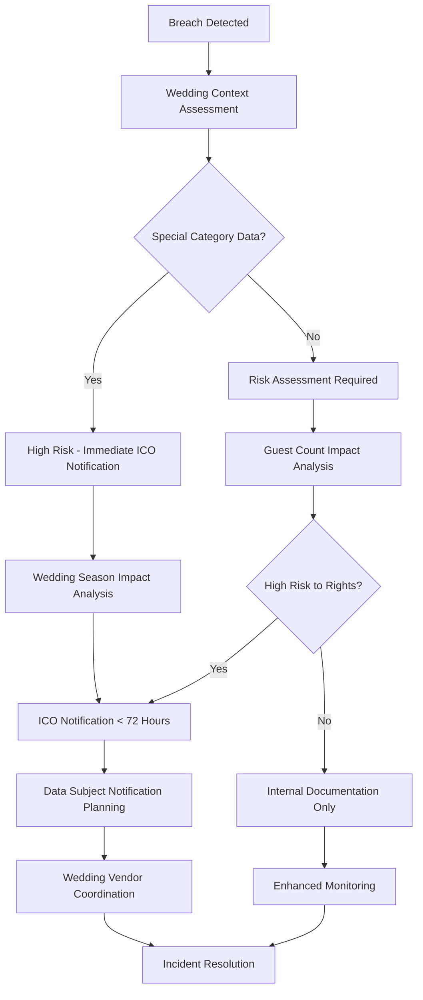

# WS-190 GDPR Compliance Guide for Wedding Industry

## 🎭 GDPR Compliance for Wedding Businesses

**Document Version**: 1.0  
**Last Updated**: 2025-01-20  
**Classification**: CONFIDENTIAL - Legal & Compliance  
**Team**: WS-190 Team E - QA/Testing & Documentation  

---

## 🎯 Wedding Industry Data Protection Framework

### Overview
The wedding industry processes extensive personal data including guest information, dietary requirements, accessibility needs, and payment details. This guide ensures WedSync and wedding vendors maintain GDPR compliance while delivering exceptional wedding experiences.

### Wedding-Specific Data Categories

#### Personal Data Types in Wedding Context
```
Basic Personal Data:
├── Contact Information (email, phone, addresses)
├── Guest Names and Relationships
├── Wedding Party Roles
├── Emergency Contact Details
└── Communication Preferences

Special Category Data (Article 9 GDPR):
├── Dietary Requirements (health-related)
├── Accessibility Needs (health/disability data)
├── Religious Preferences (religious beliefs)
├── Ethnic Heritage (for cultural ceremonies)
└── Medical Information (allergies, conditions)

Financial Data:
├── Payment Methods and Card Details
├── Vendor Deposit Information
├── Wedding Budget Details
└── Insurance Information
```

---

## 📋 Legal Basis for Wedding Data Processing

### Lawful Basis Framework for Wedding Operations

| Processing Purpose | Legal Basis | Wedding Context | Retention Period |
|-------------------|-------------|-----------------|------------------|
| **Contract Fulfillment** | Article 6(1)(b) | Wedding service delivery | Duration + 2 years |
| **Legitimate Interest** | Article 6(1)(f) | Wedding coordination, vendor management | Duration + 1 year |
| **Legal Obligation** | Article 6(1)(c) | Tax records, payment processing | 7 years |
| **Consent** | Article 6(1)(a) | Marketing, newsletter, portfolio use | Until withdrawn |
| **Vital Interest** | Article 6(1)(d) | Emergency medical situations | Emergency duration |

### Special Category Data Legal Basis
```
Dietary Requirements Processing:
├── Explicit Consent (Article 9(2)(a))
├── Substantial Public Interest (Article 9(2)(g))
└── Health/Social Care (Article 9(2)(h))

Religious/Cultural Preferences:
├── Explicit Consent (Article 9(2)(a))
└── Religious Organization Exception (Article 9(2)(d))

Accessibility Data:
├── Explicit Consent (Article 9(2)(a))
└── Social Protection (Article 9(2)(g))
```

---

## 🔒 Data Protection by Design and Default

### Wedding Platform Technical Measures

#### Data Minimization for Wedding Events
```typescript
interface WeddingDataMinimization {
  guestInformation: {
    collect: ['name', 'email', 'plus_one_status'];
    avoid: ['full_address', 'phone_unless_emergency'];
    purpose: 'wedding_attendance_coordination';
  };
  
  dietaryRequirements: {
    collect: ['specific_requirements', 'severity_level'];
    avoid: ['detailed_medical_history'];
    retention: 'event_completion_plus_30_days';
    specialCategory: true;
  };
  
  photographyConsent: {
    granular: ['ceremony', 'reception', 'portfolio_use'];
    separate: ['social_media', 'marketing'];
    withdrawable: true;
  };
}
```

#### Privacy-Enhancing Technologies
```bash
# Wedding Data Protection Implementation
wedding_privacy_controls() {
    # Data encryption at rest
    encrypt_guest_data_with_wedding_specific_keys
    
    # Access controls
    implement_role_based_access_control {
        wedding_couple: full_access_to_own_wedding
        photographer: limited_to_assigned_wedding_photos
        caterer: dietary_requirements_only
        venue: accessibility_and_emergency_contacts
    }
    
    # Data pseudonymization
    pseudonymize_guest_identifiers_for_analytics
    
    # Consent management
    maintain_granular_consent_records_per_guest
}
```

---

## 📞 Data Subject Rights Management

### Wedding Guest Rights Framework

#### Right of Access (Article 15)
```bash
# Guest Data Subject Access Request (DSAR)
process_wedding_guest_dsar() {
    local GUEST_EMAIL=$1
    
    # Identify all wedding associations
    WEDDINGS=$(find_guest_wedding_associations "$GUEST_EMAIL")
    
    # Compile personal data across all weddings
    for wedding in $WEDDINGS; do
        extract_guest_profile_data "$wedding" "$GUEST_EMAIL"
        extract_dietary_preferences "$wedding" "$GUEST_EMAIL"
        extract_seating_arrangements "$wedding" "$GUEST_EMAIL"
        extract_communication_history "$wedding" "$GUEST_EMAIL"
        extract_photo_appearance_records "$wedding" "$GUEST_EMAIL"
    done
    
    # Generate machine-readable format
    generate_json_dsar_response "$GUEST_EMAIL"
    
    # 30-day response requirement
    schedule_dsar_response_delivery "$GUEST_EMAIL"
}
```

#### Right of Rectification (Article 16)
```typescript
interface WeddingDataRectification {
  guestCorrection: {
    triggers: ['guest_request', 'couple_update', 'vendor_notification'];
    cascade: ['update_all_vendor_systems', 'notify_affected_suppliers'];
    urgency: wedding_date < 30_days ? 'HIGH' : 'NORMAL';
  };
  
  dietaryUpdate: {
    immediateNotification: ['caterer', 'venue'];
    deadline: 'before_menu_finalization';
    specialCategoryHandling: true;
  };
}
```

#### Right to Erasure (Article 17)
```bash
# Wedding Data Erasure with Business Justification
wedding_data_erasure() {
    local GUEST_ID=$1
    local ERASURE_REASON=$2
    
    case $ERASURE_REASON in
        "CONSENT_WITHDRAWAL")
            # Can erase marketing/communication data
            erase_marketing_preferences "$GUEST_ID"
            erase_communication_history "$GUEST_ID"
            # But retain essential wedding coordination data
            retain_essential_wedding_data "$GUEST_ID" "LEGITIMATE_INTEREST"
            ;;
            
        "DATA_NO_LONGER_NECESSARY")  
            # Post-wedding completion erasure
            if wedding_completed_and_retention_period_expired; then
                full_guest_data_erasure "$GUEST_ID"
            else
                schedule_future_erasure "$GUEST_ID"
            fi
            ;;
            
        "OBJECTION_TO_PROCESSING")
            # Evaluate legitimate interests
            if assess_legitimate_interest_override "$GUEST_ID"; then
                partial_erasure_with_justification "$GUEST_ID"
            else
                full_erasure_granted "$GUEST_ID"  
            fi
            ;;
    esac
}
```

---

## 🚨 Personal Data Breach Response

### Wedding-Specific Breach Assessment

#### 72-Hour Breach Notification Framework


#### Breach Risk Assessment Matrix
```typescript
interface WeddingBreachRiskAssessment {
  dataVolume: {
    low: 'single_wedding_guests < 50';
    medium: 'multiple_weddings OR guests 50-500';
    high: 'peak_season_data OR guests > 500';
  };
  
  dataTypes: {
    basic_contact: { risk: 'LOW', notification: 'internal_only' };
    dietary_medical: { risk: 'HIGH', notification: 'ico_and_subjects' };
    financial: { risk: 'HIGH', notification: 'ico_and_subjects' };
    photos_with_guests: { risk: 'MEDIUM', notification: 'case_by_case' };
  };
  
  timing: {
    wedding_season_peak: 'ELEVATED_RISK';
    wedding_day_active: 'MAXIMUM_RISK';
    off_season: 'STANDARD_RISK';
  };
}
```

### Automated Breach Notification System
```bash
# Wedding Industry Breach Notification Automation
automated_breach_notification() {
    local BREACH_ID=$1
    local BREACH_TYPE=$2
    
    # Immediate assessment
    GUEST_COUNT=$(assess_affected_guest_count "$BREACH_ID")
    SPECIAL_CATEGORY=$(check_special_category_data "$BREACH_ID") 
    WEDDING_SEASON=$(check_wedding_season_status)
    
    # ICO notification decision
    if [ "$SPECIAL_CATEGORY" == "true" ] || [ "$GUEST_COUNT" -gt 500 ] || [ "$WEDDING_SEASON" == "PEAK" ]; then
        echo "ICO notification required within 72 hours"
        
        # Auto-generate ICO notification
        generate_ico_breach_notification "$BREACH_ID"
        
        # Schedule submission (with human review)
        schedule_ico_submission "$BREACH_ID" "72_HOURS"
        
        # Data subject notification assessment
        if assess_high_risk_to_rights "$BREACH_ID"; then
            prepare_data_subject_notifications "$BREACH_ID"
        fi
    fi
    
    # Wedding vendor notification
    notify_affected_wedding_vendors "$BREACH_ID"
    
    # Regulatory compliance tracking
    track_notification_deadlines "$BREACH_ID"
}
```

---

## 👥 Consent Management for Wedding Ecosystem

### Granular Wedding Consent Framework

#### Multi-Purpose Consent System
```typescript
interface WeddingConsentManagement {
  guestConsent: {
    essential: {
      wedding_coordination: { basis: 'CONTRACT', required: true };
      dietary_accommodation: { basis: 'EXPLICIT_CONSENT', withdrawable: true };
    };
    
    optional: {
      photography_inclusion: { 
        granular: ['ceremony', 'reception', 'group_photos'];
        separate: ['social_media_use', 'vendor_portfolio'];
      };
      
      communication_preferences: {
        wedding_updates: { basis: 'LEGITIMATE_INTEREST', objectable: true };
        marketing: { basis: 'CONSENT', withdrawable: true };
      };
    };
    
    vendor_specific: {
      photographer_portfolio: { basis: 'EXPLICIT_CONSENT', separate: true };
      venue_marketing: { basis: 'EXPLICIT_CONSENT', separate: true };
      caterer_testimonials: { basis: 'EXPLICIT_CONSENT', separate: true };
    };
  };
}
```

#### Consent Withdrawal Management
```bash
# Wedding Consent Withdrawal Processing
process_consent_withdrawal() {
    local GUEST_ID=$1
    local CONSENT_TYPE=$2
    local WEDDING_ID=$3
    
    case $CONSENT_TYPE in
        "PHOTOGRAPHY_CONSENT")
            # Remove from future photo processing
            exclude_from_photo_processing "$GUEST_ID" "$WEDDING_ID"
            
            # Existing photos - assess legitimate interest
            if assess_photography_legitimate_interest "$WEDDING_ID"; then
                anonymize_guest_in_existing_photos "$GUEST_ID" "$WEDDING_ID"
            else
                remove_guest_from_photos "$GUEST_ID" "$WEDDING_ID"
            fi
            ;;
            
        "MARKETING_CONSENT")
            # Immediate marketing suppression
            suppress_marketing_communications "$GUEST_ID"
            update_communication_preferences "$GUEST_ID" "NO_MARKETING"
            
            # Maintain essential wedding communications
            maintain_essential_wedding_updates "$GUEST_ID" "$WEDDING_ID"
            ;;
            
        "DIETARY_DATA_CONSENT")
            # Complex case - required for wedding service
            if wedding_service_requires_dietary_data "$WEDDING_ID"; then
                # Cannot fully withdraw if essential for service
                explain_legitimate_interest_basis "$GUEST_ID"
                offer_anonymization_alternative "$GUEST_ID" "$WEDDING_ID"
            else
                remove_dietary_preferences "$GUEST_ID" "$WEDDING_ID"
            fi
            ;;
    esac
}
```

---

## 🌍 International Data Transfers

### Post-Brexit Wedding Data Transfers

#### Transfer Impact Assessment
```typescript
interface WeddingDataTransferAssessment {
  scenarios: {
    uk_to_eu_venues: {
      adequacy: false; // Post-Brexit
      safeguards: 'STANDARD_CONTRACTUAL_CLAUSES';
      additionalMeasures: ['ENCRYPTION', 'PSEUDONYMIZATION'];
    };
    
    destination_weddings: {
      country_assessment: 'CASE_BY_CASE';
      guest_notification: 'REQUIRED';
      vendor_contracts: 'TRANSFER_CLAUSES_MANDATORY';
    };
    
    cloud_providers: {
      aws_eu: { adequacy: true, additional_measures: 'NONE' };
      us_providers: { adequacy: false, safeguards: 'SCCs_REQUIRED' };
    };
  };
}
```

#### International Wedding Coordination
```bash
# International Wedding Data Transfer Management
international_wedding_transfers() {
    local WEDDING_ID=$1
    local DESTINATION_COUNTRY=$2
    
    # Country adequacy assessment
    ADEQUACY_STATUS=$(check_adequacy_decision "$DESTINATION_COUNTRY")
    
    if [ "$ADEQUACY_STATUS" == "ADEQUATE" ]; then
        echo "Free transfer allowed to $DESTINATION_COUNTRY"
        document_adequacy_basis "$WEDDING_ID" "$DESTINATION_COUNTRY"
    else
        echo "Safeguards required for transfer to $DESTINATION_COUNTRY"
        
        # Implement standard contractual clauses
        implement_sccs_with_vendors "$WEDDING_ID" "$DESTINATION_COUNTRY"
        
        # Additional protection measures
        apply_encryption_in_transit "$WEDDING_ID"
        implement_access_controls "$WEDDING_ID" 
        
        # Guest notification
        notify_guests_of_international_transfer "$WEDDING_ID" "$DESTINATION_COUNTRY"
    fi
    
    # Document transfer basis
    create_transfer_impact_assessment "$WEDDING_ID" "$DESTINATION_COUNTRY"
}
```

---

## 📊 Compliance Monitoring and Auditing

### Wedding Industry Compliance Dashboard

#### Automated Compliance Monitoring
```bash
# Daily GDPR Compliance Check for Wedding Operations
daily_compliance_monitoring() {
    echo "Running daily GDPR compliance check..."
    
    # Data retention compliance
    check_expired_guest_data_retention
    identify_weddings_requiring_data_cleanup
    process_automated_data_deletion
    
    # Consent status monitoring  
    audit_guest_consent_status
    identify_withdrawn_consents_requiring_action
    validate_consent_renewal_requirements
    
    # Data subject rights compliance
    track_dsar_response_deadlines
    monitor_rectification_request_processing
    validate_erasure_request_completions
    
    # Breach notification compliance
    check_ico_notification_deadlines
    verify_data_subject_notification_sending
    audit_breach_documentation_completeness
    
    # Vendor compliance monitoring
    audit_vendor_gdpr_compliance_status
    validate_data_processing_agreements
    check_international_transfer_safeguards
    
    # Generate compliance report
    generate_daily_compliance_report $(date +%Y-%m-%d)
}
```

#### Wedding Season Compliance Scaling
```bash
# Peak Wedding Season GDPR Compliance Scaling
wedding_season_compliance() {
    local SEASON_STATUS=$1
    
    case $SEASON_STATUS in
        "PEAK_SEASON")
            # Enhanced monitoring
            increase_compliance_monitoring_frequency "HOURLY"
            scale_dsar_processing_capacity "3X"
            activate_additional_dpo_support
            
            # Proactive measures
            pre_prepare_breach_response_templates
            scale_consent_management_infrastructure
            enhance_data_retention_automation
            ;;
            
        "OFF_SEASON")
            # Deep compliance review
            conduct_comprehensive_compliance_audit
            review_and_update_privacy_policies
            training_program_for_all_staff
            vendor_compliance_requirement_review
            ;;
    esac
}
```

### Compliance Reporting Framework
```typescript
interface WeddingGDPRReporting {
  monthly: {
    dsarStatistics: {
      received: number;
      processed: number;
      averageResponseTime: number;
      escalations: number;
    };
    
    consentManagement: {
      consentGiven: number;
      consentWithdrawn: number;
      marketingOptOuts: number;
      photographyWithdrawals: number;
    };
    
    breachStatistics: {
      incidentCount: number;
      icoNotifications: number;
      dataSubjectNotifications: number;
      averageContainmentTime: number;
    };
  };
  
  quarterly: {
    vendorCompliance: {
      contractsUpdated: number;
      dpiasConducted: number;
      auditFindings: number;
      remedialActions: number;
    };
    
    dataMinimizationProgress: {
      dataTypesReduced: number;
      retentionPeriodsOptimized: number;
      processingPurposesRefined: number;
    };
  };
}
```

---

## 🎓 Training and Awareness Program

### Wedding Industry GDPR Training Framework

#### Role-Specific Training Modules
```
Wedding Coordinators:
├── Guest data handling procedures
├── Consent collection best practices  
├── Special category data management
└── Incident reporting procedures

Photographers/Videographers:
├── Photography consent requirements
├── Portfolio use permissions
├── Social media sharing guidelines
└── Data breach prevention

Venues:
├── Guest safety data processing
├── Emergency contact management
├── Accessibility data handling
└── Third-party sharing protocols

Caterers:
├── Dietary requirement processing
├── Health data protection
├── Supplier data sharing
└── Retention period compliance
```

#### Continuous Education Program
```bash
# Ongoing GDPR Education for Wedding Industry
gdpr_education_program() {
    # Monthly awareness sessions
    conduct_monthly_privacy_workshops
    
    # Seasonal training intensification
    if [ "$(check_wedding_season)" == "APPROACHING_PEAK" ]; then
        intensive_gdpr_bootcamp_for_seasonal_staff
        vendor_partner_compliance_workshops
    fi
    
    # Incident-based learning
    if [ "$RECENT_INCIDENTS" -gt 0 ]; then
        conduct_lessons_learned_sessions
        update_training_materials_with_real_cases
    fi
    
    # Compliance certification tracking
    track_staff_gdpr_certification_status
    schedule_recertification_requirements
}
```

---

## 📞 Emergency GDPR Contact Information

### Data Protection Officer (DPO) Contact
```
Primary DPO: privacy@wedsync.com
Emergency DPO Hotline: +44 7XXX XXX XXX
Wedding Day Privacy Emergency: +44 7XXX XXX XXX (24/7)
```

### Regulatory Contacts
```  
ICO Data Protection Helpline: 0303 123 1113
ICO Breach Reporting: report@ico.org.uk
Emergency Legal Counsel: +44 7XXX XXX XXX
```

---

**Document Control**
- **Next Review Date**: 2025-04-20  
- **Approval Authority**: Data Protection Officer, Legal Counsel, Wedding Operations Director
- **Distribution**: All Staff, Wedding Vendors, Senior Leadership

---

*This GDPR compliance guide is specifically tailored for the wedding industry's unique data protection challenges. Regular updates ensure continued compliance with evolving regulations and wedding business requirements.*