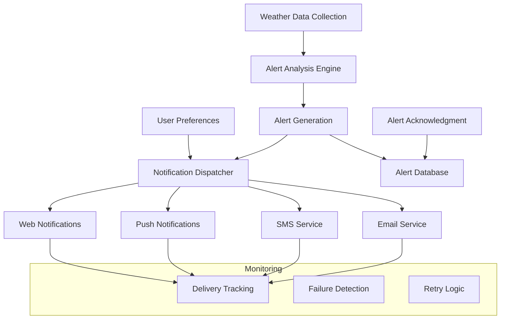

# Weather Alert System Troubleshooting Guide

## Overview

The WedSync Weather Alert System provides critical weather notifications to ensure wedding planners and couples are prepared for any weather conditions. This guide helps diagnose and resolve common issues with weather alerts.

## Alert System Architecture



## Common Issues and Solutions

### 1. Alerts Not Being Generated

#### Symptoms
- Weather conditions meet thresholds but no alerts appear
- Alert count shows 0 despite severe weather warnings
- No notifications sent despite enabled preferences

#### Diagnostic Steps

**Step 1: Verify Weather Data Collection**
```bash
# Check if weather data is being collected
curl -X GET "https://api.wedsync.com/weather/health" \
  -H "Authorization: Bearer YOUR_TOKEN"

# Expected response:
{
  "status": "healthy",
  "checks": {
    "weather_api": true,
    "alert_engine": true,
    "database": true
  }
}
```

**Step 2: Check Alert Thresholds**
```typescript
// Verify user alert settings
const alertSettings = await getAlertSettings(weddingId)
console.log('Alert Thresholds:', {
  precipitation: alertSettings.precipitation, // Should be 0.0-1.0
  windSpeed: alertSettings.windSpeed,        // km/h
  temperature: {
    min: alertSettings.temperature.min,      // Celsius
    max: alertSettings.temperature.max
  },
  visibility: alertSettings.visibility       // meters
})
```

**Step 3: Manual Alert Generation Test**
```typescript
// Test alert generation for specific conditions
const testConditions = {
  precipitation: 0.85,  // 85% chance of rain
  windSpeed: 45,        // 45 km/h wind
  temperature: 38,      // 38°C temperature
  visibility: 500       // 500m visibility
}

const alerts = await alertEngine.analyzeConditions(weddingId, testConditions)
console.log('Generated alerts:', alerts)
```

#### Common Solutions

**Threshold Configuration Issues:**
- Default precipitation threshold: 0.70 (70%)
- Default wind speed threshold: 25 km/h
- Default temperature range: 10°C - 35°C
- Default visibility threshold: 1000m

Reset to defaults:
```sql
UPDATE weather_settings 
SET alert_thresholds = '{
  "precipitation": 0.70,
  "windSpeed": 25,
  "temperature": {"min": 10, "max": 35},
  "visibility": 1000,
  "uvIndex": 8
}'::jsonb
WHERE wedding_id = 'WEDDING_ID';
```

**Weather Data Collection Issues:**
```typescript
// Check if weather service is responding
const weatherService = new OpenWeatherService()
try {
  const data = await weatherService.getCurrentWeather(lat, lon)
  if (!data.success) {
    console.error('Weather API Error:', data.error)
  }
} catch (error) {
  console.error('Weather Service Exception:', error)
}
```

**Alert Engine Timing Issues:**
```typescript
// Verify alert generation frequency
const lastCheck = await getLastAlertCheck(weddingId)
const hoursSinceLastCheck = (Date.now() - lastCheck) / (1000 * 60 * 60)

if (hoursSinceLastCheck > 6) {
  console.warn('Alert checks are running less frequently than expected')
  // Manual trigger
  await triggerAlertCheck(weddingId)
}
```

### 2. Email Alerts Not Delivered

#### Symptoms
- SMS and push notifications work, but emails don't arrive
- Emails going to spam folder
- Bounced email notifications
- Long delays in email delivery

#### Diagnostic Steps

**Step 1: Check Email Configuration**
```bash
# Verify email service status
curl -X GET "https://api.resend.com/status" \
  -H "Authorization: Bearer YOUR_RESEND_API_KEY"
```

**Step 2: Test Email Delivery**
```typescript
// Send test weather alert email
const testAlert = {
  id: 'test-alert',
  severity: 'warning',
  title: 'Test Weather Alert',
  description: 'This is a test alert for email delivery verification',
  timestamp: new Date().toISOString()
}

await emailService.sendWeatherAlert(
  'test@example.com',
  testAlert,
  'Test Wedding'
)
```

**Step 3: Check Email Logs**
```sql
-- Check recent email delivery attempts
SELECT 
  id,
  recipient,
  status,
  error_message,
  sent_at,
  delivered_at
FROM email_logs 
WHERE alert_type = 'weather'
  AND sent_at > NOW() - INTERVAL '24 hours'
ORDER BY sent_at DESC;
```

#### Common Solutions

**Email Service Configuration:**
```typescript
// Verify Resend configuration
const emailConfig = {
  apiKey: process.env.RESEND_API_KEY,
  from: 'alerts@wedsync.com', // Must be verified domain
  replyTo: 'support@wedsync.com'
}

// Test configuration
try {
  const result = await resend.emails.send({
    from: emailConfig.from,
    to: 'test@example.com',
    subject: 'Configuration Test',
    text: 'Email service is working correctly'
  })
  console.log('Test email sent:', result)
} catch (error) {
  console.error('Email configuration error:', error)
}
```

**Spam Prevention:**
```typescript
// Email template with spam-prevention measures
const emailTemplate = {
  from: 'WedSync Weather Alerts <alerts@wedsync.com>',
  subject: 'Weather Alert: [SEVERITY] - [TITLE]',
  headers: {
    'List-Unsubscribe': '<mailto:unsubscribe@wedsync.com>',
    'X-Priority': severity === 'critical' ? '1' : '3'
  },
  html: generateWeatherAlertHTML(alert),
  text: generateWeatherAlertText(alert) // Always include text version
}
```

**Domain Authentication:**
```bash
# Verify SPF record
dig TXT wedsync.com | grep "v=spf1"

# Verify DKIM record  
dig TXT default._domainkey.wedsync.com

# Verify DMARC record
dig TXT _dmarc.wedsync.com
```

### 3. SMS Alerts Not Delivered

#### Symptoms
- SMS notifications enabled but not received
- International numbers not receiving SMS
- SMS delivery delays or failures
- Carrier blocking messages

#### Diagnostic Steps

**Step 1: Verify SMS Service**
```typescript
// Test SMS service connectivity
const smsService = new SMSService()
try {
  const result = await smsService.sendTestMessage('+1234567890')
  console.log('SMS test result:', result)
} catch (error) {
  console.error('SMS service error:', error)
}
```

**Step 2: Check Phone Number Format**
```typescript
// Validate phone number format
const phoneNumber = '+1234567890'
const isValid = /^\+[1-9]\d{1,14}$/.test(phoneNumber)

if (!isValid) {
  console.error('Invalid phone number format:', phoneNumber)
  // Should be: +[country code][number] (E.164 format)
}
```

**Step 3: Review SMS Logs**
```sql
SELECT 
  id,
  phone_number,
  message,
  status,
  error_code,
  sent_at,
  delivered_at,
  cost
FROM sms_logs
WHERE alert_type = 'weather'
  AND sent_at > NOW() - INTERVAL '24 hours'
ORDER BY sent_at DESC;
```

#### Common Solutions

**Phone Number Validation:**
```typescript
function validatePhoneNumber(phone: string): boolean {
  // Remove all non-digit characters except +
  const cleaned = phone.replace(/[^\d+]/g, '')
  
  // Must start with + and country code
  if (!cleaned.startsWith('+')) {
    return false
  }
  
  // Length check (7-15 digits after country code)
  const digits = cleaned.substring(1)
  return digits.length >= 7 && digits.length <= 15
}

// Update user phone numbers
await updateUserPhoneNumber(userId, validateAndFormat(phoneNumber))
```

**Carrier-Specific Issues:**
```typescript
// Check for carrier blocking
const carrierInfo = await getCarrierInfo(phoneNumber)
if (carrierInfo.blocksShortcodes) {
  // Use long-code SMS instead
  await smsService.sendLongCode(phoneNumber, message)
} else {
  await smsService.sendShortCode(phoneNumber, message)
}
```

**International SMS:**
```typescript
// Handle international SMS differently
const countryCode = getCountryCode(phoneNumber)
const config = {
  domestic: {
    service: 'twilio',
    sender: '+18005551234'
  },
  international: {
    service: 'messagebird',
    sender: 'WedSync'
  }
}

const smsConfig = countryCode === '1' ? config.domestic : config.international
await sendSMSWithConfig(phoneNumber, message, smsConfig)
```

### 4. Push Notifications Not Working

#### Symptoms
- Mobile app notifications not appearing
- Web push notifications blocked
- Notification badges not updating
- Silent notifications not triggering

#### Diagnostic Steps

**Step 1: Check Device Registration**
```typescript
// Verify device is registered for push notifications
const devices = await getUserDevices(userId)
console.log('Registered devices:', devices.map(d => ({
  id: d.id,
  platform: d.platform,
  token: d.token ? 'present' : 'missing',
  lastSeen: d.lastSeen
})))
```

**Step 2: Test Push Notification**
```typescript
// Send test push notification
const testNotification = {
  title: 'Weather Alert Test',
  body: 'Testing push notification delivery',
  data: {
    alertId: 'test-123',
    type: 'weather',
    severity: 'info'
  }
}

await pushService.sendToDevice(deviceToken, testNotification)
```

**Step 3: Check Notification Permissions**
```javascript
// Browser notification permission check
if ('Notification' in window) {
  console.log('Notification permission:', Notification.permission)
  
  if (Notification.permission === 'denied') {
    console.warn('User has blocked notifications')
  } else if (Notification.permission === 'default') {
    console.info('User needs to grant notification permission')
  }
}
```

#### Common Solutions

**Device Token Refresh:**
```typescript
// Handle expired device tokens
async function refreshDeviceToken(userId: string, deviceId: string) {
  try {
    const newToken = await generateNewPushToken(deviceId)
    await updateDeviceToken(userId, deviceId, newToken)
    
    // Test new token
    await sendTestNotification(newToken)
  } catch (error) {
    console.error('Token refresh failed:', error)
    // Remove invalid device registration
    await removeDeviceRegistration(userId, deviceId)
  }
}
```

**Platform-Specific Configuration:**
```typescript
// iOS push configuration
const iosConfig = {
  aps: {
    alert: {
      title: alert.title,
      body: alert.description
    },
    badge: unreadCount,
    sound: alert.severity === 'critical' ? 'alarm.aiff' : 'default',
    'content-available': 1
  },
  alertId: alert.id,
  weddingId: alert.weddingId
}

// Android push configuration  
const androidConfig = {
  notification: {
    title: alert.title,
    body: alert.description,
    icon: 'weather_alert',
    color: getSeverityColor(alert.severity),
    sound: alert.severity === 'critical' ? 'alarm' : 'default'
  },
  data: {
    alertId: alert.id,
    weddingId: alert.weddingId,
    severity: alert.severity
  }
}
```

**Web Push Configuration:**
```typescript
// Service worker registration
if ('serviceWorker' in navigator && 'PushManager' in window) {
  const registration = await navigator.serviceWorker.register('/sw.js')
  
  const subscription = await registration.pushManager.subscribe({
    userVisibleOnly: true,
    applicationServerKey: urlBase64ToUint8Array(vapidPublicKey)
  })
  
  // Send subscription to server
  await saveWebPushSubscription(userId, subscription)
}
```

### 5. Alert Acknowledgment Issues

#### Symptoms
- "Acknowledge" button not working
- Alerts remain unread after acknowledgment
- Multiple acknowledgments for same alert
- Acknowledgment status not syncing across devices

#### Diagnostic Steps

**Step 1: Check API Endpoint**
```bash
# Test acknowledgment endpoint
curl -X POST "https://api.wedsync.com/api/weather/alerts" \
  -H "Content-Type: application/json" \
  -H "Authorization: Bearer YOUR_TOKEN" \
  -d '{
    "action": "acknowledge",
    "notificationId": "alert-123",
    "userId": "user-456"
  }'
```

**Step 2: Verify Database Updates**
```sql
-- Check acknowledgment status
SELECT 
  id,
  title,
  acknowledged,
  acknowledged_at,
  acknowledged_by
FROM weather_alerts
WHERE id = 'alert-123';
```

**Step 3: Test Real-Time Updates**
```typescript
// Check if acknowledgment triggers real-time updates
const socket = io('ws://localhost:3001')
socket.on('alert_acknowledged', (data) => {
  console.log('Alert acknowledged:', data)
})
```

#### Common Solutions

**Race Condition Prevention:**
```typescript
// Prevent double acknowledgment
async function acknowledgeAlert(alertId: string, userId: string) {
  const transaction = await db.transaction()
  
  try {
    // Check if already acknowledged
    const alert = await transaction.weatherAlerts.findUnique({
      where: { id: alertId }
    })
    
    if (alert.acknowledged) {
      await transaction.rollback()
      return { success: true, message: 'Alert already acknowledged' }
    }
    
    // Acknowledge alert
    await transaction.weatherAlerts.update({
      where: { id: alertId },
      data: {
        acknowledged: true,
        acknowledgedAt: new Date(),
        acknowledgedBy: userId
      }
    })
    
    await transaction.commit()
    
    // Broadcast update
    broadcastAlertUpdate(alertId, 'acknowledged')
    
    return { success: true }
  } catch (error) {
    await transaction.rollback()
    throw error
  }
}
```

**Real-Time Synchronization:**
```typescript
// WebSocket implementation for real-time updates
io.on('connection', (socket) => {
  socket.on('join_wedding', (weddingId) => {
    socket.join(`wedding:${weddingId}`)
  })
  
  socket.on('acknowledge_alert', async (data) => {
    try {
      await acknowledgeAlert(data.alertId, data.userId)
      
      // Broadcast to all connected users for this wedding
      io.to(`wedding:${data.weddingId}`).emit('alert_acknowledged', {
        alertId: data.alertId,
        acknowledgedBy: data.userId,
        timestamp: new Date()
      })
    } catch (error) {
      socket.emit('error', { message: 'Failed to acknowledge alert' })
    }
  })
})
```

**Frontend State Management:**
```typescript
// React state management for acknowledgments
const useAlertAcknowledgment = (alerts: WeatherAlert[]) => {
  const [acknowledgingAlerts, setAcknowledgingAlerts] = useState<Set<string>>(new Set())
  
  const acknowledgeAlert = useCallback(async (alertId: string) => {
    if (acknowledgingAlerts.has(alertId)) return // Prevent double-click
    
    setAcknowledgingAlerts(prev => new Set([...prev, alertId]))
    
    try {
      await api.post('/weather/alerts', {
        action: 'acknowledge',
        notificationId: alertId
      })
      
      // Update local state optimistically
      setAlerts(prev => prev.map(alert => 
        alert.id === alertId 
          ? { ...alert, acknowledged: true, acknowledgedAt: new Date().toISOString() }
          : alert
      ))
    } catch (error) {
      console.error('Failed to acknowledge alert:', error)
      // Show error message to user
    } finally {
      setAcknowledgingAlerts(prev => {
        const newSet = new Set(prev)
        newSet.delete(alertId)
        return newSet
      })
    }
  }, [acknowledgingAlerts])
  
  return { acknowledgeAlert, isAcknowledging: acknowledgingAlerts }
}
```

## Alert Performance Optimization

### Database Query Optimization

**Efficient Alert Queries:**
```sql
-- Optimized query for unread alerts
CREATE INDEX idx_weather_alerts_unread ON weather_alerts(wedding_id, acknowledged) 
WHERE acknowledged = false;

-- Query with proper indexing
SELECT * FROM weather_alerts 
WHERE wedding_id = $1 
  AND acknowledged = false 
ORDER BY created_at DESC
LIMIT 50;
```

**Alert Aggregation:**
```sql
-- Get alert counts by severity
SELECT 
  severity,
  COUNT(*) as count,
  COUNT(*) FILTER (WHERE acknowledged = false) as unread_count
FROM weather_alerts 
WHERE wedding_id = $1
GROUP BY severity;
```

### Notification Batching

**Batch Processing for High Volume:**
```typescript
class NotificationBatcher {
  private batch: NotificationRequest[] = []
  private batchSize = 100
  private flushInterval = 5000 // 5 seconds
  
  constructor() {
    setInterval(() => this.flush(), this.flushInterval)
  }
  
  async add(notification: NotificationRequest) {
    this.batch.push(notification)
    
    if (this.batch.length >= this.batchSize) {
      await this.flush()
    }
  }
  
  async flush() {
    if (this.batch.length === 0) return
    
    const currentBatch = [...this.batch]
    this.batch = []
    
    // Group by notification type for efficient processing
    const grouped = groupBy(currentBatch, 'type')
    
    await Promise.all([
      this.sendEmailBatch(grouped.email || []),
      this.sendSMSBatch(grouped.sms || []),
      this.sendPushBatch(grouped.push || [])
    ])
  }
}
```

### Alert Deduplication

**Prevent Duplicate Alerts:**
```typescript
class AlertDeduplicator {
  private recentAlerts = new Map<string, Date>()
  private dedupeWindow = 30 * 60 * 1000 // 30 minutes
  
  isDuplicate(alert: WeatherAlert): boolean {
    const key = this.getAlertKey(alert)
    const lastSent = this.recentAlerts.get(key)
    
    if (lastSent && (Date.now() - lastSent.getTime()) < this.dedupeWindow) {
      return true
    }
    
    this.recentAlerts.set(key, new Date())
    return false
  }
  
  private getAlertKey(alert: WeatherAlert): string {
    return `${alert.weddingId}:${alert.type}:${alert.severity}`
  }
  
  cleanup() {
    const cutoff = Date.now() - this.dedupeWindow
    
    for (const [key, timestamp] of this.recentAlerts) {
      if (timestamp.getTime() < cutoff) {
        this.recentAlerts.delete(key)
      }
    }
  }
}
```

## Monitoring and Analytics

### Alert Metrics Dashboard

**Key Performance Indicators:**
```typescript
interface AlertMetrics {
  generation: {
    total: number
    byType: Record<string, number>
    bySeverity: Record<string, number>
    responseTime: number // Average time to generate alert
  }
  
  delivery: {
    email: {
      sent: number
      delivered: number
      bounced: number
      opened: number
    }
    sms: {
      sent: number
      delivered: number
      failed: number
    }
    push: {
      sent: number
      delivered: number
      clicked: number
    }
  }
  
  engagement: {
    acknowledgmentRate: number
    averageAckTime: number
    unreadCount: number
  }
}
```

**Metrics Collection:**
```typescript
class AlertMetricsCollector {
  async recordAlertGeneration(alert: WeatherAlert) {
    await this.incrementCounter('weather.alerts.generated', {
      type: alert.type,
      severity: alert.severity,
      wedding_id: alert.weddingId
    })
  }
  
  async recordDelivery(alertId: string, channel: string, success: boolean) {
    await this.incrementCounter('weather.alerts.delivery', {
      channel,
      status: success ? 'success' : 'failed',
      alert_id: alertId
    })
  }
  
  async recordAcknowledgment(alertId: string, responseTime: number) {
    await this.recordHistogram('weather.alerts.acknowledgment_time', responseTime)
    await this.incrementCounter('weather.alerts.acknowledged')
  }
}
```

### Health Monitoring

**System Health Checks:**
```typescript
export async function weatherAlertHealthCheck(): Promise<HealthCheckResult> {
  const checks = {
    alertGeneration: false,
    emailDelivery: false,
    smsDelivery: false,
    pushDelivery: false,
    database: false
  }
  
  try {
    // Test alert generation
    const testAlert = await generateTestAlert()
    checks.alertGeneration = testAlert !== null
    
    // Test email delivery
    const emailResult = await testEmailDelivery()
    checks.emailDelivery = emailResult.success
    
    // Test SMS delivery  
    const smsResult = await testSMSDelivery()
    checks.smsDelivery = smsResult.success
    
    // Test push notifications
    const pushResult = await testPushDelivery()
    checks.pushDelivery = pushResult.success
    
    // Test database connectivity
    const dbResult = await testDatabaseConnection()
    checks.database = dbResult.success
    
  } catch (error) {
    console.error('Health check error:', error)
  }
  
  const allHealthy = Object.values(checks).every(Boolean)
  
  return {
    status: allHealthy ? 'healthy' : 'degraded',
    checks,
    timestamp: new Date().toISOString()
  }
}
```

## Emergency Procedures

### Critical Alert Failures

**When Critical Alerts Fail:**
1. **Immediate Response**
   - Switch to backup notification service
   - Send manual alerts to wedding planners
   - Activate emergency communication channels

2. **Escalation Procedure**
   ```typescript
   async function emergencyAlertEscalation(alert: WeatherAlert) {
     // Try primary channels first
     const results = await Promise.allSettled([
       sendEmailAlert(alert),
       sendSMSAlert(alert),
       sendPushAlert(alert)
     ])
     
     const failures = results.filter(r => r.status === 'rejected')
     
     if (failures.length === results.length) {
       // All channels failed - emergency escalation
       await triggerEmergencyProtocol(alert)
     }
   }
   
   async function triggerEmergencyProtocol(alert: WeatherAlert) {
     // 1. Alert operations team
     await notifyOperationsTeam(alert)
     
     // 2. Use backup services
     await sendViaBackupServices(alert)
     
     // 3. Create incident ticket
     await createIncidentTicket({
       type: 'critical_alert_failure',
       alert: alert.id,
       severity: 'high'
     })
     
     // 4. Log to external monitoring
     await logToExternalMonitoring({
       event: 'emergency_escalation',
       alertId: alert.id,
       timestamp: new Date()
     })
   }
   ```

### Service Degradation Response

**Graceful Degradation Steps:**
```typescript
class AlertSystemFailsafe {
  async handleServiceDegradation(failedService: string) {
    switch (failedService) {
      case 'email':
        // Use SMS and push for critical alerts
        await this.rerouteEmailsToSMS()
        break
        
      case 'sms':
        // Increase email frequency, use push notifications
        await this.enhanceEmailAlerts()
        break
        
      case 'push':
        // Rely on email and SMS
        await this.increaseEmailSMSFrequency()
        break
        
      case 'database':
        // Use cache-only mode
        await this.activateCacheOnlyMode()
        break
    }
    
    // Notify administrators
    await this.notifyAdministrators(failedService)
  }
}
```

## Support Escalation

### User Support Tiers

**Tier 1 - General Support:**
- Basic troubleshooting
- Account and preference issues
- General weather questions

**Tier 2 - Technical Support:**
- API and integration issues
- Advanced troubleshooting
- Performance problems

**Tier 3 - Engineering Support:**
- Critical system failures
- Data corruption issues
- Emergency response during weddings

### Support Contact Information

**Emergency Support (Critical Alerts Only):**
- Phone: 1-800-WEDSYNC-911
- Available: 24/7 during wedding season
- Response: Within 15 minutes

**Standard Support:**
- Email: weather-support@wedsync.com
- Response: Within 4 hours (business days)
- Include: Wedding ID, alert details, error messages

**Developer Support:**
- Email: developer-support@wedsync.com
- Slack: #weather-alerts-support
- Response: Within 2 hours (business days)

---

*Weather Alert Troubleshooting Guide Version: 2.1*  
*Last Updated: January 30, 2025*  
*For emergency weather alerts: Call 1-800-WEDSYNC-911*