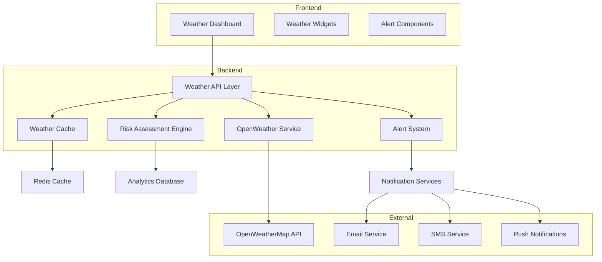

# Weather API Technical Implementation Guide

## Architecture Overview

The WedSync Weather Integration system is built using a modern, scalable architecture that provides real-time weather data, risk assessment, and intelligent alerts for wedding planning.

### System Components



## Core Components

### 1. Weather Service Layer (`/src/lib/weather/`)

#### OpenWeatherService Class

The main service class that handles all weather data operations:

```typescript
export class OpenWeatherService {
  private apiKey: string
  private baseUrl = 'https://api.openweathermap.org/data/3.0/onecall'
  private cache = new Map<string, WeatherCacheEntry>()
  private cacheDuration = 60 * 60 * 1000 // 1 hour

  constructor() {
    this.apiKey = process.env.OPENWEATHER_API_KEY || ''
    if (!this.apiKey) {
      throw new Error('OpenWeatherMap API key not configured')
    }
  }

  // Core methods
  async getCurrentWeather(lat: number, lon: number): Promise<WeatherApiResponse>
  async getWeatherForecast(lat: number, lon: number, days: number): Promise<WeatherApiResponse>
  async getWeatherForWeddingDate(lat: number, lon: number, weddingDate: string): Promise<WeatherApiResponse<WeddingWeatherData>>
  async analyzeWeatherRisk(lat: number, lon: number, weddingDate: string, isOutdoor: boolean): Promise<WeatherApiResponse<WeatherAnalytics>>
}
```

#### Key Features

**Intelligent Caching:**
- In-memory cache with configurable TTL
- Cache key generation based on coordinates and parameters
- Automatic cache expiry and cleanup
- Cache hit/miss statistics tracking

**Error Handling:**
- Graceful degradation when API is unavailable
- Retry logic with exponential backoff
- Fallback to cached data when appropriate
- Comprehensive error logging

**Rate Limiting:**
- Built-in request throttling
- Queue management for high-traffic scenarios
- API quota monitoring and alerts

### 2. Weather Components (`/src/components/weather/`)

#### WeatherDashboard Component

Main dashboard component that orchestrates all weather displays:

```typescript
interface WeatherDashboardProps {
  weddingId: string
  venue: {
    name: string
    lat: number
    lon: number
    address: string
  }
  weddingDate: string
  isOutdoor?: boolean
}

export function WeatherDashboard(props: WeatherDashboardProps) {
  // State management
  const [weatherData, setWeatherData] = useState<WeddingWeatherData | null>(null)
  const [analytics, setAnalytics] = useState<WeatherAnalytics | null>(null)
  const [alerts, setAlerts] = useState<WeatherNotification[]>([])
  const [loading, setLoading] = useState(true)
  const [error, setError] = useState<string | null>(null)
  const [activeTab, setActiveTab] = useState('overview')

  // Automatic refresh every hour
  useEffect(() => {
    loadWeatherData()
    const interval = setInterval(loadWeatherData, 60 * 60 * 1000)
    return () => clearInterval(interval)
  }, [weddingId, venue.lat, venue.lon, weddingDate])

  // Component implementation...
}
```

#### WeatherForecastWidget Component

Specialized component for displaying weather forecasts:

```typescript
interface WeatherForecastWidgetProps {
  dailyForecast: DailyWeather[]
  hourlyForecast: HourlyWeather[]
  weddingDate: string
}

export function WeatherForecastWidget(props: WeatherForecastWidgetProps) {
  // Features:
  // - Daily/hourly forecast switching
  // - Wedding day highlighting
  // - Interactive day expansion
  // - Weather icon mapping
  // - Responsive design
}
```

#### WeatherAlertsPanel Component

Manages weather alerts and notifications:

```typescript
interface WeatherAlertsPanelProps {
  alerts: WeatherNotification[]
  weddingId: string
  onAlertsUpdated: (alerts: WeatherNotification[]) => void
}

export function WeatherAlertsPanel(props: WeatherAlertsPanelProps) {
  // Features:
  // - Alert filtering and categorization
  // - Acknowledgment tracking
  // - Bulk operations
  // - Severity-based styling
  // - Real-time updates
}
```

### 3. Type Definitions (`/src/types/weather.ts`)

Comprehensive TypeScript definitions for weather data:

```typescript
// Core weather data types
export interface CurrentWeather { /* ... */ }
export interface HourlyWeather { /* ... */ }
export interface DailyWeather { /* ... */ }
export interface WeatherAlert { /* ... */ }

// WedSync-specific types
export interface WeddingWeatherData {
  id: string
  weddingId: string
  venue: VenueLocation
  current: CurrentWeather
  hourlyForecast: HourlyWeather[]
  dailyForecast: DailyWeather[]
  alerts: WeatherAlert[]
  weddingDate: string
  isOutdoor: boolean
  weatherDependentEvents: string[]
  backupPlans: WeatherBackupPlan[]
  settings: WeatherSettings
  lastUpdated: string
  cacheExpiry: string
}

export interface WeatherAnalytics {
  weddingId: string
  venue: VenueLocation
  weddingDate: string
  risk: WeatherRiskAssessment
  recommendations: WeatherRecommendation[]
  optimalScheduling: OptimalScheduling
  historicalContext: WeatherHistoryPattern
  confidence: number
}
```

### 4. API Routes (`/src/app/api/weather/`)

RESTful API endpoints for weather data:

```typescript
// GET /api/weather
// Query parameters: type, lat, lon, weddingDate, weddingId, outdoor
export async function GET(request: NextRequest) {
  const { searchParams } = new URL(request.url)
  const type = searchParams.get('type') // 'current', 'forecast', 'wedding', 'analysis'
  const lat = parseFloat(searchParams.get('lat') || '0')
  const lon = parseFloat(searchParams.get('lon') || '0')
  
  try {
    const weatherService = new OpenWeatherService()
    
    switch (type) {
      case 'current':
        return NextResponse.json(await weatherService.getCurrentWeather(lat, lon))
      case 'forecast':
        return NextResponse.json(await weatherService.getWeatherForecast(lat, lon))
      case 'wedding':
        return NextResponse.json(await weatherService.getWeatherForWeddingDate(lat, lon, weddingDate))
      case 'analysis':
        return NextResponse.json(await weatherService.analyzeWeatherRisk(lat, lon, weddingDate, isOutdoor))
    }
  } catch (error) {
    return NextResponse.json({ error: 'Weather service unavailable' }, { status: 500 })
  }
}

// POST /api/weather/alerts
export async function POST(request: NextRequest) {
  const body = await request.json()
  
  switch (body.action) {
    case 'acknowledge':
      return handleAlertAcknowledgment(body)
    case 'markAllRead':
      return handleMarkAllRead(body)
    case 'create':
      return handleCreateAlert(body)
  }
}
```

## Risk Assessment Engine

### Algorithm Implementation

The weather risk assessment uses a sophisticated weighted scoring system:

```typescript
class WeatherRiskAssessment {
  // Risk calculation methods
  private calculatePrecipitationRisk(pop: number, rain: number): number {
    const popRisk = pop * 100
    const rainRisk = Math.min(rain * 10, 100)
    return Math.max(popRisk, rainRisk)
  }

  private calculateTemperatureRisk(temp: number): number {
    if (temp < 0 || temp > 40) return 100      // Extreme
    if (temp < 5 || temp > 35) return 80       // Very uncomfortable  
    if (temp < 10 || temp > 30) return 60      // Uncomfortable
    if (temp < 15 || temp > 25) return 40      // Slightly uncomfortable
    return 20                                   // Comfortable
  }

  private calculateWindRisk(windSpeed: number): number {
    if (windSpeed > 50) return 100     // Dangerous
    if (windSpeed > 40) return 80      // Very strong
    if (windSpeed > 30) return 60      // Strong
    if (windSpeed > 20) return 40      // Moderate
    return 20                          // Light
  }

  private calculateVisibilityRisk(visibility: number): number {
    if (visibility < 1000) return 100   // Very poor
    if (visibility < 5000) return 60    // Poor
    if (visibility < 10000) return 30   // Reduced
    return 10                           // Good
  }

  private calculateOverallRisk(
    precipitation: number,
    temperature: number, 
    wind: number,
    visibility: number,
    isOutdoor: boolean
  ): 'low' | 'medium' | 'high' | 'extreme' {
    // Different weights for outdoor vs indoor events
    const weights = isOutdoor 
      ? { precipitation: 0.4, temperature: 0.2, wind: 0.3, visibility: 0.1 }
      : { precipitation: 0.2, temperature: 0.3, wind: 0.1, visibility: 0.4 }

    const weightedScore = 
      (precipitation * weights.precipitation) +
      (temperature * weights.temperature) +
      (wind * weights.wind) +
      (visibility * weights.visibility)

    if (weightedScore >= 80) return 'extreme'
    if (weightedScore >= 60) return 'high'  
    if (weightedScore >= 40) return 'medium'
    return 'low'
  }
}
```

### Recommendation Engine

AI-powered recommendations based on weather analysis:

```typescript
class RecommendationEngine {
  generateRecommendations(
    forecast: DailyWeather,
    alerts: WeatherAlert[],
    weddingType: 'outdoor' | 'indoor' | 'mixed'
  ): WeatherRecommendation[] {
    const recommendations: WeatherRecommendation[] = []

    // Precipitation recommendations
    if (forecast.pop > 0.7) {
      recommendations.push({
        type: 'equipment',
        title: 'Tent Rental Required',
        description: 'High probability of rain requires covered ceremony space',
        priority: 'high',
        estimatedCost: 1500,
        implementationTime: 48, // hours
        affectedEvents: ['ceremony', 'cocktail-hour']
      })
    }

    // Temperature recommendations
    if (forecast.temp.max > 30) {
      recommendations.push({
        type: 'logistics',
        title: 'Guest Comfort Measures',
        description: 'Provide fans, cooling stations, and shade for guests',
        priority: 'medium',
        estimatedCost: 300,
        implementationTime: 6,
        affectedEvents: ['ceremony', 'reception']
      })
    }

    // Wind recommendations  
    if (forecast.wind_speed > 25) {
      recommendations.push({
        type: 'vendor',
        title: 'Decoration Adjustments',
        description: 'Secure or replace lightweight decorations',
        priority: 'high',
        implementationTime: 12,
        affectedEvents: ['ceremony', 'reception']
      })
    }

    return recommendations
  }
}
```

## Caching Strategy

### Multi-Level Caching

The system implements a comprehensive caching strategy to optimize performance and reduce API costs:

**Level 1: In-Memory Cache**
- Fastest access for frequently requested data
- TTL-based expiration (1 hour for weather data)
- Automatic cleanup of expired entries
- LRU eviction when memory limits approached

**Level 2: Redis Cache (Production)**
- Distributed cache for multiple server instances
- Longer TTL for less volatile data
- Pub/sub for cache invalidation across instances
- Persistent storage survives server restarts

**Level 3: Database Cache**
- Long-term storage for historical analysis
- Backup when external APIs unavailable
- Analytics and pattern recognition data
- Compliance with data retention policies

```typescript
class WeatherCacheManager {
  private inMemoryCache = new Map<string, WeatherCacheEntry>()
  private redisClient: Redis
  private database: Database

  async get<T>(key: string): Promise<T | null> {
    // Check in-memory first
    const memCached = this.inMemoryCache.get(key)
    if (memCached && !this.isExpired(memCached)) {
      return memCached.data
    }

    // Check Redis second  
    const redisCached = await this.redisClient.get(key)
    if (redisCached) {
      const data = JSON.parse(redisCached)
      // Populate in-memory cache
      this.inMemoryCache.set(key, {
        data,
        timestamp: Date.now(),
        expiry: Date.now() + this.cacheDuration
      })
      return data
    }

    // Check database last
    const dbCached = await this.database.getWeatherCache(key)
    if (dbCached && !this.isExpired(dbCached)) {
      return dbCached.data
    }

    return null
  }

  async set<T>(key: string, data: T, ttl?: number): Promise<void> {
    const expiry = Date.now() + (ttl || this.cacheDuration)
    
    // Store in all cache levels
    this.inMemoryCache.set(key, { data, timestamp: Date.now(), expiry })
    await this.redisClient.setex(key, Math.floor(ttl || this.cacheDuration / 1000), JSON.stringify(data))
    await this.database.setWeatherCache(key, data, expiry)
  }
}
```

## Alert System Implementation

### Real-Time Notification Pipeline

```typescript
class WeatherAlertSystem {
  private notificationChannels: NotificationChannel[]
  
  async processWeatherUpdate(weddingId: string, weatherData: WeddingWeatherData): Promise<void> {
    // Analyze weather for potential alerts
    const alerts = await this.analyzeForAlerts(weatherData)
    
    for (const alert of alerts) {
      // Check if alert already exists
      if (await this.isDuplicateAlert(alert)) continue
      
      // Store alert in database
      await this.storeAlert(alert)
      
      // Send notifications based on alert severity and user preferences
      await this.dispatchNotifications(alert)
      
      // Trigger webhook for integrations
      await this.triggerWebhooks(alert)
    }
  }

  private async analyzeForAlerts(weatherData: WeddingWeatherData): Promise<WeatherAlert[]> {
    const alerts: WeatherAlert[] = []
    const settings = weatherData.settings
    
    // Check precipitation threshold
    const weddingDayForecast = this.getWeddingDayForecast(weatherData)
    if (weddingDayForecast.pop > settings.alertThresholds.precipitation) {
      alerts.push({
        type: 'precipitation',
        severity: this.calculateSeverity(weddingDayForecast.pop, settings.alertThresholds.precipitation),
        title: 'Rain Expected on Wedding Day',
        description: `${Math.round(weddingDayForecast.pop * 100)}% chance of rain during your ceremony`,
        triggers: [{
          type: 'precipitation',
          condition: 'above',
          value: settings.alertThresholds.precipitation,
          timeframe: '24h'
        }],
        affectedEvents: ['ceremony', 'photography'],
        recommendedActions: ['Secure tent rental', 'Prepare indoor backup', 'Notify vendors']
      })
    }

    // Check temperature thresholds
    if (weddingDayForecast.temp.max > settings.alertThresholds.temperature.max) {
      alerts.push({
        type: 'temperature',
        severity: 'warning',
        title: 'High Temperature Warning',
        description: `Temperature expected to reach ${Math.round(weddingDayForecast.temp.max)}°C`,
        // ... additional alert properties
      })
    }

    return alerts
  }
}
```

### Notification Channels

**Email Notifications:**
```typescript
class EmailNotificationChannel implements NotificationChannel {
  async send(alert: WeatherAlert, recipients: string[]): Promise<void> {
    const template = this.selectTemplate(alert.severity)
    const content = await this.renderTemplate(template, alert)
    
    for (const recipient of recipients) {
      await this.emailService.send({
        to: recipient,
        subject: `Weather Alert: ${alert.title}`,
        html: content,
        priority: alert.severity === 'critical' ? 'high' : 'normal'
      })
    }
  }
}
```

**SMS Notifications:**
```typescript
class SMSNotificationChannel implements NotificationChannel {
  async send(alert: WeatherAlert, recipients: string[]): Promise<void> {
    const message = this.formatForSMS(alert)
    
    for (const recipient of recipients) {
      await this.smsService.send({
        to: recipient,
        body: message,
        priority: alert.severity === 'critical'
      })
    }
  }

  private formatForSMS(alert: WeatherAlert): string {
    // Truncate for SMS length limits
    return `WedSync Alert: ${alert.title}. ${alert.description.substring(0, 100)}... View details: ${alert.url}`
  }
}
```

## Performance Optimization

### Database Optimization

**Efficient Queries:**
```sql
-- Optimized weather data retrieval
CREATE INDEX idx_weather_wedding_date ON weather_data(wedding_id, wedding_date);
CREATE INDEX idx_weather_location ON weather_data(venue_lat, venue_lon);
CREATE INDEX idx_weather_alerts_unread ON weather_alerts(wedding_id, acknowledged) WHERE acknowledged = false;

-- Partitioning for large datasets
CREATE TABLE weather_data_2025 PARTITION OF weather_data
    FOR VALUES FROM ('2025-01-01') TO ('2026-01-01');
```

**Connection Pooling:**
```typescript
const pool = new Pool({
  connectionString: process.env.DATABASE_URL,
  ssl: process.env.NODE_ENV === 'production',
  max: 20, // Maximum connections
  idleTimeoutMillis: 30000,
  connectionTimeoutMillis: 2000,
})
```

### API Rate Limiting

```typescript
class RateLimiter {
  private requests = new Map<string, number[]>()
  
  async checkLimit(key: string, limit: number, windowMs: number): Promise<boolean> {
    const now = Date.now()
    const windowStart = now - windowMs
    
    // Get existing requests for this key
    let requestTimes = this.requests.get(key) || []
    
    // Remove requests outside the window
    requestTimes = requestTimes.filter(time => time > windowStart)
    
    // Check if under limit
    if (requestTimes.length >= limit) {
      return false
    }
    
    // Add current request
    requestTimes.push(now)
    this.requests.set(key, requestTimes)
    
    return true
  }
}
```

### Frontend Optimization

**React Query Integration:**
```typescript
const useWeatherData = (weddingId: string, venue: VenueLocation) => {
  return useQuery({
    queryKey: ['weather', weddingId, venue.lat, venue.lon],
    queryFn: () => fetchWeatherData(weddingId, venue),
    staleTime: 5 * 60 * 1000, // 5 minutes
    cacheTime: 10 * 60 * 1000, // 10 minutes  
    refetchInterval: 60 * 60 * 1000, // 1 hour
    retry: 3,
    retryDelay: attemptIndex => Math.min(1000 * 2 ** attemptIndex, 30000)
  })
}
```

**Lazy Loading:**
```typescript
const WeatherForecastWidget = lazy(() => import('./WeatherForecastWidget'))
const WeatherAlertsPanel = lazy(() => import('./WeatherAlertsPanel'))

// Usage in dashboard
<Suspense fallback={<WeatherWidgetSkeleton />}>
  {activeTab === 'forecast' && <WeatherForecastWidget {...props} />}
</Suspense>
```

## Security Implementation

### API Security

**Input Validation:**
```typescript
const weatherRequestSchema = z.object({
  lat: z.number().min(-90).max(90),
  lon: z.number().min(-180).max(180),
  weddingDate: z.string().datetime(),
  type: z.enum(['current', 'forecast', 'wedding', 'analysis'])
})

export async function GET(request: NextRequest) {
  try {
    const params = weatherRequestSchema.parse(getSearchParams(request))
    // Process validated params...
  } catch (error) {
    return NextResponse.json({ error: 'Invalid parameters' }, { status: 400 })
  }
}
```

**Authentication:**
```typescript
async function authenticateWeatherRequest(request: NextRequest): Promise<User | null> {
  const session = await getServerSession(authOptions)
  
  if (!session?.user) {
    throw new Error('Authentication required')
  }
  
  // Verify user has access to requested wedding
  const weddingId = request.nextUrl.searchParams.get('weddingId')
  if (weddingId) {
    const hasAccess = await verifyWeddingAccess(session.user.id, weddingId)
    if (!hasAccess) {
      throw new Error('Access denied')
    }
  }
  
  return session.user
}
```

**Rate Limiting:**
```typescript
const rateLimiter = new RateLimiter()

export async function GET(request: NextRequest) {
  const clientId = getClientId(request)
  
  const allowed = await rateLimiter.checkLimit(
    `weather:${clientId}`, 
    100, // 100 requests
    60 * 60 * 1000 // per hour
  )
  
  if (!allowed) {
    return NextResponse.json({ error: 'Rate limit exceeded' }, { status: 429 })
  }
  
  // Process request...
}
```

### Data Protection

**Sensitive Data Handling:**
```typescript
// Weather data should not include personal information
function sanitizeWeatherData(data: WeddingWeatherData): PublicWeatherData {
  return {
    id: data.id,
    current: data.current,
    forecast: data.dailyForecast,
    riskLevel: data.analytics?.risk.overall,
    // Exclude: weddingId, venue details, personal settings
  }
}
```

## Testing Implementation

### Unit Tests

Comprehensive test coverage for all weather components:

```typescript
describe('OpenWeatherService', () => {
  let service: OpenWeatherService
  
  beforeEach(() => {
    service = new OpenWeatherService()
    service.clearCache()
  })

  test('fetches current weather successfully', async () => {
    const mockResponse = createMockWeatherResponse()
    global.fetch = jest.fn().mockResolvedValue({
      ok: true,
      json: async () => mockResponse
    })

    const result = await service.getCurrentWeather(51.5074, -0.1278)
    
    expect(result.success).toBe(true)
    expect(result.data).toEqual(mockResponse)
    expect(result.cacheHit).toBe(false)
  })

  test('returns cached data when available', async () => {
    // Test implementation...
  })
})
```

### Integration Tests

```typescript
describe('Weather API Integration', () => {
  test('weather dashboard loads with real API data', async () => {
    const mockWedding = await createTestWedding()
    const response = await request(app)
      .get(`/api/weather?type=wedding&weddingId=${mockWedding.id}`)
      .expect(200)
    
    expect(response.body).toHaveProperty('current')
    expect(response.body).toHaveProperty('forecast')
    expect(response.body).toHaveProperty('riskLevel')
  })
})
```

### E2E Tests (Playwright)

Comprehensive end-to-end testing covering all user workflows:

```typescript
test('weather dashboard user journey', async ({ page }) => {
  await page.goto('/weddings/test-wedding/weather')
  
  // Verify loading state
  await expect(page.locator('[data-testid="weather-loading"]')).toBeVisible()
  
  // Verify data loads
  await expect(page.locator('[data-testid="current-temperature"]')).toBeVisible()
  
  // Test tab navigation
  await page.click('[data-testid="forecast-tab"]')
  await expect(page.locator('[data-testid="forecast-widget"]')).toBeVisible()
  
  // Test alert acknowledgment
  await page.click('[data-testid="alerts-tab"]')
  if (await page.locator('[data-testid="acknowledge-alert"]').isVisible()) {
    await page.click('[data-testid="acknowledge-alert"]')
    await expect(page.locator('[data-testid="alert-acknowledged"]')).toBeVisible()
  }
})
```

## Deployment and Monitoring

### Environment Configuration

```env
# Weather API Configuration
OPENWEATHER_API_KEY=your_api_key_here
WEATHER_CACHE_TTL=3600 # seconds
WEATHER_API_TIMEOUT=5000 # milliseconds
WEATHER_RETRY_ATTEMPTS=3

# Alert Configuration  
WEATHER_ALERTS_ENABLED=true
WEATHER_EMAIL_NOTIFICATIONS=true
WEATHER_SMS_NOTIFICATIONS=true
WEATHER_PUSH_NOTIFICATIONS=true

# Performance Configuration
WEATHER_CACHE_SIZE=1000 # number of entries
WEATHER_RATE_LIMIT=100 # requests per hour per user
WEATHER_BATCH_SIZE=50 # alerts per batch

# Database Configuration
DATABASE_WEATHER_POOL_SIZE=10
DATABASE_WEATHER_TIMEOUT=30000
```

### Health Checks

```typescript
export async function GET() {
  const healthChecks = {
    weather_api: false,
    cache: false,
    database: false,
    notifications: false
  }

  try {
    // Test OpenWeather API
    const weatherService = new OpenWeatherService()
    await weatherService.getCurrentWeather(0, 0) // Test coordinates
    healthChecks.weather_api = true
  } catch (error) {
    console.error('Weather API health check failed:', error)
  }

  try {
    // Test cache
    const cache = new WeatherCacheManager()
    await cache.set('health_check', 'ok', 60)
    const result = await cache.get('health_check')
    healthChecks.cache = result === 'ok'
  } catch (error) {
    console.error('Cache health check failed:', error)
  }

  const allHealthy = Object.values(healthChecks).every(Boolean)
  
  return NextResponse.json({
    status: allHealthy ? 'healthy' : 'degraded',
    checks: healthChecks,
    timestamp: new Date().toISOString()
  }, {
    status: allHealthy ? 200 : 503
  })
}
```

### Monitoring and Logging

```typescript
class WeatherLogger {
  static logApiRequest(method: string, url: string, duration: number, success: boolean) {
    console.log({
      type: 'weather_api_request',
      method,
      url: this.sanitizeUrl(url),
      duration,
      success,
      timestamp: new Date().toISOString()
    })
  }

  static logCacheOperation(operation: 'hit' | 'miss' | 'set', key: string) {
    console.log({
      type: 'weather_cache_operation',
      operation,
      key: this.sanitizeKey(key),
      timestamp: new Date().toISOString()
    })
  }

  static logAlert(alert: WeatherAlert, action: string) {
    console.log({
      type: 'weather_alert',
      alertId: alert.id,
      severity: alert.severity,
      action,
      timestamp: new Date().toISOString()
    })
  }
}
```

### Performance Metrics

```typescript
class WeatherMetrics {
  private static metrics = new Map<string, number>()

  static incrementCounter(name: string, tags?: Record<string, string>) {
    const key = this.buildMetricKey(name, tags)
    this.metrics.set(key, (this.metrics.get(key) || 0) + 1)
  }

  static recordDuration(name: string, duration: number, tags?: Record<string, string>) {
    const key = this.buildMetricKey(`${name}_duration`, tags)
    // In production, send to metrics service (DataDog, NewRelic, etc.)
    console.log(`METRIC: ${key} = ${duration}ms`)
  }

  static recordGauge(name: string, value: number, tags?: Record<string, string>) {
    const key = this.buildMetricKey(name, tags)
    this.metrics.set(key, value)
  }
}
```

## Troubleshooting Guide

### Common Issues

**API Key Issues:**
- Verify OPENWEATHER_API_KEY environment variable
- Check API key validity and quota limits
- Confirm API key has access to required endpoints

**Cache Performance:**
- Monitor cache hit rates (should be >70%)
- Check memory usage and cache size limits
- Verify Redis connectivity in production

**Alert Delivery:**
- Test notification channels individually
- Check spam folders for email alerts
- Verify mobile app notification permissions
- Monitor webhook delivery success rates

**Database Performance:**
- Monitor query execution times
- Check index usage for weather queries  
- Review connection pool utilization
- Optimize queries with high execution times

### Debugging Tools

```typescript
// Debug mode logging
if (process.env.WEATHER_DEBUG === 'true') {
  console.log('Weather API Request:', {
    url,
    params,
    cacheKey,
    timestamp: new Date().toISOString()
  })
}

// Performance profiling
const startTime = performance.now()
const result = await weatherService.getWeatherData()
const duration = performance.now() - startTime
console.log(`Weather API call took ${duration.toFixed(2)}ms`)
```

---

*Technical Documentation Version: 2.1*  
*Last Updated: January 30, 2025*  
*For API support: developers@wedsync.com*